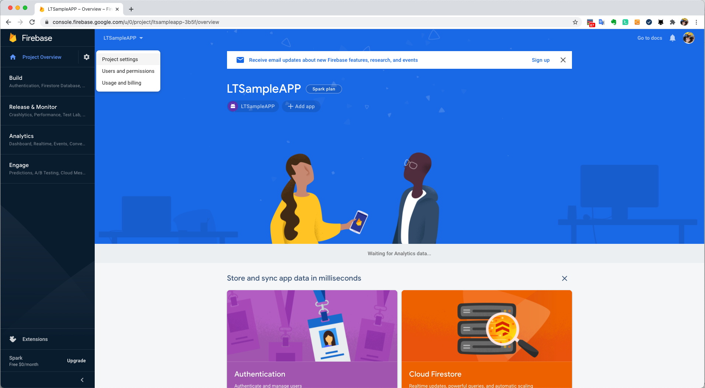
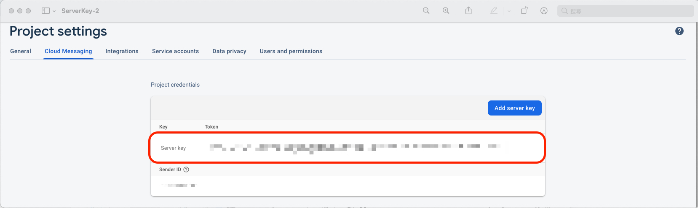

# LT Call SDK Android Document

---
## Overview

With LT SDK, you can build your own customized application with Call and IM function. This documentary provides a guideline that demonstrates how to build and configure an in-app message and call using LT SDK.

1. At the first beginning, you must create user account/login/password to continue the following process.
2. In order to connect to the LT service please read the [Authentication](#authentication).
3. Support Version:

    Android 5.0 (API level 21) or higher ;</br>
    Java 8 or higher ;</br>
    Gradle 5.4.1 or higher ;</br>
    Support Program language：Java, Kotlin

## Try the sample app

The sample application has the core functions of our LT SDK. Download the app from our GitHub repository to get an idea of what you can build with the SDK and start building in your project.

[Download sample app](https://github.com/LoFTechs/LTSample-Android-Kotlin)

## Getting started

### Import SDK

Step 1. Add MavenCentral to your repositories in your project level build.gradle file:

```java
allprojects {
    repositories {
        mavenCentral()
    }
}
```

Step 2. Add the library as a dependency in your module level build.gradle file:

[](https://search.maven.org/search?q=g:%22com.loftechs.sdk%22%20AND%20a:%22lt%22)

```java
def LTSDK_version = "5.x.y"
implementation "com.loftechs.sdk:lt:$LTSDK_version-SNAPSHOT"
implementation "com.loftechs.sdk:call:$LTSDK_version-SNAPSHOT"

```

Step 3. Grant system permissions on your module level AndroidManifest.xml file:

```java
<uses-permission android:name="android.permission.INTERNET" />
<uses-permission android:name="android.permission.READ_EXTERNAL_STORAGE" />
<uses-permission android:name="android.permission.WRITE_EXTERNAL_STORAGE" />

```

## Authentication

### Init SDK

In the beginning, you must initialize **LTSDK** instance by passing the **LTSDKOptions** of your App as an argument to a parameter in the `LTSDK.init()` method. When initializing your App, you need to call `LTSDK.init()` in the onCreate method of the application class.

Note: Before switching users, be sure to call [Clean SDK](#clean-sdk)

```java
LTSDKOptions options = LTSDKOptions.builder()
                .context(this)
                .licenseKey("licenseKey")
                .url("https://xxx.xxx.net")
                .userID(userID)
                .uuid(uuID)
                .build();

LTSDK.init(options).subscribe(new Observer<Boolean>() {
            @Override
            public void onSubscribe(Disposable d) {

            }

            @Override
            public void onNext(Boolean aBoolean) {
                Log.i("CHECK", "SampleApp init:" + aBoolean);
            }

            @Override
            public void onError(Throwable e) {

            }

            @Override
            public void onComplete() {

            }
        });
```

#### The definition of LTSDKOptions parameters

| Parameter  | Definition | Necessity | Detail                      |
| :--------- | :--------- | :-------- | :-------------------------- |
| context    | Context    | Requierd  | Android context object      |
| licenseKey | String     | Requierd  | LT ID                       |
| url        | String     | Requierd  | LT authenticate url         |
| userID     | String     | Requierd  | LT unique user ID           |
| uuid       | String     | Requierd  | LT unique user authenticate |

### Start SDK

You can get user's information by calling `LTSDK.getInstance().getUsers()` method.

```java
try {
    LTSDK.getInstance().getUsers().subscribe(new io.reactivex.Observer<LTUsers>() {
        @Override
        public void onSubscribe(Disposable d) {

        }

        @Override
        public void onNext(LTUsers users) {
            //Get user info
        }

        @Override
        public void onError(Throwable e) {
            //Error
            if(e instanceof LTErrorInfo) {
                int returnCode = ((LTErrorInfo) e).getReturnCode();
                String errorMessage = ((LTErrorInfo) e).getErrorMessage();
            }
        }

        @Override
        public void onComplete() {

        }
    });
} catch (LTSDKNoInitializationException e) {
    e.printStackTrace();
}
```

#### The definition of LTUsers parameters

| Parameter   | Definition | Detail                      |
| :---------- | :--------- | :-------------------------- |
| userID      | String     | LT unique user ID           |
| uuid        | String     | LT unique user authenticate |
| phoneNumber | String     | User's phone number          |
| semiUID     | String     | Customized unique key to register |
| deviceID    | String     | LT unique device ID          |
| accountSrc  | String     | LT account source           |

### Get user status

Get the status of other users through their respective phoneNumbers or semiUIDs.

1.query with phonenumbers, use `LTSDK.getInstance().getUserStatuswithPhoneNumber()` method.

```java
List<String> phones = new ArrayList<>();
phones.add("+886912345678");
try {
    LTSDK.getInstance().getUserStatusWithPhoneNumbers(phones)
        .subscribe(new io.reactivex.Observer<List<LTUserStatus>>() {
            @Override
            public void onSubscribe(Disposable d) {

            }

            @Override
            public void onNext(List<LTUserStatus> userStatuses) {
                //Get other user info
            }

            @Override
            public void onError(Throwable e) {
                //Error
                if(e instanceof LTErrorInfo) {
                    int returnCode = ((LTErrorInfo) e).getReturnCode();
                    String errorMessage = ((LTErrorInfo) e).getErrorMessage();
                }
            }

            @Override
            public void onComplete() {

            }
        });
} catch (LTSDKNoInitializationException e) {
    e.printStackTrace();
}
```

2.query with semiUIDs, using `LTSDK.getInstance().getUserStatusWithSemiUIDs()` method.

```java
List<String> semiUIDs = new ArrayList<>();
semiUIDs.add("semiUID1");
try {
    LTSDK.getInstance(). getUserStatusWithSemiUIDs(semiUIDs)
        .subscribe(new io.reactivex.Observer<List<LTUserStatus>>() {
            @Override
            public void onSubscribe(Disposable d) {

            }

            @Override
            public void onNext(List<LTUserStatus> userStatuses) {
                //Get other user info
            }

            @Override
            public void onError(Throwable e) {
                //Error
                if(e instanceof LTErrorInfo) {
                    int returnCode = ((LTErrorInfo) e).getReturnCode();
                    String errorMessage = ((LTErrorInfo) e).getErrorMessage();
                }
            }

            @Override
            public void onComplete() {

            }
        });
} catch (LTSDKNoInitializationException e) {
    e.printStackTrace();
}
```

#### LTUserStatus

| Parameter   | Definition | Detail                    |
| :---------- | :--------- | :------------------------ |
| userID      | String     | user's LT unique ID       |
| email       | String     | user's email              |
| phoneNumber | String     | user's phoneNumber        |
| semiUID     | String     | user's custom ID          |
| corpID      | String     | User's corp ID            |
| brandID     | String     | User's brand ID           |
| canVOIP     | String     | User enable VoIP feature. |
| canIM       | String     | user enable IM feature.   |

### Clean SDK

When your App was logged in with different users or when the return code of `LTSDK.init` from `LTErrorInfo` is 6000, be sure to call `LTSDK.clean`.

```java
LTSDK.clean(context).subscribe(new io.reactivex.Observer<Boolean>() {
        @Override
        public void onSubscribe(Disposable d) {

        }

        @Override
        public void onNext(Boolean aBoolean) {
            //success
        }

        @Override
        public void onError(Throwable e) {
            //Clean SDK error
        }

        @Override
        public void onComplete() {

        }
    });
```

## Firebase Cloud Messaging

### About FCM Messages

Firebase Cloud Messaging sends notifications and messages to devices which have installed your App.

### Prerequisites

- A device running Android 4.0 or higher, and Google Play services 15.0.0 or higher.
- FirebaseMessaging API and Android Studio 1.4 or higher with Gradle.


### Connect your App to Firebase

Adding Firebase to your app involves tasks both in the Firebase console and in your open Android project (for example, you download Firebase config files from the console, then move them into your Android project).

#### Step 1: Create a Firebase project
Before you can add Firebase to your Android app, you need to create a Firebase project to connect to your Android app.

1. In the [Firebase console](https://console.firebase.google.com/u/0/), click Add project, then select or enter a Project name.


2. (Optional) If you are creating a new project, you can edit the Project ID.
3. Click Continue.


4. (Optional) Set up Google Analytics for your project
5. Click Create project.


#### Step 2: Register your app with Firebase
To use Firebase in your Android app, you need to register your app with your Firebase project. Registering your app is often called "adding" your app to your project.


#### Step 3: Add a Firebase configuration file
  - 3.1 Add the Firebase Android configuration file to your app:
    - 3.1.1 Click Download google-services.json to obtain your Firebase Android config file (google-services.json).
    - 3.1.2 Move your config file into the module (app-level) directory of your app.
  


  - 3.2 To enable Firebase products in your app, add the google-services plugin to your Gradle files.
    - 3.2.1 In your root-level (project-level) Gradle file (build.gradle), add rules to include the Google Services Gradle plugin. Check that you have Google's Maven repository, as well.
    - 3.2.2 In your module (app-level) Gradle file (usually app/build.gradle), apply the Google Services Gradle plugin:

```java
buildscript {

  repositories {
    // Check that you have the following line (if not, add it):
    google()  // Google's Maven repository
  }

  dependencies {
    // ...

    // Add the following line:
    classpath 'com.google.gms:google-services:4.3.5'  // Google Services plugin
  }
}

allprojects {
  // ...

  repositories {
    // Check that you have the following line (if not, add it):
    google()  // Google's Maven repository
    // ...
  }
}
```

```java
apply plugin: 'com.android.application'
// Add the following line:
apply plugin: 'com.google.gms.google-services'  // Google Services plugin

android {
  // ...
}
```

#### Step 4: Add Firebase SDKs to your app

  - 4.1 Using the Firebase Android BoM, declare the dependencies for the Firebase products that you want to use in your app. Declare them in your module (app-level) Gradle file (usually app/build.gradle).

```java
dependencies {
    // Import the BoM for the Firebase platform
    implementation platform('com.google.firebase:firebase-bom:26.8.0')

    // Declare the dependencies for the Firebase Cloud Messaging and Analytics libraries
    // When using the BoM, you don't specify versions in Firebase library dependencies
    implementation 'com.google.firebase:firebase-messaging'
    implementation 'com.google.firebase:firebase-analytics'
}
```

  - 4.2 Sync your app to ensure that all dependencies have the necessary versions.


### Generate server key form Firebase

#### Step 1: In the [Firebase console](https://console.firebase.google.com/u/0/), click Project settings



#### Step 2: Go to Cloud Messaging > Project credentials to obtain your server key



#### Step 3: Register to LFSDK Console

Register your server key to LFSDK server through the [LFSDK console](https://console-sat.baby.juiker.net/info/notification) as follows:


### Edit your app manifest

Add the following to your app's manifest:

- A service that extends FirebaseMessagingService. This is required if you want to do any message handling beyond receiving notifications on apps in the background. To receive notifications in foregrounded apps, to receive data payload, to send upstream messages, and so on, you must extend this service.

```java
<service
    android:name=".java.MyFirebaseMessagingService"
    android:exported="false">
    <intent-filter>
        <action android:name="com.google.firebase.MESSAGING_EVENT" />
    </intent-filter>
</service>
```

### Retrieve the current registration token

When you need to retrieve the current token, call `FirebaseMessaging.getInstance().getToken()`

```java
FirebaseMessaging.getInstance().getToken()
    .addOnCompleteListener(new OnCompleteListener<String>() {
        @Override
        public void onComplete(@NonNull Task<String> task) {
          if (!task.isSuccessful()) {
            Log.w(TAG, "Fetching FCM registration token failed", task.getException());
            return;
          }

          // Get new FCM registration token
          String token = task.getResult();

          // Log and toast
          String msg = getString(R.string.msg_token_fmt, token);
          Log.d(TAG, msg);
          Toast.makeText(MainActivity.this, msg, Toast.LENGTH_SHORT).show();
        }
    });

```

### Monitor token generation

The onNewToken callback fires whenever a new token is generated.

```java
/**
 * There are two scenarios when onNewToken is called:
 * 1) When a new token is generated on initial app startup
 * 2) Whenever an existing token is changed
 * Under #2, there are three scenarios when the existing token is changed:
 * A) App is restored to a new device
 * B) User uninstalls/reinstalls the app
 * C) User clears app data
 */
public class MyFirebaseMessagingService extends FirebaseMessagingService {
    private static final String TAG = MyFirebaseMessagingService.class.getSimpleName();
    @Override
    public void onNewToken(String token) {
        Log.d(TAG, "Refreshed token: " + token);

        // If you want to send messages to this application instance or
        // manage this apps subscriptions on the server side, send the
        // FCM registration token to your app server.
        sendRegistrationToServer(token);
    }
}

```

### Update FCM Token To LT Server

Update this refreshedToken to your app server.

```java
try {
    String key = "update_key";
    boolean cleanOld = true;   //true: clean old key
    LTSDK.getInstance().updateNotificationKey(key, cleanOld).subscribe(new io.reactivex.Observer<LTResponse>() {
        @Override
        public void onSubscribe(Disposable d) {

        }

        @Override
        public void onNext(LTResponse response) {
            // reponse for server
        }

        @Override
        public void onError(Throwable e) {
            //Error
        }

        @Override
        public void onComplete() {

        }
    });
} catch (LTSDKNoInitializationException e) {
    e.printStackTrace();
}

```

#### Request parameters description

| Parameter   | Definition | Detail                    |
| :---------- | :--------- | :------------------------ |
| key      | String     | FCM API Token       |
| cleanOld       | boolean     | Clean the tokens of previous devices that login using the same userID             |

#### Response parameters description - **LTResponse**

| Parameter   | Definition | Detail                    |
| :---------- | :--------- | :------------------------ |
| returnCode      | int     | Please refer to [Appendix A. Other Error Code List](#appendix-a-other-error-code-list)       |
| returnMsg       | String     | result message           |


### Handling messages

To receive messages, use a service that extends FirebaseMessagingService. Your service should override the onMessageReceived and onDeletedMessages callbacks. It should handle any message within 20 seconds of receipt (10 seconds on Android Marshmallow). The time window may be shorter depending on OS delays incurred ahead of calling onMessageReceived. After that time, various OS behaviors such as Android O's background execution limits may interfere with your ability to complete your work. For more information see our overview on message priority.
onMessageReceived is provided for most message types, with the following exceptions:

- Notification messages delivered when your app is in the background. In this case, the notification is delivered to the device’s system tray. A user tap on a notification opens the app launcher by default.
- Messages with both notification and data payload, when received in the background. In this case, the notification is delivered to the device’s system tray, and the data payload is delivered in the extras of the intent of your launcher Activity.
In summary:

| App state   | Notification | Data    | Both |
| :---------- | :--------- | :------------- |:---------------|
| Foreground  | onMessageReceived  | onMessageReceived |onMessageReceived|
| Background        | System tray     | onMessageReceived | Notification: system tray Data: in extras of the intent.|

```java
public class MyFirebaseMessagingService extends FirebaseMessagingService {
    private static final String TAG = MyFirebaseMessagingService.class.getSimpleName();

    @Override
    public void onMessageReceived(RemoteMessage remoteMessage) {
        super.onMessageReceived(remoteMessage);
        Log.d(TAG, "From: " + remoteMessage.getFrom());
        // Check if message contains a notification payload.
        if (remoteMessage.getNotification() != null) {
            Log.d(TAG, "Message Notification Body: " + remoteMessage.getNotification().getBody());
        }
        ...
    }
}
```

## Call information

### About a call

LT Call SDK enables real-time voice calls between users within your app. A voice call definition is: a caller makes a call to the call server, and tells the server the number of the callee. The number in VOIP is defined as the user account, and the server finds the device of callee, then send the incoming call notifications to the device. After the callee receives the incoming call notifications and chooses to answer the call, the caller and the callee can make a voice call.

### Make a call

Initiate a call by providing the callee’s data into the `voiceManager.startCallWithUserID()`. Custom message can be attached in `LTVoiceCallOptions`.

```java
try {
    Map<String, Object> extInfo = new ConcurrentHashMap<>(); //define custome message
    extInfo.put("key1","value2");
    extInfo.put("key2","value2");


    LTcallCenterManager callCenterManager = LTSDK.getInstance().getcallCenterManager();

    // init a call by callee's userID
    LTCallOptions callOptions = new LTCallOptions.UserIDBuilder()
                .setUserID("userID1")
                .setExtInfo(extInfo)
                .build();

    // init a call by callee's phone number
    //LTCallOptions callOptions = new LTCallOptions.PhoneNumberBuilder()
    //            .setIsRCode("00_123")
    //            .setPhoneNumber("0912345678")
    //            .setExtInfo(extInfo)
    //            .build();
    LTCall ltCall = callCenterManager.startCallWithUserID( callerUserID, callOptions, new LTCallStateListener() {
            @Override
            public void onLTCallStateRegistered(LTCall ltCall) {

            }

            @Override
            public void onLTCallStateConnected(LTCall ltCall) {

            }

            @Override
            public void onLTCallStateTerminated(LTCall ltCall, LTCallStatusCode callStatusCode) {

            }

            @Override
            public void onLTCallStateWarning(LTCall ltCall, LTCallStatusCode callStatusCode) {

            }

            @Override
            public void onLTCallMediaStateChanged(LTCall ltCall, LTMediaType mediaType) {

            }

            @Override
            public void onLTCallConnectionDuration(LTCall ltCall, int duration) {

            });

} catch (ClassNotFoundException e) {
    Log.d(TAG, "ClassNotFoundException:" + e.getMessage());
} catch (LTSDKNoInitializationException e) {
    Log.d(TAG, "LTSDKNoInitializationException:" + e.getMessage());
}
```

#### LTCallOptions parameters description

| Parameter | Definition | Necessity | Detail |
| :-- | :-- | :-- | :-- |
| callID | String | Mandatory | unique ID for call |
| userID | String | Requierd | callee's user ID, which is mandatory parameter if using `UserIDBuilder` |
| phoneNumber | String | Requierd | callee's phoneNumber, which is mandatory parameter if using `PhoneNumberBuilder` |
| semiUID | String | Requierd | callee's LT unique semiUID, which is mandatory parameter if using `SemiUIDBuilder:` |
| deviceID | String | Requierd | callee's LT unique deviceID, which is mandatory parameter if using `DeviceIDBuilder:` |
| isrCode | String | Requierd | code for saving calle |
| accountType | LTCallAccountType | Mandatory | account type for call |
| callType | LTCallType | Mandatory | call type for call |
| extInfo | Map<String, Object> | Optional | provide customized call information, total length is limited to 256 bytes. |

### Receive a call

To receive an incoming call, you have to ready FCM setting and update key to LT server. Then a **LTCallNotificationListener** event handler should already be registered in your app.

Step 1. recevive FCM call notifications, call `parseIncomingPushWithNotify()` method to check LT SDK call notifications payload.

```java
@Override
public void onMessageReceived(RemoteMessage remoteMessage) {
    super.onMessageReceived(remoteMessage);
    Set<String> keys = remoteMessage.getData().keySet();
    for (String gcmMessage : keys) {
        if (gcmMessage.equals("json")) {
            try {
                LTSDK.getInstance().parseIncomingPushWithNotify(gcmMessage);
            } catch (LTSDKNoInitializationException e) {
                e.printStackTrace();
            }
            return;
        }
    }
}

```

Step 2. After LTSDK parse notifications. If notification is incoming call notifications, then receive incoming events form `LTCallNotificationListener.onLTCallNotification()` method to handle incomingCall.

```java
try {
    LTCallCenterManager callCenterManager = LTSDK.getInstance().getCallCenterManager();
    callCenterManager.setCallNotificationListener(new LTCallNotificationListener() {
        @Override
        public void onLTCallNotification(LTCallNotificationMessage callNotificationMessage) {
            // receive custom message from caller
            for (Map.Entry<String, Object> entry : callNotificationMessage.getCallOptions().getExtInfo().entrySet()) {
                Log.d(TAG, "key: " + entry.getKey() + " value: " + entry.getValue());
            }


            // receiver a incoming call, do satrt call and Activity
            LTCall ltCall = callCenterManager.startCallWithNotificationMessage(callNotificationMessage, new LTCallStateListener() {
            @Override
            public void onLTCallStateRegistered(LTCall ltCall) {
                ltCall.acceptCall();
            }

            @Override
            public void onLTCallStateConnected(LTCall ltCall) {

            }

            @Override
            public void onLTCallStateTerminated(LTCall ltCall, LTCallStatusCode callStatusCode) {

            }

            @Override
            public void onLTCallStateWarning(LTCall ltCall, LTCallStatusCode callStatusCode) {

            }

            @Override
            public void onLTCallMediaStateChanged(LTCall ltCall, LTMediaType mediaType) {

            }

            @Override
            public void onLTCallConnectionDuration(LTCall ltCall, int duration) {

            }
        });


        }

        @Override
        public void onLTCallCDRNotification(LTCallCDRNotificationMessage callCDRNotificationMessage) {
            // The callback needs to be work with IM service
        }
    });

} catch (ClassNotFoundException e) {
    Log.d(TAG, "ClassNotFoundException:" + e.getMessage());
} catch (LTSDKNoInitializationException e) {
    Log.d(TAG, "LTSDKNoInitializationException:" + e.getMessage());
}
```

### Handle a current call

#### Reveive call evnet

Start a call, the **LTCallStateListener** event handler must be added `callCenterManager.startCallWithUserID()` or `callCenterManager.startCallWithNotificationMessage()`. The events during the call through its callback methods.

```java
new LTCallStateListener() {
    @Override
    public void onLTCallStateRegistered(LTCall ltCall) {

    }

    @Override
    public void onLTCallStateConnected(LTCall ltCall) {

    }

    @Override
    public void onLTCallStateTerminated(LTCall ltCall, LTCallStatusCode callStatusCode) {

    }

    @Override
    public void onLTCallStateWarning(LTCall ltCall, LTCallStatusCode callStatusCode) {

    }

    @Override
    public void onLTCallMediaStateChanged(LTCall ltCall, LTMediaType mediaType) {

    }

    @Override
    public void onLTCallConnectionDuration(LTCall ltCall, int duration) {

    }
}
```

| Method | Detail |
| :-- | :-- |
| onLTCallStateRegistered | Register LT call server success. Callee receive event to start incoming page to your app user. |
| onLTCallStateConnected | When callee call ltCall.acceptCall(), caller and callee are connected and can start the call. |
| onLTCallStateTerminated | When call ltCall.hangupCall() or ltCall.busyCall(), the call is ended. The call is ended due to other reasons in LTCallStatusCode. |
| onLTCallStateWarning | When call happen warning event. The call happen warning due to other reasons in LTCallStatusCode. |
| onLTCallMediaStateChange | Mute or held or audioRoute change. |
| onLTCallConnectionDuration | Call Duration in call. |

#### LTCallState

| State      | Detail                           |
| :--------- | :------------------------------- |
| IDLE       | Idle                             |
| INIT       | Call init.                       |
| REGISTERED | Call registered.                 |
| CONNECTED  | Call connected and start a call. |
| TERMINATED | Call End.                        |

#### LTMediaType

| State      | Detail                                                |
| :--------- | :---------------------------------------------------- |
| AUDIOROUTE | reference [Audio route setting](#audio-route-setting) |
| CALLMUTED  | reference [Mute the microphone](#mute-the-microphone) |
| CALLHELD   | reference [Held the call](#held-the-call)             |

#### Mute the microphone

During a call, both the caller and callee’s audio can be muted or unmuted by the `ltCall.setCallMuted()` method. If changed mute settings, the event callback through the `LTCallStateListener.onLTCallMediaStateChange()` method

```java
// Mute the microphone
ltCall.setCallMuted(true);

// Unmuted the microphone
ltCall.setCallMuted(false);

// Check the microphone mute state
ltCall.isCallMuted();
```

#### Held the call

During a call, both the caller and callee can be held or unHeld by the `ltCall.setCallHeld()` method. If changes held settings, the event callback through the `LTCallStateListener.onLTCallMediaStateChange()` method

```java
// Held the call
ltCall.setCallHeld(true);

// Un Held the call
ltCall.setCallHeld(false);

// Check the call held state
ltCall.isCallHeld();
```

#### Audio route setting

During a call, both the caller and callee can be set audio route by the `ltCall.setAudioRout()` method. If changes audio route settings, the event callback through the `LTCallStateListener.onLTCallMediaStateChange()` method

```java
// Set audio route
ltCall.setAudioRout(audioRoute);

// Get current audio route
LTAudioRoute audioRoute = ltCall.getCurrentAudioRoute();

// Get available audio route
 ArrayList<LTAudioRoute> audioRouteArray = ltCall.getAvailableAudioRoutes();
```

##### LTAudioRoute

| Device                 | Detail            |
| :--------------------- | :---------------- |
| LTAudioRouteBuiltin    | Device receiver   |
| LTAudioRouteSpeaker    | Device speaker    |
| LTAudioRouteHeadphones | Headset           |
| LTAudioRouteBluetooth  | Bluetooth headset |

#### Send DTMF

During a call, both the caller and callee can be send DTMF by the `ltCall.sendDTMFDigit()` method.

```java
// Set DTMF with tone
ltCall.sendDTMFDigit("1", true);

// Set DTMF without tone
ltCall.sendDTMFDigit("1", false);
```

### End a call

During a call, both the caller and callee can be end the call by the `ltCall.hangupCall()` method. And during a incoming call, the callee can be reject the call by the `ltCall.hangupCall()`. If callee receiver a other call in current call, the callee can be busy the call by the `ltCall.busyCall()`. If call is end, the event callback through the `LTCallStateListener.onLTCallStateTerminated()` method.

```java
// End or reject a call
ltCall.hangupCall();

// Busy a call
ltCall.busyCall();
```

### Call history

The call history will be recorded when a call is ended. callCenterManager provide two methods to get the call detail record (CDR). The first method is `callCenterManager.queryCDRWithUserID()`, which can query the call records of a specific period of time in the past by markTS and afterN(the number of CDRs). The second method needs to be equipped with IM service, which will callback to `LTCallNotificationListener. onLTCallCDRNotification()` after the call is end.

```java
callCenterManager.queryCDRWithUserID(userID, markTS, count)
    .subscribe(new Observer<LTUserCDRResponse>() {
        @Override
        public void onSubscribe(Disposable d) {

        }

        @Override
        public void onNext(LTUserCDRResponse response) {
            Log.d(TAG, "result : " + response.toString());
            for (LTCallCDRNotificationMessage cdrMessage : response.getCdrMessages()) {
                Log.d(TAG, "cdrMessage : " + cdrMessage.toString());
            }
        }

        @Override
        public void onError(Throwable e) {
            Log.d(TAG, "requestCDR onError: " + e.getMessage());
        }

        @Override
        public void onComplete() {

        }
    });
```

#### Request parameters description

-   **userID** _(M, String)_ : Which userID to query CDR.
-   **markTS** _(M, Long)_ : Which timestamp to query CDR.
-   **count** _(M, Int)_ : The number of CDRs recorded after markTS time, negative values can get the number of CDRs recorded before markTS time. count limit is less than 100.

#### Response parameters description

-   **LTUserCDRResponse** :
    -   **returnCode** _(M, int)_: Please refer to [Appendix C. Other Error Code List](#appendix-a-other-error-code-list).
    -   **markTS** _(M, Long)_: request's timestamp.
    -   **count** _(M, Int)_: request's count.
    -   **cdrMessages** _(M, List<LTCallCDRNotificationMessage>)_: CDR message detail list.

### Call notification

When call state change, You can set custom notification by `setAndroidNotification()` method with the parameter, <a href="https://developer.android.com/reference/androidx/core/app/NotificationCompat.Builder" title="Title">NotificationCompat.Builder</a> and notificationID. The default is LT style notification.

```java
setAndroidNotification(NotificationCompat.Builder builder, int notificationID);
```

### Call Blocking

Block all calls from users who are within the block list. Blocked callers will receive a block status code after call attempt has ended.

#### Set callers be blocked

The method `callCenterManager.blockCallWithUserID` use to add userIDs to blocklist. Similarly, you can use `callCenterManager.unBlockCallWithUserID` method to delete block userIDs from blocklist.

```java
        List<String> blockUserIDList = new ArrayList<String>();
        blockUserIDList.add("userID1");
        blockUserIDList.add("userID2");

        callCenterManager.blockCallWithUserID(userID, blockUserIDList)
                .subscribeOn(Schedulers.io())
                .subscribe(new Observer<LTResponse>() {
                    @Override
                    public void onSubscribe(Disposable d) {

                    }

                    @Override
                    public void onNext(LTResponse response) {
                        //success
                    }

                    @Override
                    public void onError(Throwable e) {
                        Log.d(TAG, "blockCallWithUserID onError: " + e.getMessage());
                    }

                    @Override
                    public void onComplete() {

                    }
                });
```

```java
        List<String> unBlockUserIDList = new ArrayList<String>();
        unBlockUserIDList.add("userID1");

        callCenterManager.unBlockCallWithUserID(userID, unBlockUserIDList)
                .subscribeOn(Schedulers.io())
                .subscribe(new Observer<LTResponse>() {
                    @Override
                    public void onSubscribe(Disposable d) {

                    }

                    @Override
                    public void onNext(LTResponse response) {
                        //success
                    }

                    @Override
                    public void onError(Throwable e) {
                        Log.d(TAG, "unBlockCallWithUserID onError: " + e.getMessage());
                    }

                    @Override
                    public void onComplete() {

                    }
                });

```

#### blockCallWithUserID parameters description

| Parameter | Definition | Necessity | Detail |
| :-- | :-- | :-- | :-- |
| userID | String | Mandatory | the userID |
| blockUserIDList | List<String> | Mandatory | the userIDs you want to add to blocklist |

#### unBlockCallWithUserID parameters description

| Parameter | Definition | Necessity | Detail |
| :-- | :-- | :-- | :-- |
| userID | String | Mandatory | the userID |
| unBlockUserIDList | List<String> | Mandatory | the userIDs you want to delete from blocklist |

#### Get block list

The method `callCenterManager.getBlockCallListWithUserID` can return the cuurent block list of the user.

```java
        callCenterManager.getBlockCallListWithUserID(userID)
                .subscribeOn(Schedulers.io())
                .subscribe(new Observer<LTBlockListResponse>() {
                    @Override
                    public void onSubscribe(Disposable d) {

                    }

                    @Override
                    public void onNext(LTBlockListResponse response) {
                        Log.d(TAG, "getBlockCallListWithUserID result : " + response.toString());
                        for (String blockedUserID : response.getUserIDs()) {
                            Log.d(TAG, "blockedUserID : " + blockedUserID);
                        }
                    }

                    @Override
                    public void onError(Throwable e) {
                        Log.d(TAG, "getBlockList onError: " + e.getMessage());
                    }

                    @Override
                    public void onComplete() {

                    }
                });
```

#### getBlockCallListWithUserID parameters description

| Parameter | Definition | Necessity | Detail     |
| :-------- | :--------- | :-------- | :--------- |
| userID    | String     | Mandatory | the userID |

## Appendix A. Other Error Code List

While requesting **failed**, you will get **ErrorResponse** which includes **returnCode** and **returnMessage** The details are as below.

### System

| ReturnCode | Description                    |
| :--------: | :----------------------------- |
|     1      | Wrong User Account or Password |
|     2      | Wrong Function                 |
|     3      | Error happened in database     |
|     4      | PHP Error                      |
|     5      | Wrong EndPoint                 |
|     6      | Error happened in Data Format  |
|     7      | The function is unavailable    |
|     8      | Wrong number format            |
|    6000    | Not current user               |

### LTCallStatusCode

| ReturnCode | status | Description |
| :-- | :-: | :-- |
| OK | Normal | OK |
| HANGUP | Normal | HangUp call |
| MISS | Normal | Miss call |
| CALLEE_DECLINE | Normal | Decline call |
| CALLEE_BUSY | Normal | Busy call |
| ANSWER_ELSEWHERE | Normal | Answered else where |
| DECLINE_ELSEWHERE | Normal | Declined else where |
| CALLEE_NOT_FOUND | Normal | Callee not found |
| BLOCK_CALL | Normal | Block call |
| NO_RECORD_PERMISSION | Wrong | No record permission |
| REGISTER_FORBIDDEN | Wrong | Register forbidden |
| NETWORK_DISCONNECT | Wrong | Network disconnect |
| REGISTER_NETWORK_UNREACHABLE | Wrong | Register Unreachtable |
| OPERATION_NOT_AVAILABLE | Wrong | Operation not available |
| CALLEE_AT_CALLER_DEVICE | Wrong | Callee at caller device |
| GROUPCALL_MEMBER_AT_ADMIN_DEVICE | Wrong | Group call member at admin device |
| ERROR_OPTION | Error | Error options |
| ERROR_REGISTER_FAIL | Error | Register failed |
| ERROR_CONNECTION | Error | Error connection |
| ERROR_NO_CALL_PACKET | Error | No call packet |
| ERROR_EXTINFO_LENGTH | Error | Extinfo is over 256 byte |
| ERROR_NO_SDK_PERMISSION | Error | No SDK permission |
| ERROR_NO_VALID_USER | Error | No valid user |
| ERROR_GROUPCALL_NO_CHANNEL | Error | Group call no channel |
| ERROR_GROUPCALL_INSUFFICIENT_BALANCE | Error | Group call insufficient balance |
| ERROR_GROUPCALL_TOO_MANY_INVITEE | Error | Group call too many invitee |
