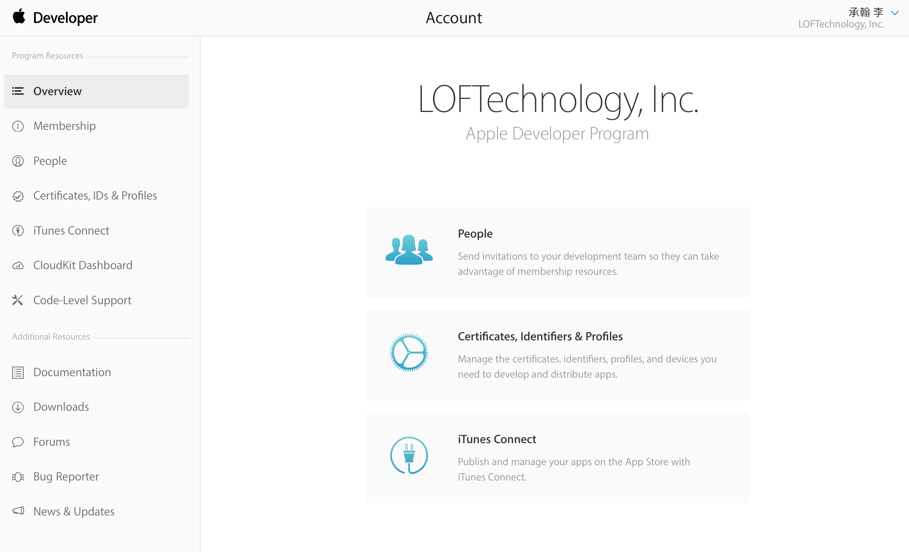
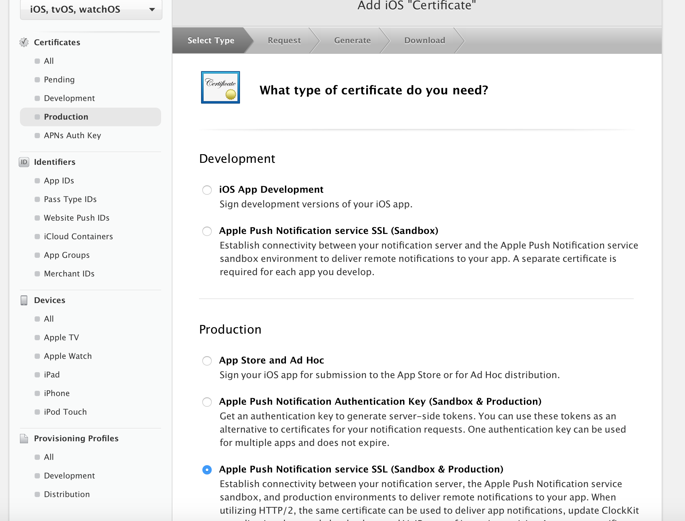
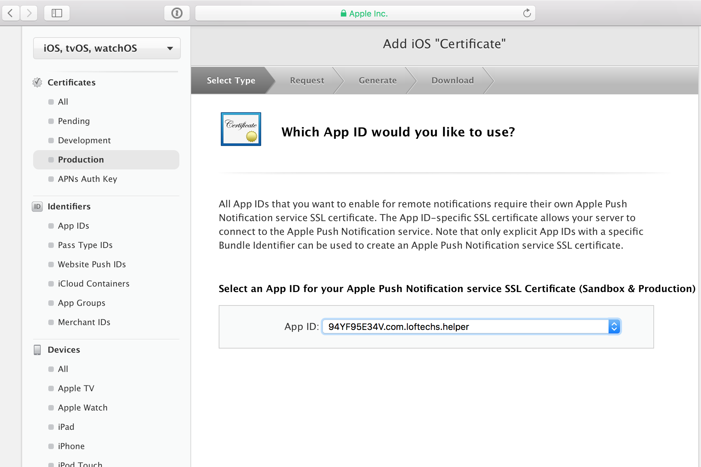
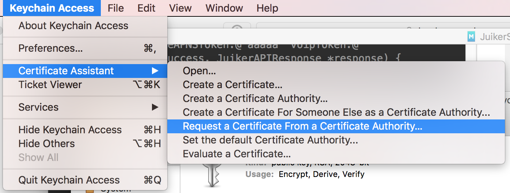
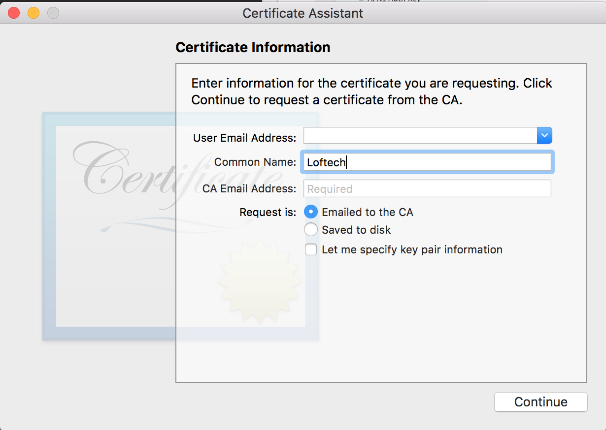
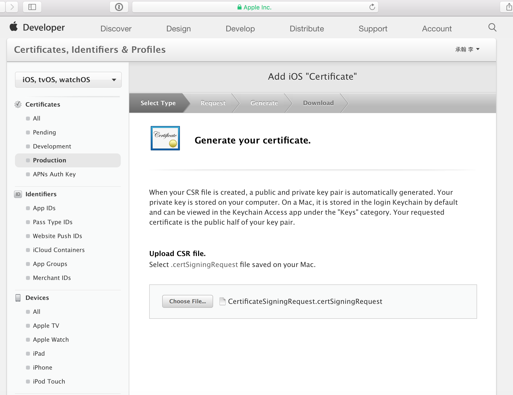
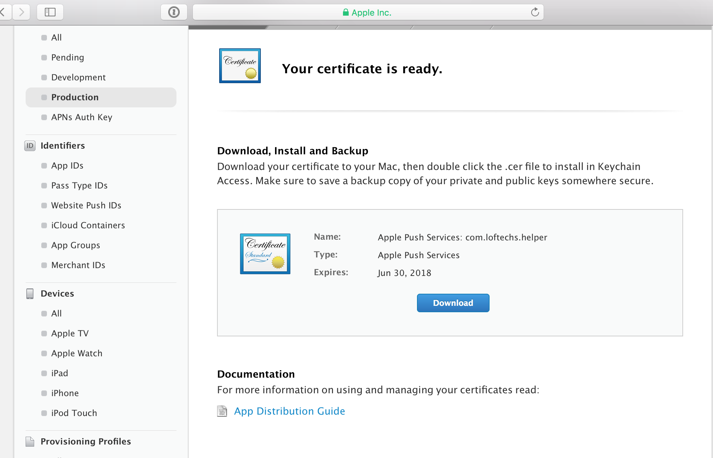
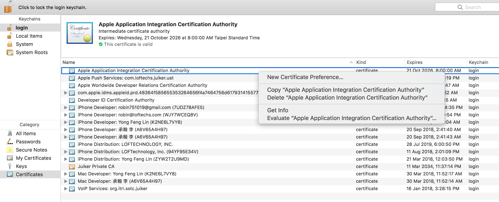

# LT Call SDK iOS Document

---
## Overview

With LT SDK, you can build your own customized application with Call and IM function. This documentary provides a guideline that demonstrates how to build and configure an in-app message and call using LT SDK.

1. At the first beginning, you must create user account/login/password to continue the following process.
2. In order to connect to the LT service please read the [Authentication](#authentication).
3. Support Version：

    iOS 10.0 above ;</br>
    Support Program language：objective c, swift

## Try the sample app

The sample application has the core functions of our LT SDK. Download the app from our GitHub repository to get an idea of what you can build with the SDK and start building in your project.

[Download sample app](https://github.com/LoFTechs/LTSample-iOS-Swift)

## Getting started

### Import SDK

Step1. You can install LT SDK for iOS through `cocoapods`.

To install the pod, add following line to your Podfile:

```
pod 'LTSDK'
pod 'LTCallSDK'
```

Step2. Install LT SDK

```
pod install
```

Step 3. Grant system permissions on your `Info.plist`:

```
<key>NSMicrophoneUsageDescription</key>
<string>Need microphone access for voice call</string>
```
## Authentication

### Init SDK

In the beginning, you must initialize **LTSDK** instance by passing the **LTSDKOptions** of your application as an argument to a parameter in the `initWithOptions:completion:` method. When initializing your App, you need to call `initWithOptions:completion:` in the `application:didFinishLaunchingWithOptions:` method of the application class.

Note: Before switching users, be sure to call [Clean SDK](#clean-sdk)

```objectivec
LTSDKOptions *options = [[LTSDKOptions alloc] init];
options.licenseKey = @"licenseKey";
options.url = @"https://xxx.xxx.net";
options.userID = userID;
options.uuid = uuid;

[LTSDK initWithOptions:options completion:^(LTResponse * _Nonnull response) {
    if (response.returnCode == 0) {
    } else {
    }
}];
```

#### The definition of LTSDKOptions parameters

| Parameter  | Definition | Necessity | Detail                      |
| :--------- | :--------- | :-------- | :-------------------------- |
| licenseKey | String     | Requierd  | LT ID                       |
| url        | String     | Requierd  | LT authenticate url         |
| userID     | String     | Requierd  | LT unique user ID           |
| uuid       | String     | Requierd  | LT unique user authenticate |

### Start SDK

You can get user's information again by calling `getUsersWithCompletion:` completion method.

```objectivec
[LTSDK getUsersWithCompletion:^(LTResponse * _Nonnull response, NSArray<LTUser *> * _Nullable users) {
    if (response.returnCode == LTReturnCodeSuccess) {
        for (LTUser *user in users) {

        }
    }
}];
```

#### The definition of LTUsers parameters

| Parameter   | Definition | Detail                      |
| :---------- | :--------- | :-------------------------- |
| userID      | String     | LT unique user ID           |
| uuid        | String     | LT unique user authenticate |
| phoneNumber | String     | User's phone number          |
| semiUID     | String     | Customized unique key to register |
| deviceID    | String     | LT unique device ID          |
| accountSrc  | String     | LT account source           |

### Get user status

Get the status of other users through their respective phoneNumbers or semiUIDs.

1. query with phonenumbers, use `getUserStatusWithPhoneNumbers: completion:` method.

```objectivec
[LTSDK getUserStatusWithPhoneNumbers:@[@"phonenumber1",@"phonenumber2"] completion:(void (^)(LTResponse * _Nonnull response, NSArray<LTUserStatus *> * _Nullable userStatuses)) {
    if (response.returnCode == LTReturnCodeSuccess) {
        for (LTUserStatus *userStatus in userStatuses) {

        }
    }
}];
```

2. query with semiUIDs, using `getUserStatusWithSemiUIDs: completion:` method.

```objectivec
[LTSDK getUserStatusWithSemiUIDs:@[@"semiUID1",@"semiUID2"] completion:(void (^)(LTResponse * _Nonnull response, NSArray<LTUserStatus *> * _Nullable userStatuses)) {
    if (response.returnCode == LTReturnCodeSuccess) {
        for (LTUserStatus *userStatus in userStatuses) {

        }
    }
}];
```

#### LTUserStatus parameters description

-   **userID** _(M, String)_: LT unique user ID.
-   **phoneNumber** _(O, String)_: user's phoneNumber.
-   **email** _(O, String)_: LT user's email.
-   **semiUID** _(C, String)_: LT unique semiUID.
-   **brandID** _(M, String)_: LT user brand.
-   **corpID** _(M, String)_: LT user corpID.
-   **canVOIP** _(M, Bool)_: user enable VoIP feature.
-   **canIM** _(M, Bool)_: user enable IM feature.

### Clean SDK

When your App was logged in with different users or when the return code of `initWithOptions` from `LTErrorInfo` is 6000, be sure to call `clean`.

```objectivec
[LTSDK initWithOptions:options completion:^(LTResponse * _Nonnull response) {
    if (response.returnCode == LTReturnCodeNotCurrentUser) {
        [LTSDK clean];
    }
}];
```

## PushKit

### About pushkit

The PushKit framework supports specialized notifications for receiving incoming VoIP calls. Instead of displaying an alert, badging your app’s icon, or playing a sound, PushKit notifications wake up or launch your app and give it time to respond. Both PushKit and User Notifications use the Apple Push Notification service (APNs) to deliver push notifications to user devices.


### Generate your Apple Push Notification Push SSL Certificate

Step 1：Open [Apple developer website](https://developer.apple.com) 

Step 2：Click "Account" &gt;&gt; "Certificates, IDs & Profiles". 

Step 3：Select the type of Apple Push Notification Push SSL Certificate  


-   For Apple Push Notification Push SSL Certificate, please select "Apple Push Notification service SSL (Sandbox & Production)"
-   For VOIP Apple Push Notification Push SSL Certificate, please select "VoIP Services Certificate"

Step 4: Select your APP ID (For example,select com.loftechs.helper)



Step 5: Based on the description of Certificate Assistant, create Certificate Request





Step 6: Upload Certificate Request that was created previously.



Step 7: Download and double click the certification and add it to Keychain Access.



### Provide APNS .p12 certificate

Step 1: Launch the Keychain Access application (Application -&gt; Utilities -&gt; Keychain Access -&gt; Certificates) in your Mac OS X and Generate APNS .p12 certificate.

Go to Keychain Access, select login keychain and My Certificate from side menu. Find app certificate and right click to export it



Step 2: Provide APNS .p12 certificate to Loftech. Otherwise you can't send APNS.

### Register App with PushKit

You must configure your app to handle PushKit-related notifications, and you must supply a server to generate those notifications. Every time your app launches, whether in the foreground or in the background, create a push registry object and configure it.

```objectivec
- (BOOL)application:(UIApplication *)application didFinishLaunchingWithOptions:(NSDictionary *)launchOptions {
    _voipRegistry = [[PKPushRegistry alloc] initWithQueue:dispatch_get_main_queue()];
    _voipRegistry.delegate = self;
    _voipRegistry.desiredPushTypes = [NSSet setWithObject:PKPushTypeVoIP];
    return YES;
}
```

### Update APNS Token to LT Server

Please always keep updating APNS Token. Otherwise, the users may not be able to receive messages or call notification.

```objectivec
- (void)pushRegistry:(PKPushRegistry *)registry didUpdatePushCredentials:(PKPushCredentials *)credentials forType:(NSString *)type {
    NSString *token = [self hexadecimalStringFromData:credentials.token];
    [LTSDK updateNotificationKeyWithAPNSToken:@"" voipToken:token cleanOld:NO completion:^(LTResponse * _Nonnull response) {
        if (response.returnCode == 0) {
        } else {
        }
    }];
}

- (NSString *)hexadecimalStringFromData:(NSData *)data {
    NSUInteger dataLength = data.length;
    if (dataLength == 0) {
        return nil;
    }

    const unsigned char *dataBuffer = data.bytes;
    NSMutableString *hexString  = [NSMutableString stringWithCapacity:(dataLength * 2)];
    for (int i = 0; i < dataLength; ++i) {
        [hexString appendFormat:@"%02x", dataBuffer[i]];
    }
    return [NSString stringWithFormat:@"%@",hexString];
}
```

#### Request parameters description

-   **apnsToken** _(O, String)_ : Member Device Token
-   **voipToken** _(M, String)_ : Member Device PushKit Token.
-   **cleanOld** _(O, boolean)_ : Clean the tokens of previous devices that login using the same userID.

## Callkit

### About CallKit

CallKit lets you integrate your calling services with other call-related apps on the system. CallKit provides the calling interface, and you handle the back-end communication with your VoIP service. For incoming and outgoing calls, CallKit displays the same interfaces as the Phone app, giving your app a more native look and feel.

**_Note: For apps built using the iOS 13 SDK or later, PushKit requires VoIP services to use CallKit when handling VoIP calls._**

### Setting CallKit

Callkit use for display the system-calling UI for VoIP services, and coordinate your calling services with other apps and the system. LTCallKitProxy implements the Callkit proxy, and you handle the calling services with LTCallKitProxy interface. (above iOS 10)

set parameter under **_LTCallKitProxy_**

```objectivec
[[LTCallKitProxy sharedInstance] configureProviderWithLocalizedName:[[NSBundle mainBundle] objectForInfoDictionaryKey:@"CFBundleDisplayName"] ringtoneSound:@"iPhone_Marimba_Ringtone.wav" iconTemplateImage:[UIImage imageNamed:@""]];
[LTCallKitProxy sharedInstance].delegate = self;
```

#### parameters description

-   **localizedName** _(M, String)_: show localized name in system-calling UI or call history.
-   **ringtoneSound** _(O, String)_: the name of the sound resource in the app bundle to be used for the provider ringtone. (default: empty string).
-   **iconTemplateImage** _(O, String)_: show icon in system-calling UI,image should be a square (length:40 points).

### Callkit status and monitoring

LTCallKitProxyDelegate is used to monitor events triggered by the Callkit object in LTCallKitProxy. When the Callkit state changed, LTCallKitProxyCallChanged will report the status.

| LTCallKitProxyState         | Description                        |
| :-------------------------- | :--------------------------------- |
| LTCallKitProxyStateOutgoing | StartCallAction is successed       |
| LTCallKitProxyStateIncoming | ReportNewIncomingCall is successed |
| LTCallKitProxyStateUnHold   | Callkit unHold the call            |
| LTCallKitProxyStateHold     | Callkit hold the call              |
| LTCallKitProxyStateEnd      | Callkit end call                   |

```objectivec
//MARK - LTCallKitProxyDelegate
- (void)LTCallKitProxyCallChanged:(id<LTCallKitDelegate>_Nonnull)call callState:(LTCallKitProxyState)callState {
    if (callState == LTCallKitProxyStateOutgoing) {
        //trigger when startCallAction is successed
    } else if (callState == LTCallKitProxyStateIncoming) {
        //trigger when reportNewIncomingCall is successed
    } else if (callState == LTCallKitProxyStateUnHold) {
        //trigger when Callkit unHold the call
    } else if (callState == LTCallKitProxyStateHold) {
        //trigger when Callkit hold the call
    } else if (callState == LTCallKitProxyStateEnd) {
        //trigger when Callkit end call
    }
}
```

### Start an outgoing call using Callkit

To make an outgoing call in Callkit, first create LTCallKitDelegate object from CallCenterManager and passes that to the method.

```
- (void)startOutgoingCall:(LTCall *)call callerName:(NSString *)callerName {
    CXCallUpdate *callkitUpdate = [[CXCallUpdate alloc] init];
    callkitUpdate.remoteHandle = [[CXHandle alloc] initWithType:CXHandleTypeGeneric value:@"Sample"];
    callkitUpdate.localizedCallerName = callerName;
    [[LTCallKitProxy sharedInstance] startOutgoingCall:call update:callkitUpdate];
}
```

#### parameters description

-   **call** _(O, Object)_: the call object.
-   **update** _(O, CXCallUpdate)_ : an encapsulation of new and changed information about a call.
    -   **remoteHandle** _(M, CXHandle)_ : the handle for the remote party.
    -   **localizedCallerName** _(M, String)_ : the localized name of the caller.

### Receiving an incoming Call using Callkit

To receive incoming calls and show system-calling UI, first get LTCallKitDelegate object from CallCenterManager and passes that to the method.

```objectivec
- (void)startIncomingCall:(LTCall *) call callerName:(NSString *)callerName {
    CXCallUpdate *callkitUpdate = [[CXCallUpdate alloc] init];
    NSString *phoneNumber = notificationMessage.callerInfo.phoneNumber ?: @"Unknow Number";
    callkitUpdate.remoteHandle = [[CXHandle alloc] initWithType:CXHandleTypeGeneric value:phoneNumber];
    callkitUpdate.localizedCallerName = phoneNumber;
    
    NSUUID *uuid = [NSUUID UUID];
    
    [[LTCallKitProxy sharedInstance] startIncomingCallWithUpdate:callkitUpdate completion:^id<LTCallKitDelegate> _Nullable(NSError * _Nullable error, NSUUID * _Nullable callUUID) {
        id<LTCallKitDelegate> callkitCall = nil;
        if (call) {
            callkitCall = call;
        }
        return callkitCall;
    }];
}

```

#### startIncomingCallWithUpdate parameters description

-   **uuid** _(O, Object)_: Provide unique ID to CallKit.
-   **call** _(O, Object)_: the call object.
-   **update** _(O, CXCallUpdate)_ : an encapsulation of new and changed information about a call.
    -   **remoteHandle** _(M, CXHandle)_ : the handle for the remote party.
    -   **localizedCallerName** _(M, String)_ : the localized name of the caller.

### Change display name

Using `reportCall:displayName:` method when you want to change the name display on incoming call UI after report `startIncomingCall:update:`.

```objectivec
// change display name on incoming call
[[LTCallKitProxy sharedInstance] reportCall:call displayName:@"newName"];
```

#### parameters description

-   **call** _(M, Object)_: the call object.
-   **displayName** _(M, String)_ : the localized name of the caller.

--

## Call information

### About a call

LT call SDK enables real-time calls between users within your app. A call definition is: a caller makes a call to the call server, and tells the server the number of the callee. The number in VoIP is defined as the user account, and the server finds the device of callee, then send the incoming call notifications to the device. After the callee receives the incoming call notifications and chooses to answer the call, the caller and the callee can make a call.

### Make a call

Initiate a call by providing the callee’s date into the `startCallWithUserID:options:setDelegate:`. Please refer to [Start an outgoing call using Callkit](#start-an-outgoing-call-using-callkit) to know how to use Callkit.

```objectivec
//initOptions
LTCallOptions *options = [LTCallOptions initWithUserIDBuilder:^(LTCallPhoneNumberBuilder *builder) {
    builder.userID = calleeUserID;
    builder.extInfo = @{@"example1":@"custom message 1",@"example2":@"custom message 2",@"example3":@"custom message 3"};//nullable
}];

//startCall
LTCall *call = [[LTSDK getCallCenterManager] startCallWithUserID:userID options:options setDelegate:self];
if (call) {

    //add call to LTCallKitProxy if you want to use Callkit
    CXCallUpdate *callkitUpdate = [[CXCallUpdate alloc] init];
    callkitUpdate.remoteHandle = [[CXHandle alloc] initWithType:CXHandleTypeGeneric value:@"Sample"];
    callkitUpdate.localizedCallerName = calleeDisplayName;
    [[LTCallKitProxy sharedInstance] startOutgoingCall:call update:callkitUpdate];

    //show user call view
}
```

#### LTCallOptions parameters description

-   **callID** _(M, String)_: unique ID for call.
-   **userID** _(C, String)_: callee's userID, which is mandatory parameter if using `initWithUserIDBuilder:`.
-   **phoneNumber** _(C, String)_: callee's phoneNumber, which is mandatory parameter if using `initWithPhoneNumberBuilder:`.
-   **semiUID** _(C, String)_: callee's LT unique semiUID, which is mandatory parameter if using `initWithSemiUIDBuilder:`.
-   **deviceID** _(C, String)_: callee's LT unique deviceID, which is mandatory parameter if using `initWithDeviceIDBuilder:`.
-   **isrCode** _(C, String)_: code for saving call.
-   **accountType** _(M, LTCallAccountType)_: account type for call.
-   **callType** _(M, LTCallType)_: call type for call.
-   **extInfo** _(O, Dictionary)_: provide customized call information, total length is limited to 256 bytes.

### Receive a call

To receive an incoming call, you have to ready APNS setting and update key to LT server. Then a LTCallNotification event handler should already be registered in your app.

Step 1. recevive VoIP push notification, call `parseIncomingPushWithNotify:` method to check LT SDK call notifications payload.

```objectivec
//MARK - PKPushRegistryDelegate
- (void)pushRegistry:(PKPushRegistry *)registry didReceiveIncomingPushWithPayload:(PKPushPayload *)payload forType:(PKPushType)type withCompletionHandler:(void (^)(void))completion {
    if ([type isEqualToString:PKPushTypeVoIP]) {
        //handle incoming call
        [LTSDK parseIncomingPushWithNotify:payload];
    }
}

- (void)pushRegistry:(PKPushRegistry *)registry didReceiveIncomingPushWithPayload:(nonnull PKPushPayload *)payload forType:(nonnull PKPushType)type {
    if ([type isEqualToString:PKPushTypeVoIP]) {
        //handle incoming call
        [LTSDK parseIncomingPushWithNotify:payload];
    }
}
```

For VoIP push notifications, the system launches or wakes your app and delivers the notification to your app's PKPushRegistry object, which calls the `pushRegistry:didReceiveIncomingPushWithPayload:forType:withCompletionHandler:` method of its delegate. Use that method to display the incoming call UI and to establish a connection to your VoIP server.

Step 2. After LT SDK parse notifications. If notification is incoming call notifications, then receive incoming events form LTCallNotification, call `startCallWithNotificationMessage:options:setDelegate:` method to handle incomingCall.

```objectivec
//MARK - LTCallCenterDelegate
- (void)LTCallNotification:(LTVoiceNotificationMessage *_Nonnull)notificationMessage {

    CXCallUpdate *callkitUpdate = [[CXCallUpdate alloc] init];
    id<LTCallKitDelegate> callkitCall = nil;

    callkitUpdate.remoteHandle = [[CXHandle alloc] initWithType:CXHandleTypeGeneric value:@"Sample"];
    callkitUpdate.localizedCallerName = notificationMessage.callerInfo.name;

    NSUUID *UUID = [NSUUID UUID];

    [[LTCallKitProxy sharedInstance] initIncomingCallWithUUID:UUID update:callkitUpdate completion:^(NSError * _Nullable error) {
        if (!error) {
            id<LTCallKitDelegate> callkitCall = nil;
            if (notificationMessage.callOptions) {
                LTCall *call = [[LTSDK getCallCenterManager] startCallWithNotificationMessage:notificationMessage setDelegate:self.delegate];
                if (call) {
                    callkitCall = call;
                }
                [[LTCallKitProxy sharedInstance] startIncomingCall:callkitCall update:callkitUpdate];
            }
        }
    }];
}
```

Since PushKit requires use of Callkit when App built using the iOS 13 SDK or later. Any event respond from `pushRegistry:didReceiveIncomingPushWithPayload:forType:withCompletionHandler:` will be handle in LTCallNotification if used ` parseIncomingPushWithNotify:` method. The system-calling UI must be displayed by using `initIncomingCallWithUUID:update:completion:` method. This method is used for protect the app from being punished, which is app can not respond to push notification for a day by the system. Please refer to [Receiving an incoming Call using Callkit](#receiving-an-incoming-call-using-callkit) to know how to use Callkit.

### Handle a current call

#### Reveive call evnet

Start a call, the LTCallDelegate event handler must be added `startCallWithUserID:options:setDelegate:` or `startCallWithNotificationMessage:setDelegate:`. The events during the call through its callback methods.

```objectivec
@protocol LTCallDelegate <NSObject>
@optional
- (void)LTCallStateRegistered:(LTCall *_Nonnull)call;
- (void)LTCallStateConnected:(LTCall *_Nonnull)call;
- (void)LTCallStateWarning:(LTCall *_Nonnull)call statusCode:(LTVoiceStatusCode)statusCode;
- (void)LTCallStateTerminated:(LTCall *_Nullable)call statusCode:(LTVoiceStatusCode)statusCode;
- (void)LTCallMediaStateChanged:(LTCall *_Nonnull)call mediaType:(LTMediaType)mediaType;
- (void)LTCallConnectDuration:(LTCall *_Nonnull)call duration:(long)sec;
@end
```

| Method | Detail |
| :-- | :-- |
| LTCallStateRegistered | Register LT voice server success. Ringing started and waiting Caller select accept call or decline call. incoming page to your app user. |
| LTCallStateConnected | When callee call `call.acceptCall`, caller and callee are connected successfully, they can talk to each other now. |
| LTCallStateTerminated | The call is terminated successfully after call `call.hangupCall` or other reasons. The end reasons report in LTVoiceStatusCode. |
| LTCallStateWarning | When call happen warning event. The end reasons report in LTVoiceStatusCode. |
| LTCallMediaStateChanged | Mute or hold or audioRoute change. |
| LTCallConnectDuration | After Call is connected, return duration time after call is connected, which report once a second. |

#### Mute the microphone

During a current call, both the caller and callee’s audio can be muted or unmuted by the `setCallMuted:` method. If changes mute settings, the event callback through the `LTVoiceMediaStateChange:mediaType:` method.

```objectivec
// Mute the microphone
[call setCallMuted:YES];

// Unmuted the microphone
[call setCallMuted:NO];

// Check the microphone mute state
BOOL isCallMuted = [call isCallMuted];
```

#### Hold the call

During a current call, both the caller and callee can be hold or unHold by the `setCallHeld:` method. If changes hold settings, the event callback through the `LTVoiceMediaStateChange:mediaType:` method.

```objectivec
// Hold the call
[call setCallHeld:YES];

// Unhold the call
[call setCallHeld:NO];

// Check the call hold state
BOOL isCallHeld = [call isCallHeld];
```

#### Audio route setting

During a current call, both the caller and callee can be set audio route by the `setAudioRout:` method. If changes audio route settings, the event callback through the `LTVoiceMediaStateChange:mediaType:` method

```objectivec
// Set audio route
[call setAudioRoute:LTAudioRouteSpeaker];

// Get current audio route
LTAudioRoute audioRoute = [call getCurrentAudioRoute];

// Get available audio route
NSArray *availableAudioRoutes = [call getAvailableAudioRoutes];
if([availableAudioRoutes containsObject:@(LTAudioRouteSpeaker)]) {

}
```

##### LTAudioRoute

| Device                 | Detail         |
| :--------------------- | :------------- |
| LTAudioRouteBuiltin    | Device receive |
| LTAudioRouteSpeaker    | Device speaker |
| LTAudioRouteHeadphones | Headset        |
| LTAudioRouteBluetooth  | Bluetooth      |

#### Send DTMF

During a current call, both the caller and callee can be send DTMF by the `sendDTMFDigit:playTone:` method.

```objectivec
// Set DTMF with tone
[call sendDTMF:@"1" playTone:YES];

// Set DTMF without tone
[call sendDTMF:@"1" playTone:NO];
```

### End a call

`hangupCall` method can be used to terminate a call at any time. During a incoming call, Callee can use `hangupCall` method to decline call. If user receiver a other call in current call, who can use `busyCall` method to report a busy state to other call.

```objectivec
// End or decline a call
[call hangUpCall];

// Busy a call
[call busyCall];

```

### Call history

The call history will be recorded when a call is ended. CallCenterManager provide two methods to get the call detail record (CDR). The first method is `queryCDRWithUserID:markTS:afterN:completion:`, which can query the call records of a specific period of time in the past by markTS and afterN(the number of CDRs). The second method needs to be equipped with IM service, which will callback to `LTVoiceCDRNotification:` after the call is end.

```objectivec
[[LTSDK getCallCenterManager] queryCDRWithUserID:userID markTS:[[NSDate date] timeIntervalSince1970] * 1000 afterN:-20 completion:^(LTUserCDRResponse * _Nonnull response) {
    if (response.returnCode == LTReturnCodeSuccess) {
        //the number of CDRs
        int count = response.count;
        //CDR array
        NSArray<LTVoiceCDRNotificationMessage *> *cdrMessages = response.cdrMessages;
        for (LTVoiceCDRNotificationMessage *cdrMessage in cdrMessages) {

        }
    } else {

    }
}];

//MARK - LTCallCenterDelegate
- (void)LTVoiceCDRNotification:(LTVoiceCDRNotificationMessage *_Nonnull)notificationMessage {
    //need IM service
}
```

#### queryCDRWithUserID parameters description

-   **markTS** _(M, Number)_: timestamp.
-   **afterN** _(M, Number)_: the number of CDRs recorded after markTS time, negative values can get the number of CDRs recorded before markTS time.

### Call Blocking

Block all calls from users who are within the block list. Blocked callers will receive a block status code after call attempt has ended.

#### Set callers be blocked

The method `blockCallWithUserID:blockUserIDs:block:completion:` use to add userIDs to blocklist. Similarly, you can use `unBlockCallWithUserID:blockUserIDs:block:completion:` method to delete block userIDs from blocklist.

```objectivec
// Add block userIDs
[[LTSDK getCallCenterManager] blockCallWithUserID:userID blockUserIDs:@[callerUserID] completion:^(LTResponse * _Nonnull response) {
    if (response.returnCode == LTReturnCodeSuccess) {
    } else {
    }
}];

// Delete block userIDs
[[LTSDK getCallCenterManager] unBlockCallWithUserID:userID blockUserIDs:@[callerUserID] completion:^(LTResponse * _Nonnull response) {
    if (response.returnCode == LTReturnCodeSuccess) {
    } else {
    }
}];
```

##### blockCallWithUserID parameters description

-   **userID** _(M, Number)_: the userID.
-   **blockUserIDs** _(M, Number)_: the userIDs you want to add to blocklist.

##### unBlockCallWithUserID parameters description

-   **userID** _(M, Number)_: the userID.
-   **blockUserIDs** _(M, Number)_: the userIDs you want to delete from blocklist.

#### Get block list

Get all users in block list through `getBlockCallListWithUserID:completion::` method.

```objectivec
[[LTSDK getCallCenterManager] getBlockCallListWithUserID:userID completion:^(LTBlockListResponse * _Nonnull response) {
    if (completion) {
        if (response.returnCode == LTReturnCodeSuccess) {
            for (NSSring *userIDs in response.userIDs) {
            }
        } else {
        }
    }
}];

```

##### LTBlockListResponse description

-   **userIDs** _(M, Array)_: the userIDs in block list.

## Appendix A. Error Code List

While requesting **failed**, you will get **ErrorResponse** which includes **returnCode** and **returnMessage** The details are as below.

### System

| ReturnCode |          Description           |
| :--------: | :----------------------------: |
|     1      | Wrong User Account or Password |
|     2      |         Wrong Function         |
|     3      |   Error happened in database   |
|     4      |           PHP Error            |
|     5      |         Wrong EndPoint         |
|     6      | Error happened in Data Format  |
|     7      |  The function is unavailable   |
|     8      |      Wrong number format       |
|    6000    |        Not current user        |

### LTCallStatusCode

| ReturnCode | Status | Description                       |
| :--------: | :----: | :-------------------------------- |
|     0      | Normal | OK                                |
|     1      | Normal | HangUp call                       |
|     2      | Normal | Miss call                         |
|     4      | Normal | Decline call                      |
|     5      | Normal | Busy call                         |
|     6      | Normal | Answered else where               |
|     7      | Normal | Declined else where               |
|     8      | Normal | Callee not found                  |
|     9      | Normal | Blocked call                      |
|    101     | Wrong  | No record permission              |
|    102     | Wrong  | Register forbidden                |
|    103     | Wrong  | Network disconnect                |
|    104     | Wrong  | Register Unreachtable             |
|    105     | Wrong  | Operation not available           |
|    111     | Wrong  | Callee at caller device           |
|    112     | Wrong  | Group call member at admin device |
|    201     | Error  | Error options                     |
|    202     | Error  | Register failed                   |
|    203     | Error  | Error connection                  |
|    204     | Error  | No voice packet                   |
|    205     | Error  | Extinfo is over 256 byte          |
|    210     | Error  | No SDK permission                 |
|    211     | Error  | No valid user                     |
|    216     | Error  | Group call no channel             |
|    217     | Error  | Group call insufficient balance   |
|    218     | Error  | Group call too many invitee       |
