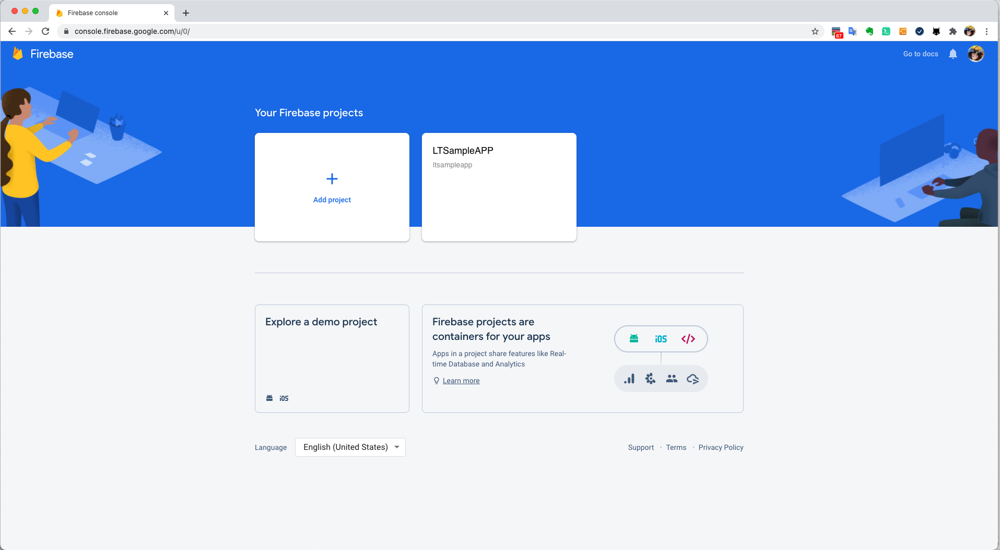
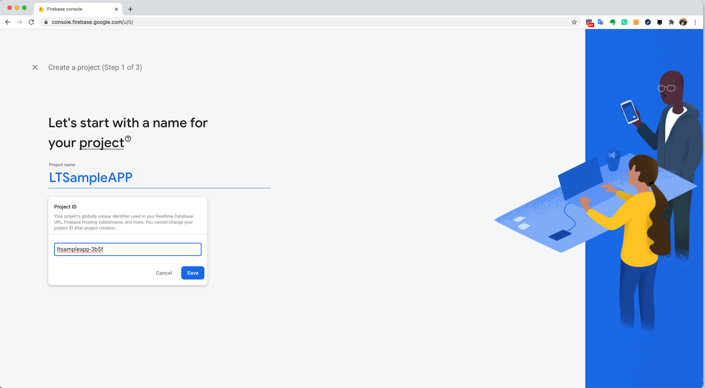
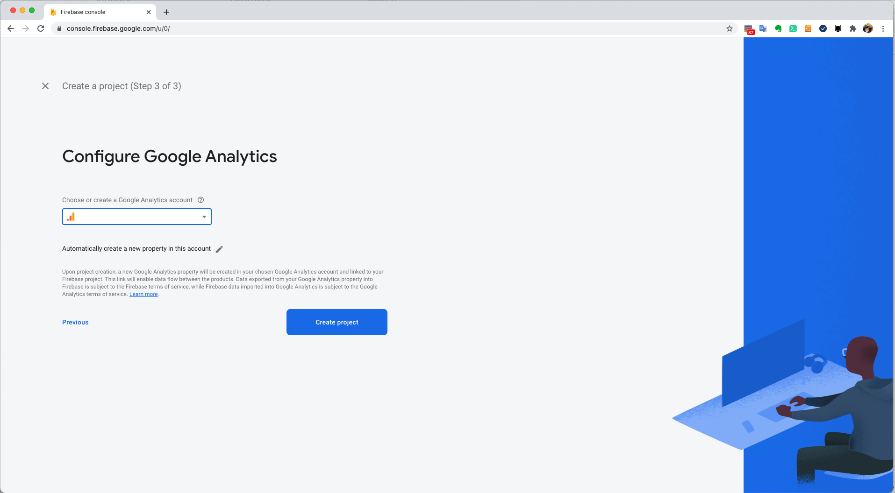
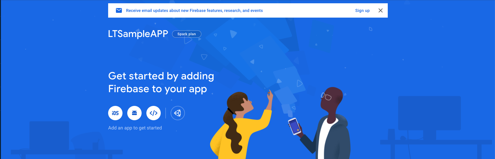
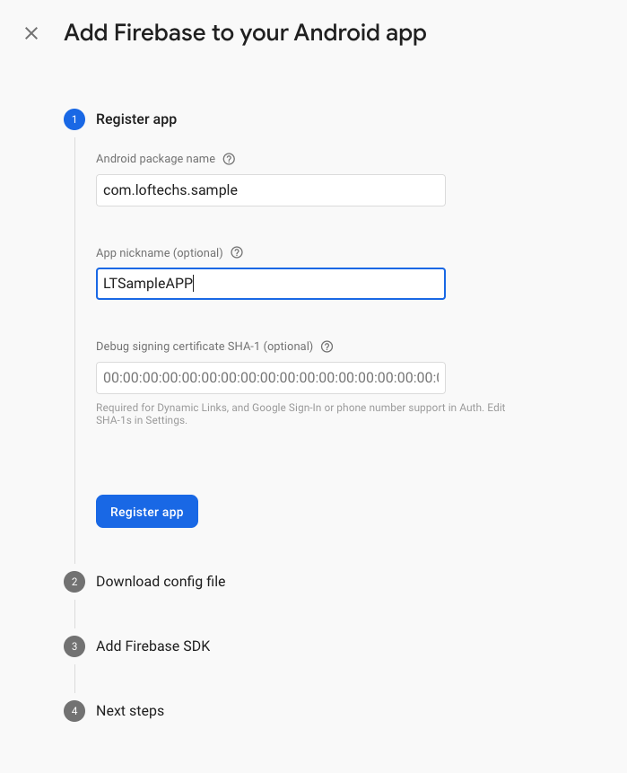
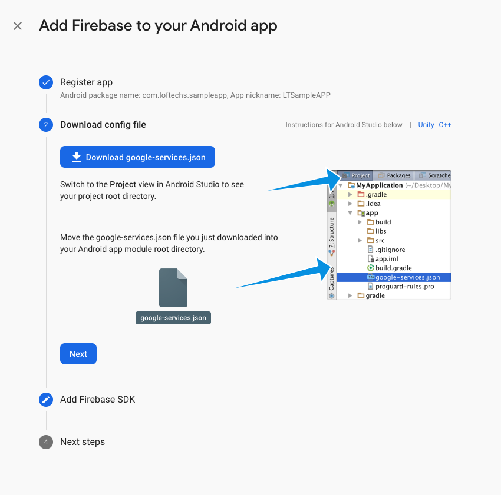
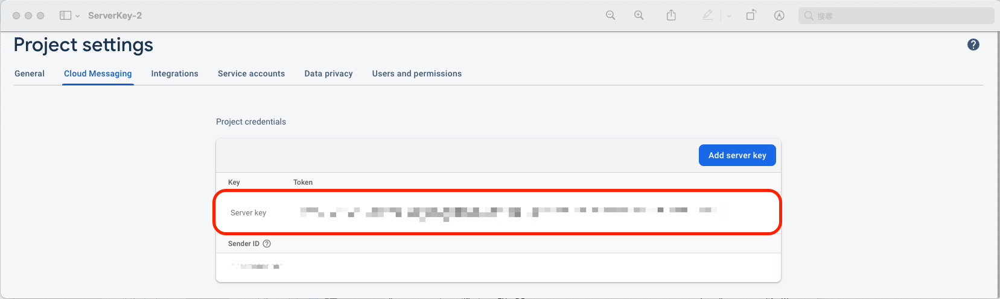
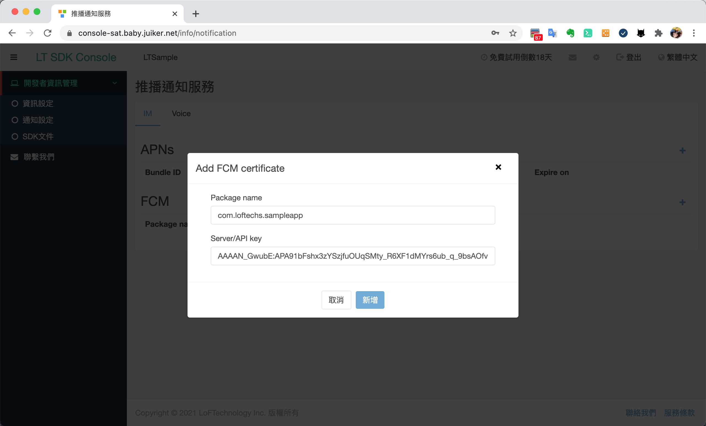

# LT IM SDK Android Document

<sub>Last update time: 2024/01/17</sub>

---

## Overview

With LT SDK, you can build your own customized application with Call and IM function. This documentary provides a guideline that demonstrates how to build and configure an in-app message and call using LT SDK.

1. At the first beginning, you must create user account/login/password to continue the following process.
2. In order to connect to the LT service please read the [Authentication](#authentication).
3. Support Version:

    Android 5.0 (API level 21) or higher ;</br>
    Java 8 or higher ;</br>
    Gradle 7.3.3 or higher ;</br>
    Support Program language：Java, Kotlin

## Try the sample app

The sample application has the core functions of our LT SDK. Download the app from our GitHub repository to get an idea of what you can build with the SDK and start building in your project.

[Download sample app](https://github.com/LoFTechs/LTIMSmaple-Android-Kotlin)

## Getting started

### Import SDK

Step 1. Add MavenCentral to your repositories in your project level build.gradle file:

```java
allprojects {
    repositories {
        mavenCentral()
    }
}
```

Step 2. Add the library as a dependency in your module level build.gradle file:

[](https://search.maven.org/search?q=g:%22com.loftechs.sdk%22%20AND%20a:%22lt%22)

```java
def LTSDK_version = "5.x.y"
implementation "com.loftechs.sdk:lt:$LTSDK_version-SNAPSHOT"
implementation "com.loftechs.sdk:im:$LTSDK_version-SNAPSHOT"

```

Step 3. Grant system permissions n your module level AndroidManifest.xml file:

```java
<uses-permission android:name="android.permission.INTERNET" />

```

## Authentication

### Init SDK

In the beginning, you must initialize **LTSDK** instance by passing the **LTSDKOptions** of your App as an argument to a parameter in the `LTSDK.init()` method. When initializing your App, you need to call `LTSDK.init()` in the onCreate method of the application class.

Note: Before switching users, be sure to call [Clean SDK](#clean-sdk)

```java
LTSDKOptions options = LTSDKOptions.builder()
                .context(this)
                .licenseKey("licenseKey")
                .url("https://xxx.xxx.net")
                .userID(userID)
                .uuid(uuID)
                .build();

LTSDK.init(options).subscribe(new Observer<Boolean>() {
            @Override
            public void onSubscribe(Disposable d) {

            }

            @Override
            public void onNext(Boolean aBoolean) {
                Log.i("CHECK", "SampleApp init:" + aBoolean);
            }

            @Override
            public void onError(Throwable e) {

            }

            @Override
            public void onComplete() {

            }
        });
```

#### The definition of LTSDKOptions parameters

| Parameter  | Definition | Necessity | Detail                      |
| :--------- | :--------- | :-------- | :-------------------------- |
| context    | Context    | Requierd  | Android context object      |
| licenseKey | String     | Requierd  | LT ID                       |
| url        | String     | Requierd  | LT authenticate url         |
| userID     | String     | Requierd  | LT unique user ID           |
| uuid       | String     | Requierd  | LT unique user authenticate |

### Start SDK

You can get user's information by calling `LTSDK.getInstance().getUsers()` method.

```java
LTSDK.getInstance().getUsers().subscribe(new io.reactivex.Observer<LTUsers>() {
    @Override
    public void onSubscribe(Disposable d) {

    }

    @Override
    public void onNext(LTUsers users) {
        //Get user info
    }

    @Override
    public void onError(Throwable e) {
        //Error
        if(e instanceof LTErrorInfo) {
            int returnCode = ((LTErrorInfo) e).getReturnCode();
            String errorMessage = ((LTErrorInfo) e).getErrorMessage();
        }
    }

    @Override
    public void onComplete() {

    }
});
```

#### The definition of LTusers parameters

| Parameter   | Definition | Detail                            |
| :---------- | :--------- | :-------------------------------- |
| userID      | String     | LT unique user ID                 |
| uuid        | String     | LT unique user authenticate       |
| phoneNumber | String     | User's phone number               |
| semiUID     | String     | Customized unique key to register |
| deviceID    | String     | LT unique device ID               |
| accountSrc  | String     | LT account source                 |

### Get user status

Get the status of other users through their respective phoneNumbers or semiUIDs.

Query with semiUIDs, using `LTSDK.getInstance().getUserStatusWithSemiUIDs()` method.

```java
List<String> semiUIDs = new ArrayList<>();
semiUIDs.add("semiUID1");
LTSDK.getInstance(). getUserStatusWithSemiUIDs(semiUIDs)
    .subscribe(new io.reactivex.Observer<List<LTUserStatus>>() {
        @Override
        public void onSubscribe(Disposable d) {

        }

        @Override
        public void onNext(List<LTUserStatus> userStatuses) {
            //Get other user info
        }

        @Override
        public void onError(Throwable e) {
            //Error
            if(e instanceof LTErrorInfo) {
                int returnCode = ((LTErrorInfo) e).getReturnCode();
                String errorMessage = ((LTErrorInfo) e).getErrorMessage();
            }
        }

        @Override
        public void onComplete() {

        }
    });
```

#### LTUserStatus

| Parameter   | Definition | Detail                    |
| :---------- | :--------- | :------------------------ |
| userID      | String     | user's LT unique ID       |
| email       | String     | user's email              |
| phoneNumber | String     | user's phoneNumber        |
| semiUID     | String     | user's custom ID          |
| corpID      | String     | User's corp ID            |
| brandID     | String     | User's brand ID           |
| canVOIP     | String     | User enable VoIP feature. |
| canIM       | String     | user enable IM feature.   |

### Clean SDK

When your App was logged in with different users or when the return code of `LTSDK.init` from `LTErrorInfo` is 6000, be sure to call `LTSDK.clean` or `LTSDK.cleanData`.

```java
LTSDK.cleanData().subscribe(new io.reactivex.Observer<Boolean>() {
        @Override
        public void onSubscribe(Disposable d) {

        }

        @Override
        public void onNext(Boolean aBoolean) {
            //success
        }

        @Override
        public void onError(Throwable e) {
            //Clean SDK error
        }

        @Override
        public void onComplete() {

        }
    });
```

### Delete User

The `deletePrimaryUser` method can be used when the user needs to be removed from the server, it will delete the current user and clear the internal data.

```java
LTSDK.deletePrimaryUser().subscribe(new io.reactivex.Observer<LTResponse>() {
        @Override
        public void onSubscribe(Disposable d) {

        }

        @Override
        public void onNext(LTResponse response) {
            //success
        }

        @Override
        public void onError(Throwable e) {
            //deletePrimaryUser error
        }

        @Override
        public void onComplete() {

        }
    });
```

## Firebase Cloud Messaging

### About FCM Messages

Firebase Cloud Messaging sends notifications and messages to devices which have installed your App.

### Prerequisites

-   A device running Android 5.0 or higher, and FCM using the BoM services 26.8.0 or higher.

### Connect your App to Firebase

Adding Firebase to your app involves tasks both in the Firebase console and in your open Android project (for example, you download Firebase config files from the console, then move them into your Android project).

#### Step 1: Create a Firebase project

Before you can add Firebase to your Android app, you need to create a Firebase project to connect to your Android app.

1. In the [Firebase console](https://console.firebase.google.com/u/0/), click Add project, then select or enter a Project name.



2. (Optional) If you are creating a new project, you can edit the Project ID.
3. Click Continue.



4. (Optional) Set up Google Analytics for your project
5. Click Create project.



#### Step 2: Register your app with Firebase

To use Firebase in your Android app, you need to register your app with your Firebase project. Registering your app is often called "adding" your app to your project.  

#### Step 3: Add a Firebase configuration file

-   3.1 Add the Firebase Android configuration file to your app:
    -   3.1.1 Click Download google-services.json to obtain your Firebase Android config file (google-services.json).
    -   3.1.2 Move your config file into the module (app-level) directory of your app.



-   3.2 To enable Firebase products in your app, add the google-services plugin to your Gradle files.
    -   3.2.1 In your root-level (project-level) Gradle file (build.gradle), add rules to include the Google Services Gradle plugin. Check that you have Google's Maven repository, as well.
    -   3.2.2 In your module (app-level) Gradle file (usually app/build.gradle), apply the Google Services Gradle plugin:

```java
buildscript {

  repositories {
    // Check that you have the following line (if not, add it):
    google()
    jcenter()
    mavenCentral()
    maven {
        url "https://dl.bintray.com/videolan/Android"
    }
  }

  dependencies {
    // ...

    // Add the following line:
    classpath 'com.google.gms:google-services:4.3.15'  // Google Services plugin
  }
}

allprojects {
  // ...

  repositories {
    // Check that you have the following line (if not, add it):
    google()  // Google's Maven repository
    // ...
  }
}
```

```java
apply plugin: 'com.android.application'
// Add the following line:
apply plugin: 'com.google.gms.google-services'  // Google Services plugin

android {
  // ...
}
```

#### Step 4: Add Firebase SDKs to your app

-   4.1 Using the Firebase Android BoM, declare the dependencies for the Firebase products that you want to use in your app. Declare them in your module (app-level) Gradle file (usually app/build.gradle).

```java
dependencies {
    // Import the BoM for the Firebase platform
    implementation platform('com.google.firebase:firebase-bom:26.8.0')

    // Declare the dependencies for the Firebase Cloud Messaging and Analytics libraries
    // When using the BoM, you don't specify versions in Firebase library dependencies
    implementation 'com.google.firebase:firebase-messaging'
    implementation 'com.google.firebase:firebase-analytics'
}
```

-   4.2 Sync your app to ensure that all dependencies have the necessary versions.

### Generate server key form Firebase

#### Step 1: In the [Firebase console](https://console.firebase.google.com/u/0/), click Project settings


#### Step 2: Go to Cloud Messaging > Project credentials to obtain your server key



#### Step 3: Register to LFSDK Console

Register your server key to LFSDK server through the [LFSDK console](https://console-sat.baby.juiker.net/info/notification) as follows:



### Edit your app manifest

Add the following to your app's manifest:

-   A service that extends FirebaseMessagingService. This is required if you want to do any message handling beyond receiving notifications on apps in the background. To receive notifications in foregrounded apps, to receive data payload, to send upstream messages, and so on, you must extend this service.

```java
<service
    android:name=".java.MyFirebaseMessagingService"
    android:exported="false">
    <intent-filter>
        <action android:name="com.google.firebase.MESSAGING_EVENT" />
    </intent-filter>
</service>
```

### Retrieve the current registration token

When you need to retrieve the current token, call `FirebaseMessaging.getInstance().getToken()`

```java
FirebaseMessaging.getInstance().getToken()
    .addOnCompleteListener(new OnCompleteListener<String>() {
        @Override
        public void onComplete(@NonNull Task<String> task) {
          if (!task.isSuccessful()) {
            Log.w(TAG, "Fetching FCM registration token failed", task.getException());
            return;
          }

          // Get new FCM registration token
          String token = task.getResult();

          // Log and toast
          String msg = getString(R.string.msg_token_fmt, token);
          Log.d(TAG, msg);
          Toast.makeText(MainActivity.this, msg, Toast.LENGTH_SHORT).show();
        }
    });

```

### Monitor token generation

The onNewToken callback fires whenever a new token is generated.

```java
/**
 * There are two scenarios when onNewToken is called:
 * 1) When a new token is generated on initial app startup
 * 2) Whenever an existing token is changed
 * Under #2, there are three scenarios when the existing token is changed:
 * A) App is restored to a new device
 * B) User uninstalls/reinstalls the app
 * C) User clears app data
 */
public class MyFirebaseMessagingService extends FirebaseMessagingService {
    private static final String TAG = MyFirebaseMessagingService.class.getSimpleName();
    @Override
    public void onNewToken(String token) {
        Log.d(TAG, "Refreshed token: " + token);

        // If you want to send messages to this application instance or
        // manage this apps subscriptions on the server side, send the
        // FCM registration token to your app server.
        sendRegistrationToServer(token);
    }
}

```

### Update FCM Token To LT Server

Update this refreshedToken to your app server.

```java
try {
    String key = "update_key";
    boolean cleanOld = true;   //true: clean old key
    LTSDK.getInstance().updateNotificationKey(key, cleanOld).subscribe(new io.reactivex.Observer<LTResponse>() {
        @Override
        public void onSubscribe(Disposable d) {

        }

        @Override
        public void onNext(LTResponse response) {
            // reponse for server
        }

        @Override
        public void onError(Throwable e) {
            //Error
        }

        @Override
        public void onComplete() {

        }
    });
} catch (LTSDKNoInitializationException e) {
    e.printStackTrace();
}

```

#### Request parameters description

| Parameter | Definition | Detail |
| :-- | :-- | :-- |
| key | String | FCM API Token |
| cleanOld | boolean | Clean the tokens of previous devices that login using the same userID |

#### Response parameters description - **LTResponse**

| Parameter | Definition | Detail |
| :-- | :-- | :-- |
| returnCode | int | Please refer to [Appendix A. Other Error Code List](#appendix-a-other-error-code-list) |
| returnMsg | String | result message |

### Handling messages

To receive messages, use a service that extends FirebaseMessagingService. Your service should override the onMessageReceived and onDeletedMessages callbacks. It should handle any message within 20 seconds of receipt (10 seconds on Android Marshmallow). The time window may be shorter depending on OS delays incurred ahead of calling onMessageReceived. After that time, various OS behaviors such as Android O's background execution limits may interfere with your ability to complete your work. For more information see our overview on message priority. onMessageReceived is provided for most message types, with the following exceptions:

-   Notification messages delivered when your app is in the background. In this case, the notification is delivered to the device’s system tray. A user tap on a notification opens the app launcher by default.
-   Messages with both notification and data payload, when received in the background. In this case, the notification is delivered to the device’s system tray, and the data payload is delivered in the extras of the intent of your launcher Activity. In summary:

| App state | Notification | Data | Both |
| :-- | :-- | :-- | :-- |
| Foreground | onMessageReceived | onMessageReceived | onMessageReceived |
| Background | System tray | onMessageReceived | Notification: system tray Data: in extras of the intent. |

```java
public class MyFirebaseMessagingService extends FirebaseMessagingService {
    private static final String TAG = MyFirebaseMessagingService.class.getSimpleName();

    @Override
    public void onMessageReceived(RemoteMessage remoteMessage) {
        super.onMessageReceived(remoteMessage);
        Log.d(TAG, "From: " + remoteMessage.getFrom());
        // Check if message contains a notification payload.
        if (remoteMessage.getNotification() != null) {
            Log.d(TAG, "Message Notification Body: " + remoteMessage.getNotification().getBody());
        }
        ...
    }
}
```

## Start IM

Please use `LTSDK.getInstance().getIMManager` to get **LTIMManager** object, and use **LTIMManager** object to operate connection related services. While using the API, please refer to [RX](https://github.com/ReactiveX/RxJava) to know how to subscribe the response, and bring **transID** on every query. The **transID** is an exclusive ID for this API.

### Connect

Before use all the API, must first query `LTIMManager.connect`, and set IMReceiver to receive IM event (please refer [Receive Event](#receive-event)). After calling `LTIMManager.connect`, you can have the connection from **LTCallbackResultListener**, and start to use the IM API service.

```java
try {
    LTIMManager imManager = LTSDK.getInstance().getIMManager(userID);
    imManager.setManagerListener(new IMReceiver());
    imManager.connect(new LTCallbackResultListener<Boolean>() {
        @Override
        public void onResult(Boolean result) {
            // connect success
        }

        @Override
        public void onError(LTErrorInfo errorInfo) {

        }
    });
} catch (ClassNotFoundException e) {
    Log.d(TAG, "ClassNotFoundException:" + e.getMessage());
} catch (LTSDKNoInitializationException e) {
    Log.d(TAG, "LTSDKNoInitializationException:" + e.getMessage());
}
```

### Disconnect

If IM service is no longer needed, call `LTIMManager.disconnect` to disconnect IM service. Strongly suggest to disconnect in background, so as to reduce unnecessary background operations.

```java
try {
    LTIMManager imManager = LTSDK.getInstance().getIMManager(userID);
    imManager.disconnect(new LTCallbackResultListener<Boolean>() {
        @Override
        public void onResult(Boolean result) {
            // disconnect success
        }

        @Override
        public void onError(LTErrorInfo errorInfo) {

        }
    });
} catch (ClassNotFoundException e) {
    Log.d(TAG, "ClassNotFoundException:" + e.getMessage());
} catch (LTSDKNoInitializationException e) {
    Log.d(TAG, "LTSDKNoInitializationException:" + e.getMessage());
}
```

### Detect Connection

Query `LTIMManager.isConnected` to detect connection when necessary.

```java
booelan isConnected = imManager.isConnected();
```

## Channel

Channel is a delivered path of messages. If you don't have any channel, you should create a channel before sending messages.

Obtain **LTChannelHelper** from **LTIMManager** and call channel funtions.

```java
LTIMManager imManager = LTSDK.getInstance().getIMManager(userID);
LTChannelHelper channelHelper = imManager.getChannelHelper();
// Call channel functions...
```

### Create Single Channel

Single channel is for two users in a chatroom to send messages, it is unique for these two specific users. As being specific, there is no need to delete or kick off, and both members has equal right and privilege, so no role setting for **LTMemberModel** required.

**LTMemberModel** object has been set for member information, it was built before the the channel created, then bring in `LTIMManager.getChannelHelper().createSingleChannel()` for single channel.

```java
LTMemberModel memberModel =LTMemberModel.builder()
        .userID("userID")
        .chNickname("Paul")
        .build();

imManager.getChannelHelper().createSingleChannel("transID", memberModel)
    .subscribe(new io.reactivex.Observer<LTCreateChannelResponse>() {
        @Override
        public void onSubscribe(Disposable d) {

        }

        @Override
        public void onNext(LTCreateChannelResponse createChannelResponse) {
            //get LTCreateChannelResponse result
        }

        @Override
        public void onError(Throwable e) {
            if(e instanceof LTErrorInfo) {
                int returnCode = ((LTErrorInfo) e).getReturnCode();
                String errorMessage = ((LTErrorInfo) e).getErrorMessage();
            }
        }

        @Override
        public void onComplete() {

        }
    });
```

### Create Group Channel

Group Channel is a multi members chatroom, every channel is unique. Once the channel is dismissed, the chatroom doesn't exist any more. In group channel, member's privilege can be set in **LTMemberModel**, and bring in `LTIMManager.getChannelHelper().createGroupChannel`. Besides, the difference from single channel is that the chatroom's ID and displayed name can be defined. Examples as:

```java
Set<LTMemberModel> memberModelSet = new HashSet<>();
LTMemberModel memberModel =LTMemberModel.builder()
        .userID("userIDA")
        .chNickname("Paul")
        .roleID(LTChannelRole.PARTICIPANT)
        .build();
memberModelSet.add(memberModel);

memberModel =LTMemberModel.builder()
        .userID("userIDB")
        .chNickname("Hugo")
        .roleID(LTChannelRole.PARTICIPANT)
        .build();
memberModelSet.add(memberModel);
imManager.getChannelHelper().createGroupChannel("transID", "chID", "First Group Room", memberModelSet)
    .subscribe(new io.reactivex.Observer<LTCreateChannelResponse>() {
        @Override
        public void onSubscribe(Disposable d) {

        }

        @Override
        public void onNext(LTCreateChannelResponse createChannelResponse) {
            //get LTCreateChannelResponse result
        }

        @Override
        public void onError(Throwable e) {
            if(e instanceof LTErrorInfo) {
                int returnCode = ((LTErrorInfo) e).getReturnCode();
                String errorMessage = ((LTErrorInfo) e).getErrorMessage();
            }
        }

        @Override
        public void onComplete() {

        }
    });
```

### Set Channel

After channel is created, channel related setting can be edited, including:

#### Channel Preference

**Channel Preference** means user oneself's exclusive setting in this chatroom and the setting value can only be obtained by user oneself. When any setting is successful, such channel preference shall be sent back.

-   **Mute**: set the chatroom to be silent. If you want to turn the notification off, set it as true, if not, set it as false.

```java
imManager.getChannelHelper().setChannelMute("transID", "chID", true)
    .subscribe(new io.reactivex.Observer<LTChannelPreferenceResponse>() {
        @Override
        public void onSubscribe(Disposable d) {

        }

        @Override
        public void onNext(LTChannelPreferenceResponse channelPreferenceResponse) {
            //get LTChannelPreferenceResponse result
        }

        @Override
        public void onError(Throwable e) {
            if(e instanceof LTErrorInfo) {
                int returnCode = ((LTErrorInfo) e).getReturnCode();
                String errorMessage = ((LTErrorInfo) e).getErrorMessage();
            }
        }

        @Override
        public void onComplete() {

        }
    });
```

-   **RingTone**: setting for the ringtone of the chatroom, can also change the way the ringtone sync, e.g. the route or the corresponding source ID.

```java
imManager.getChannelHelper().setChannelRingTone("transID","chID","ringTonePath")
    .subscribe(new io.reactivex.Observer<LTChannelPreferenceResponse>() {
        @Override
        public void onSubscribe(Disposable d) {

        }

        @Override
        public void onNext(LTChannelPreferenceResponse channelPreferenceResponse) {
            //get LTChannelPreferenceResponse result
        }

        @Override
        public void onError(Throwable e) {
            if(e instanceof LTErrorInfo) {
                int returnCode = ((LTErrorInfo) e).getReturnCode();
                String errorMessage = ((LTErrorInfo) e).getErrorMessage();
            }
        }

        @Override
        public void onComplete() {

        }
    });
```

-   **Nickname**: setting for the chatroom's nickname, this nickname shall be shown in all member's chatroom.

```java
imManager.getChannelHelper().setChannelUserNickname("transID","chID","tree")
    .subscribe(new io.reactivex.Observer<LTChannelPreferenceResponse>() {
        @Override
        public void onSubscribe(Disposable d) {

        }

        @Override
        public void onNext(LTChannelPreferenceResponse channelPreferenceResponse) {
            //get LTChannelPreferenceResponse result
        }

        @Override
        public void onError(Throwable e) {
            if(e instanceof LTErrorInfo) {
                int returnCode = ((LTErrorInfo) e).getReturnCode();
                String errorMessage = ((LTErrorInfo) e).getErrorMessage();
            }
        }

        @Override
        public void onComplete() {

        }
    });
```

#### Channel Profile

**Channel Profile**: means the setting for the chatroom, all members shall received the same info. If some member edited it, he shall receive the setting value and also can receive other member's edits [Receiver Event - Channel](#channel-1) too.

-   **Subject**: setting the chatroom's name

```java
imManager.getChannelHelper().setChannelSubject("transID","chID","New Subject")
    .subscribe(new io.reactivex.Observer<LTChannelProfileResponse>() {
        @Override
        public void onSubscribe(Disposable d) {

        }

        @Override
        public void onNext(LTChannelProfileResponse channelProfileResponse) {
            //get LTChannelProfileResponse result
        }

        @Override
        public void onError(Throwable e) {
            if(e instanceof LTErrorInfo) {
                int returnCode = ((LTErrorInfo) e).getReturnCode();
                String errorMessage = ((LTErrorInfo) e).getErrorMessage();
            }
        }

        @Override
        public void onComplete() {

        }
    });
```

-   **Avatar**: chatroom's avatar/icon

Setting chatroom's avatar

```java
Uri imageUri = Uri.parse(Environment.getExternalStorageDirectory() + "/Download/image.jpg");
imManager.getChannelHelper().setChannelAvatar("transID","chID",imageUri)
    .subscribe(new io.reactivex.Observer<LTChannelProfileFileResponse>() {
        @Override
        public void onSubscribe(Disposable d) {

        }

        @Override
        public void onNext(LTChannelProfileFileResponse channelProfileFileResponse) {
            //get LTChannelProfileFileResponse result
        }

        @Override
        public void onError(Throwable e) {
            if(e instanceof LTErrorInfo) {
                int returnCode = ((LTErrorInfo) e).getReturnCode();
                String errorMessage = ((LTErrorInfo) e).getErrorMessage();
            }
        }

        @Override
        public void onComplete() {

        }
    });
```

Delete chatroom's avatar

```java

LTFileInfo fileinfo = channelProfileResponse.getChannelProfile().get("profileImageFileInfo");

imManager.getChannelHelper().deleteChannelAvatar("transID","chID",fileinfo)
    .subscribe(new io.reactivex.Observer<LTChannelProfileFileResponse>() {
        @Override
        public void onSubscribe(Disposable d) {

        }

        @Override
        public void onNext(LTChannelProfileFileResponse channelProfileFileResponse) {
            //get LTChannelProfileFileResponse result
        }

        @Override
        public void onError(Throwable e) {
            if(e instanceof LTErrorInfo) {
                int returnCode = ((LTErrorInfo) e).getReturnCode();
                String errorMessage = ((LTErrorInfo) e).getErrorMessage();
            }
        }

        @Override
        public void onComplete() {

        }
    });
```

-   **CustomAttr**: setting chatroom's customization requirement, can edit the attribute, using bit concept to expand display requirement with flexibility.

```java
int chat_highline = 1<<0;
int chat_encrypt= 1<<1;
int customAttr = chat_highline | chat_encrypt;
imManager.getChannelHelper().setChannelCustomAttr("transID","chID", customAttr)
    .subscribe(new io.reactivex.Observer<LTChannelProfileResponse>() {
        @Override
        public void onSubscribe(Disposable d) {

        }

        @Override
        public void onNext(LTChannelProfileResponse channelProfileResponse) {
            //get LTChannelProfileResponse result
        }

        @Override
        public void onError(Throwable e) {
            if(e instanceof LTErrorInfo) {
                int returnCode = ((LTErrorInfo) e).getReturnCode();
                String errorMessage = ((LTErrorInfo) e).getErrorMessage();
            }
        }

        @Override
        public void onComplete() {

        }
    });
```

### Get Channel

This chapter shall introduce how to obtain information about a channel.

#### Channel Information

Query `LTIMManager.getChannelHelper().queryChannel()` to obtain channel information. Using different parameters to get specific channel information. Parameter can prioritize member's information first, when it's set as false, you can also obtain the info from [Get Member](#get-member). As the dataload is heavy, please do use batch mechanism to avoid heavy loading. Suggest one batch to be 30 data at one batch.

-   Get a chatroom with specified ID:

```java
imManager.getChannelHelper().queryChannel("transID", "chID", true)
    .subscribe(new io.reactivex.Observer<LTQueryChannelsResponse>() {
        @Override
        public void onSubscribe(Disposable d) {

        }

        @Override
        public void onNext(LTQueryChannelsResponse queryChannelsResponse) {
            //get LTQueryChannelsResponse result
        }

        @Override
        public void onError(Throwable e) {
            if(e instanceof LTErrorInfo) {
                int returnCode = ((LTErrorInfo) e).getReturnCode();
                String errorMessage = ((LTErrorInfo) e).getErrorMessage();
            }
        }

        @Override
        public void onComplete() {

        }
    });
```

-   Get chatroom with specified type

```java
int batchCount = 30;
imManager.getChannelHelper().queryChannelList( "transID", Collections.singletonList(LTChannelType.GROUP), true, batchCount)).subscribe(new io.reactivex.Observer<LTQueryChannelsResponse>() {
    @Override
    public void onSubscribe(Disposable d) {

    }

    @Override
    public void onNext(LTQueryChannelsResponse queryChannelsResponse) {
         //get LTQueryChannelsResponse result
    }

    @Override
    public void onError(Throwable e) {
        if(e instanceof LTErrorInfo) {
                int returnCode = ((LTErrorInfo) e).getReturnCode();
                String errorMessage = ((LTErrorInfo) e).getErrorMessage();
            }
    }

    @Override
    public void onComplete() {

    }
});
```

-   Get changes after specific time:

```java
imManager.getChannelHelper().queryChannelList("transID", 1608797454000L, true, 30))
    .subscribe(new io.reactivex.Observer<LTQueryChannelsResponse>() {
        @Override
        public void onSubscribe(Disposable d) {

        }

        @Override
        public void onNext(LTQueryChannelsResponse queryChannelsResponse) {
           //get LTQueryChannelsResponse result
        }

        @Override
        public void onError(Throwable e) {
            if(e instanceof LTErrorInfo) {
                int returnCode = ((LTErrorInfo) e).getReturnCode();
                String errorMessage = ((LTErrorInfo) e).getErrorMessage();
            }
        }

        @Override
        public void onComplete() {

        }
    });
```

#### Channel Read Time

Chatroom reading time can be used to count unread counts and all related unread functions. Can use `LTIMManager.getChannelHelper(). queryChannelsReadTime()` with **lastChID** and **count** parameters. **lastChID** can bring in the chatroom ID from the previous time to get the next batch of chatrooms. If it's the first batch, please use `null` to capture from the first chatroom.

```java
imManager.getChannelHelper().queryChannelsReadTime("transID", "lastChID", 100))
    .subscribe(new io.reactivex.Observer<LTQueryChannelsReadTimeResponse>() {
        @Override
        public void onSubscribe(Disposable d) {

        }

        @Override
        public void onNext(LTQueryChannelsReadTimeResponse queryChannelsReadTimeResponse) {
            //get LTQueryChannelsReadTimeResponse result
        }

        @Override
        public void onError(Throwable e) {
            if(e instanceof LTErrorInfo) {
                int returnCode = ((LTErrorInfo) e).getReturnCode();
                String errorMessage = ((LTErrorInfo) e).getErrorMessage();
            }
        }

        @Override
        public void onComplete() {

        }
    });
```

#### Unread Channels

Get unread chatroom and all unread counts.

```java
imManager.getChannelHelper().queryUnreadChannels("transID"))
    .subscribe(new io.reactivex.Observer<LTQueryUnreadChannelsResponse>() {
        @Override
        public void onSubscribe(Disposable d) {

        }

        @Override
        public void onNext(LTQueryUnreadChannelsResponse queryUnreadChannelsResponse) {
            //get LTQueryUnreadChannelsResponse result
        }

        @Override
        public void onError(Throwable e) {
            if(e instanceof LTErrorInfo) {
                int returnCode = ((LTErrorInfo) e).getReturnCode();
                String errorMessage = ((LTErrorInfo) e).getErrorMessage();
            }
        }

        @Override
        public void onComplete() {

        }
    });
```

### Delete Channel

when need to delete a channel, with privilege, query `LTIMManager.getChannelHelper().dismissChannel()`.

```java
imManager.getChannelHelper().dismissChannel("transID","chID")
    .subscribe(new io.reactivex.Observer<LTDismissChannelResponse>() {
        @Override
        public void onSubscribe(Disposable d) {

        }

        @Override
        public void onNext(LTDismissChannelResponse dismissChannelResponse) {
            //get LTDismissChannelResponse result
        }

        @Override
        public void onError(Throwable e) {
            if(e instanceof LTErrorInfo) {
                int returnCode = ((LTErrorInfo) e).getReturnCode();
                String errorMessage = ((LTErrorInfo) e).getErrorMessage();
            }
        }

        @Override
        public void onComplete() {

        }
    });
```

## Channel Member

Obtain **LTChannelHelper** from **LTIMManager** and call channel member funtions.

```java
LTIMManager imManager = LTSDK.getInstance().getIMManager(userID);
LTChannelHelper channelHelper = imManager.getChannelHelper();
// Call channel member functions...
```

### Invite Member

If privileged to invite a member, query `LTIMManager.getChannelHelper().inviteMembers()` to invite an outside member to the chatroom. Use **LTJoinMethod** to calculate the invitation, bring `null` if not necessary.

```java
LTMemberModel memberModel =LTMemberModel.builder()
    .userID("userIDA")
    .chNickname("Paul")
    .roleID(LTChannelRole.MODERATOR)
    .build();
memberModelSet.add(memberModel);

memberModel =LTMemberModel.builder()
    .userID("userIDB")
    .chNickname("Hugo")
    .roleID(LTChannelRole.MODERATOR)
    .build();
memberModelSet.add(memberModel);

imManager.getChannelHelper().inviteMembers("transID","chID", memberModelSet, LTJoinMethod.NORMAL)
    .subscribe(new io.reactivex.Observer<LTInviteMemberResponse>() {
        @Override
        public void onSubscribe(Disposable d) {

        }

        @Override
        public void onNext(LTInviteMemberResponse inviteMemberResponse) {
            //get LTInviteMemberResponse result
        }

        @Override
        public void onError(Throwable e) {
            if(e instanceof LTErrorInfo) {
                int returnCode = ((LTErrorInfo) e).getReturnCode();
                String errorMessage = ((LTErrorInfo) e).getErrorMessage();
            }
        }

        @Override
        public void onComplete() {

        }
    });
```

### Kick Member

If privileged to kick a member, query `LTIMManager.getChannelHelper().inviteMembers()` to kick a specific member out of the chatroom.

```java
Set<LTMemberModel> memberModelSet = new HashSet<>();
LTMemberModel memberModel =LTMemberModel.builder()
    .userID("userIDA")
    .build();
memberModelSet.add(memberModel);

memberModel =LTMemberModel.builder()
    .userID("userIDB")
    .build();
memberModelSet.add(memberModel);

imManager.getChannelHelper().kickMembers("transID","chID", memberModelSet)
    .subscribe(new io.reactivex.Observer<LTKickMemberResponse>() {
        @Override
        public void onSubscribe(Disposable d) {

        }

        @Override
        public void onNext(LTKickMemberResponse kickMemberResponse) {
            //get LTKickMemberResponse result
        }

        @Override
        public void onError(Throwable e) {
            if(e instanceof LTErrorInfo) {
                int returnCode = ((LTErrorInfo) e).getReturnCode();
                String errorMessage = ((LTErrorInfo) e).getErrorMessage();
            }
        }

        @Override
        public void onComplete() {

        }
    });
```

### Join

The difference with Invite is that invite is the invitee is invited to join by others, and Join can actively join the chatroom. If the chatroom has the privilege to join, query `LTIMManager.getChannelHelper().joinChannel()`. Join, like Invite, can bring the setting by **LTJoinMethod** and **byWho** to count and match the invitee info, bring `null` if not necessary.

```java
imManager.getChannelHelper().joinChannel("transID","chID", LTJoinMethod.NORMAL, "byWho")
    .subscribe(new io.reactivex.Observer<LTJoinChannelResponse>() {
        @Override
        public void onSubscribe(Disposable d) {

        }

        @Override
        public void onNext(LTJoinChannelResponse joinChannelResponse) {
            //get LTChannelProfileResponse result
        }

        @Override
        public void onError(Throwable e) {
            if(e instanceof LTErrorInfo) {
                int returnCode = ((LTErrorInfo) e).getReturnCode();
                String errorMessage = ((LTErrorInfo) e).getErrorMessage();
            }
        }

        @Override
        public void onComplete() {

        }
    });
```

### Leave

If privileged to leave, query `LTIMManager.getChannelHelper().leaveChannel()` to leave the chatroom.

```java
imManager.getChannelHelper().leaveChannel("transID","chID")
    .subscribe(new io.reactivex.Observer<LTLeaveChannelResponse>() {
        @Override
        public void onSubscribe(Disposable d) {

        }

        @Override
        public void onNext(LTLeaveChannelResponse leaveChannelResponse) {
            //get LTLeaveChannelResponse result
        }

        @Override
        public void onError(Throwable e) {
            if(e instanceof LTErrorInfo) {
                int returnCode = ((LTErrorInfo) e).getReturnCode();
                String errorMessage = ((LTErrorInfo) e).getErrorMessage();
            }
        }

        @Override
        public void onComplete() {

        }
    });
```

### Set Member

If privileged to edit a member's role, query `LTIMManager.getChannelHelper().setMemberRole()`. Most common scenario is when the group admin leaves the chatroom, he needs to assign a member to be admin before leaving.

```java
imManager.getChannelHelper().setMemberRole("transID","chID", "userIDA", LTChannelRole.MODERATOR)
    .subscribe(new io.reactivex.Observer<LTMemberRoleResponse>() {
        @Override
        public void onSubscribe(Disposable d) {

        }

        @Override
        public void onNext(LTMemberRoleResponse memberRoleResponse) {
            //get LTMemberRoleResponse result
        }

        @Override
        public void onError(Throwable e) {
            if(e instanceof LTErrorInfo) {
                int returnCode = ((LTErrorInfo) e).getReturnCode();
                String errorMessage = ((LTErrorInfo) e).getErrorMessage();
            }
        }

        @Override
        public void onComplete() {

        }
    });
```

### Get Member

#### Member Information

Based on roles and privileges, get member result could be different. The higher privilege, the more roles can be edited. Use `LTIMManager.getChannelHelper().queryChannelMembersByChID()` to capture member list. Suggest to capture info in batch, **lastUserID** is the previous batch user ID, if it's the first time, use `null`.

```java
imManager.getChannelHelper().queryChannelMembersByChID("transID","chID", "lastUserID", 100)
    .subscribe(new io.reactivex.Observer<LTQueryChannelMembersResponse>() {
        @Override
        public void onSubscribe(Disposable d) {

        }

        @Override
        public void onNext(LTQueryChannelMembersResponse queryChannelMembersResponse) {
            //get LTChannelProfileResponse result
        }

        @Override
        public void onError(Throwable e) {
            if(e instanceof LTErrorInfo) {
                int returnCode = ((LTErrorInfo) e).getReturnCode();
                String errorMessage = ((LTErrorInfo) e).getErrorMessage();
            }
        }

        @Override
        public void onComplete() {

        }
    });
```

#### Member Read Info

Get member read info by using `LTIMManager.getChannelHelper().queryChannelReadInfo()` to get the chatroom's member read info. Use the time of read to decide status

```java
imManager.getChannelHelper().queryChannelReadInfo("transID","chID")
    .subscribe(new io.reactivex.Observer<LTQueryChannelReadInfoResponse>() {
        @Override
        public void onSubscribe(Disposable d) {

        }

        @Override
        public void onNext(LTQueryChannelReadInfoResponse queryChannelReadInfoResponse) {
            //get LTQueryChannelReadInfoResponse result
        }

        @Override
        public void onError(Throwable e) {
            if(e instanceof LTErrorInfo) {
                int returnCode = ((LTErrorInfo) e).getReturnCode();
                String errorMessage = ((LTErrorInfo) e).getErrorMessage();
            }
        }

        @Override
        public void onComplete() {

        }
    });
```

## Message

Obtain **LTMessageHelper** from **LTIMManager** and call message funtions.

```java
LTIMManager imManager = LTSDK.getInstance().getIMManager(userID);
LTMessageHelper messageHelper = imManager.getMessageHelper();
// Call message functions...
```

### Send Message

This chapter introduces LTIMSDK message sending and message types.

#### Messages

Below is what LTIMSDK supports in messge type, with following chapters of message sending [Send Message](#send-message), [Send Scheduled Messages](#send-scheduled-messages), [Send Broadcast Messages](#send-broadcast-messages).

-   Text Message is for general text messages. To avoid overloading, limit the messages in 8000 characters. Text message supports tag type, use tag to specify specific member. specified member can be marked by using **LTTagUser**, accompanied by **start** and **length** in **LTTagUser** the displayed way replaced in **msgContent**.

```java
List<LTTagUser> tagUsers = new ArrayList<>();
LTTagUser tagUsers = LTTagUser.builder()
    .userID("userIDA")
    .start(0)
    .length(4)
    .build();

LTTextMessage.builder()
    .transID(transID)
    .chID(chID)
    .chType(chType)
    .msgContent("@Paul, How are you?")
    .tagUsers(tagUsers)
    .build();

```

-   Sticker Message: this sticker message can be LT owned stickers or replaced by self-defined sticker. When using self-defined sticker, use **msgContent** to acquire the sticker, such as the sticker file source.

```java
LTStickerMessage stickMessage = LTStickerMessage.builder()
    .transID(transID)
    .chID(chID)
    .chType(chType)
    .msgContent("690d1a03-b9c5-ae30-046b-24936dc97c46,3013,2")
    .build();
```

-   Image Message: If using **LTImageMessage** to send a message, the message shall be sent to LT designated cloud space. If other designated space is required, use **LTCustomMessage** to customize the sending. In **LTImageMessage**, can send the original image or thumbnail file path by using the client's local files. LT also provides an **extInfo** column for attached info, such as the dimension of the image to be displayed on the image.

```java
Uri imageUri = Uri.parse(Environment.getExternalStorageDirectory() + File.separator + "Download/ef05f74a-90f7-4f69-94cb-d588fa435bae.png");
Uri thUri = Uri.parse(Environment.getExternalStorageDirectory() + File.separator + "Download/ef05f74a-90f7-4f69-94cb-d588fa435bae.png");

Map<String, Object> extInfoMap = new HashMap<>();
extInfoMap.put("width", 360);
extInfoMap.put("height", 422);

LTImageMessage imageMessage = LTImageMessage.builder()
    .transID(transID)
    .chID(chID)
    .chType(chType)
    .imageUri(imageUri)
    .thumbnailUri(thUri)
    .extInfo(extInfoMap)
    .displayFileName("android.png")
    .build();
```

-   Video Message: if using **LTVideoMessage** to send a video message, the message shall be sent to LT designated cloud space. If other designated space is required, use **LTCustomMessage** to customize the sending. In **LTVideoMessage**, can send original video or thumbnail file path by using client's local files. LT also provides an extInfo column for attached info, such as the dimension of the image to be displayed on the image.

```java
Uri videoUri = Uri.parse(Environment.getExternalStorageDirectory() + File.separator + "Download/test.mp4");
Uri thumbnailUri = Uri.parse(Environment.getExternalStorageDirectory() + File.separator + "Download/images.jpeg");

Map<String, Object> extInfoMap = new HashMap<>();
extInfoMap.put("width", 360);
extInfoMap.put("height", 422);

LTVideoMessage videoMessage = LTVideoMessage.builder()
    .transID(transID)
    .chID(chID)
    .chType(chType)
    .videoUri(videoUri)
    .thumbnailUri(thumbnailUri)
    .extInfo(extInfoMap)
    .displayFileName("android.mp4")
    .build();
```

-   Voice Message: if using **LTVoiceMessage** to send a voice message, the message shall be sent to LT designated cloud space. If other designated space is required, use **LTCustomMessage** to customize the sending. In **LTVoiceMessage**, can send original video or thumbnail file path by using client's local files. LT also provides an extInfo column for attached info, such as the dimension of the image to be displayed on the image.

```java
Uri voiceUri = Uri.parse(Environment.getExternalStorageDirectory() + File.separator + "Download/27dc2d02-a0df-47d9-9443-f8678356e25e.aac");

Map<String, Object> extInfoMap = new HashMap<>();
extInfoMap.put("duration", "00:05:30");

LTVoiceMessage voiceMessage = LTVoiceMessage.builder()
    .transID(transID)
    .chID(chID)
    .chType(chType)
    .voiceUri(voiceUri)
    .extInfo(extInfoMap)
    .displayFileName("voice.aac")
    .build();
```

-   Location Message: together with [Google Map](https://developers.google.com/maps/documentation/android-sdk/map) to get location info, assorted data for **LTLocation** parameter in sending **LTLocationMessage**

```java
LTLocation location = LTLocation.builder()
        .address("No.5, Shaoxing N. St., Zhongzheng Dist., Taipei City, Taiwan (R.O.C.)")
        .latitude(25.04492228152394)
        .longitude(121.52542401563323)
        .build();
LTLocationMessage locationMessage = LTLocationMessage.builder()
        .transID(transID)
        .chID(chID)
        .chType(chType)
        .location(location)
        .build();
```

-   Contact Message: if using **LTContactMessage** to send a contact message, the message shall be sent to LT designated cloud space. If other designated space is required, use **LTCustomMessage** to customize the sending. In **LTContactMessage**, can send original contact info or thumbnail file path by using client's local files. LT also provides an extInfo column for attached info, such as the contact displayed name on the image.

```java
Uri contactUri = Uri.parse(Environment.getExternalStorageDirectory() + File.separator + "Download/27dc2d02-a0df-47d9-9443-f8678356e25e.vcf");
Uri thumbnailUri = Uri.parse(Environment.getExternalStorageDirectory() + File.separator + "Download/images.jpeg");

Map<String, Object> extInfoMap = new HashMap<>();
extInfoMap.put("displayName", "Ann");

LTContactMessage.builder()
    .transID(transID)
    .chID(chID)
    .chType(chType)
    .contactUri(contactUri) // vcard
    .thumbnailUri(thumbnailUri)
    .displayFileName(Ann.vcf)
    .extInfo(extInfoMap)
    .build());
```

-   Document Message: If using **LTDocumentMessage** to send a document message, the message shall be sent to LT designated cloud space. If other designated space is required, use **LTCustomMessage** to customize the sending. In **LTDocumentMessage**, can send original contact info or thumbnail file path by using client's local files. LT also provides an **extInfo** column for attached info, such as the file size to be displayed on the image.

```java
Uri documentUri = Uri.parse(Environment.getExternalStorageDirectory() + File.separator + "Download/27dc2d02-a0df-47d9-9443-f8678356e25e.doc");

Map<String, Object> extInfoMap = new HashMap<>();
extInfoMap.put("fileSize", "5MB");

LTDocumentMessage.builder()
    .transID(transID)
    .chID(chID)
    .chType(chType)
    .fileUri(documentUri)
    .displayFileName(Document.doc)
    .extInfo(extInfoMap)
    .build();
```

-   Customized Message: if the requirement goes beyond any above message types, use **LTCustomMessage** to send a customized message.Use Json format for **msgContent** and **LTMessageAttribute** to set the message action pattern.

**LTMessageAttribute**

| Parameter | Description |
| --- | --- |
| SAVE_MSG | The message would be stored by the server. |
| SEND_ONLINE_USER | The message status would be synced to other online members who has the same channel. |
| SEND_IN_CHANNEL_USER | The message status would be synced to other online member who are also happened to be in the same channel. |
| SEND_NOTIFICATION | The message would stimulate notification. |
| ADD_UNREAD_COUNT | The message would show “read/unread”. |
| UPDATE_CHANNEL_LAST_MSG | The message would be updated to appear in the chatroom list. |

```java
int attributes = LTMessageAttribute.SAVE_MSG | LTMessageAttribute.SEND_NOTIFICATION;

LTCustomMessage.builder()
    .transID(transID)
    .chID(chID)
    .chType(chType)
    .msgContent("{\"title\":\"titleA\",\"body\":\"body!!\",\"note\":\"note\"}")
    .msgCategory("msg_custom")
    .attributes(attributes)
    .extInfo(extInfoMap)
    .build());
```

#### Relpy Messages

Reply messages : can reply to specified parrent [Messages](#messages), and also can reply all type of child [Messages](#messages).The way to specify parrent message is to use **LTReplyMessage** to bring in child message. **LTReplyMessage** will bring the success delivery info of the parent message in designated parameter. In addition, **msgID** of parent message needs to be brought in child message as **parentMsgID**. When child message is set, use [Send Message](#send-message) to send. Following is an image and text message sending example.

-   Image message (Parent message) replies to a text message (child message)

```java
LTReplyMessage replyMessage = LTReplyMessage.builder()
    .msgID("cec95048-9e62-11ea-9c63-599b39045450")
    .msgType(LTMessageType.TYPE_TEXT)
    .sendTime(1590054366458L)
    .senderID("senderUserID")
    .senderNickname("Ann")
    .build();

Uri imageUri = Uri.parse(Environment.getExternalStorageDirectory() + File.separator + "Download/ef05f74a-90f7-4f69-94cb-d588fa435bae.png");
Uri thUri = Uri.parse(Environment.getExternalStorageDirectory() + File.separator + "Download/ef05f74a-90f7-4f69-94cb-d588fa435bae.png");

Map<String, Object> extInfoMap = new HashMap<>();
extInfoMap.put("width", 360);
extInfoMap.put("height", 422);

LTImageMessage imageMessage = LTImageMessage.builder()
    .transID(transID)
    .chID(chID)
    .chType(chType)
    .imageUri(imageUri)
    .thumbnailUri(thUri)
    .extInfo(extInfoMap)
    .displayFileName("android.png")
    .replyMessage(replyMessage)
    .parentMsgID("cec95048-9e62-11ea-9c63-599b39045450")
    .build();

```

-   Text message (child message) replies to an image message (Parent message)

```java
LTReplyMessage replyMessage = LTReplyMessage.builder()
    .msgID("9a3a8afa-06f8-11eb-9c63-1a2e0f0676dd")
    .msgType(LTMessageType.TYPE_IMAGE)
    .sendTime(1601895037417L)
    .senderID("senderUserID")
    .senderNickname("Ann")
    .fileInfo(fileInfo)
    .thumbnailFileInfo(thumbnailFileInfo)
    .build();

LTTextMessage textMessage = LTTextMessage.builder()
    .transID(transID)
    .chID(chID)
    .chType(chType)
    .msgContent("1234")
    .replyMessage(replyMessage)
    .parentMsgID("07a9dd94-d5f7-11ea-9c63-1a2d5b06220d")
    .build();

```

#### Send Message

When sending all types of [Messages](#messages) and [Relpy Messages](#reply_messages), use `LTIMManager.getMessageHelper().sendMessage()` to send it. After delivery is successful, shall receive the result of **LTSendMessageResponse**. **LTMessage** can be transformed into the object of all types of [Messages](#messages), and obtain its exclusive info. Please refer to the following example:

```java
LTTextMessage textMessage = LTTextMessage.builder()
    .transID(transID)
    .chID(chID)
    .chType(chType)
    .msgContent("1234")
    .build();

imManager.getMessageHelper().sendMessage(textMessage)
    .subscribe(new io.reactivex.Observer<LTSendMessageResponse>() {
        @Override
        public void onSubscribe(Disposable d) {

        }

        @Override
        public void onNext(LTSendMessageResponse response) {

            // get LTSendMessageResponse result
            String msgContent = ((LTTextMessage) message).getMsgContent();

            // get LTFileMessageResponse result
            if (response instanceof LTFileMessageResponse) {
                LTFileMessageResponse fileMessageResponse = (LTFileMessageResponse) response;
                // file
                if (fileMessageResponse.getFileMessageStatus() == LTFileMessageStatus.STATUS_FILE) {
                    for (LTFileTransferResult result : fileMessageResponse.getFileTransferResults()) {
                        LTFileType fileType = result.getFileType();
                        LTStorageManager.StorageStatus status = result.getStatus();
                        long loadingBytes = result.getLoadingBytes();
                        long totalLength = result.getTotalLength();
                    }
                // message
                } else if(fileMessageResponse.getFileMessageStatus() == LTFileMessageStatus.STATUS_MESSAGE) {
                    //origin
                    LTFileInfo fileInfo = ((LTImageMessage) message).getFileInfo();
                    //thumbnail
                    LTFileInfo thumbnailFileInfo = ((LTImageMessage) message).getThumbnailFileInfo();
                }
            }
        }

        @Override
        public void onError(Throwable e) {
            if(e instanceof LTErrorInfo) {
                int returnCode = ((LTErrorInfo) e).getReturnCode();
                String errorMessage = ((LTErrorInfo) e).getErrorMessage();
            }
        }

        @Override
        public void onComplete() {

        }
    });
```

### Send Broadcast Messages

[Send Message](#send-message) can send any-type of message to any specified contact or channel. If want to send multiple messages please use `LTIMManager.getMessageHelper().sendBroadcastMessages()` to send multiple contacts or chatrooms. After broadcasting messages, it shall receive the sending result from **LTBroadcastMessageResponse** to see if it's a successful delivery. The broadcast message shall be received in [Receive Event-Message](#message-2).

```java
LTTextMessage textMessage = LTTextMessage.builder()
    .transID(transIDA)
    .msgContent("message")
    .build();
LTStickerMessage stickMessage = LTStickerMessage.builder()
    .transID(transIDB)
    .msgContent("690d1a03-b9c5-ae30-046b-24936dc97c46,3013,2")
    .build();

Uri imageUri = Uri.parse(Environment.getExternalStorageDirectory() + File.separator + "Download/ef05f74a-90f7-4f69-94cb-d588fa435bae.png");
Uri thUri = Uri.parse(Environment.getExternalStorageDirectory() + File.separator + "Download/ef05f74a-90f7-4f69-94cb-d588fa435bae.png");
Map<String, Object> extInfoMap = new HashMap<>();
extInfoMap.put("width", 360);
extInfoMap.put("height", 422);

LTImageMessage imageMessage = LTImageMessage.builder()
    .transID(transIDC)
    .imageUri(imageUri)
    .thumbnailUri(thUri)
    .extInfo(extInfoMap)
    .displayFileName("android.png")
    .build();

List<LTMessage> messages = new ArrayList<>();
messages.add(textMessage);
messages.add(stickMessage);
messages.add(imageMessage);

List<String> chIDs = new ArrayList<>();
chIDs.add("chID");

imManager.getMessageHelper().sendBroadcastMessages(transIDE, chIDs, messages)
	.subscribe(new io.reactivex.Observer<LTBroadcastMessageResponse>() {
        @Override
        public void onSubscribe(Disposable d) {

        }

        @Override
        public void onNext(LTBroadcastMessageResponse messageResponse) {
            //get LTBroadcastMessageResponse result
        }

        @Override
        public void onError(Throwable e) {
            if(e instanceof LTErrorInfo) {
                int returnCode = ((LTErrorInfo) e).getReturnCode();
                String errorMessage = ((LTErrorInfo) e).getErrorMessage();
            }
        }

        @Override
        public void onComplete() {

        }
    });
```

### Send Scheduled Messages

When sending messages to contact or chatrooms in the specified time to deliver, please use `LTIMManager.getMessageHelper().sendScheduledMessages()` sending scheduled message with specified `timeToSend` is a scheduled time tag. `timeToSend` must be set for at least 1 minute and maximum in 30 days. When time is up, the message shall be received in [Receive Event-Message](#message-2) and the sender shall also receive a sent-success signal.

```java
LTTextMessage textMessage = LTTextMessage.builder()
    .transID(transID)
    .msgContent("message")
    .build();
LTStickerMessage stickMessage = LTStickerMessage.builder()
    .transID(transID)
    .msgContent("690d1a03-b9c5-ae30-046b-24936dc97c46,3013,2")
    .build();

Uri imageUri = Uri.parse(Environment.getExternalStorageDirectory() + File.separator + "Download/ef05f74a-90f7-4f69-94cb-d588fa435bae.png");
Uri thUri = Uri.parse(Environment.getExternalStorageDirectory() + File.separator + "Download/ef05f74a-90f7-4f69-94cb-d588fa435bae.png");
Map<String, Object> extInfoMap = new HashMap<>();
extInfoMap.put("width", 360);
extInfoMap.put("height", 422);

LTImageMessage imageMessage = LTImageMessage.builder()
    .transID(transID)
    .imageUri(imageUri)
    .thumbnailUri(thUri)
    .extInfo(extInfoMap)
    .displayFileName("android.png")
    .build();

List<LTMessage> messages = new ArrayList<>();
messages.add(textMessage);
messages.add(stickMessage);
messages.add(imageMessage);

List<String> chIDs = new ArrayList<>();
chIDs.add("chID");

imManager.getMessageHelper().sendScheduledMessages(transID, chIDs, messages, timeToSend)
    .subscribe(new io.reactivex.Observer<LTScheduledMessageResponse>() {
        @Override
        public void onSubscribe(Disposable d) {

        }

        @Override
        public void onNext(LTScheduledMessageResponse messageResponse) {
            //get LTScheduledMessageResponse result
        }

        @Override
        public void onError(Throwable e) {
            if(e instanceof LTErrorInfo) {
                int returnCode = ((LTErrorInfo) e).getReturnCode();
                String errorMessage = ((LTErrorInfo) e).getErrorMessage();
            }
        }

        @Override
        public void onComplete() {

        }
    });
```

### Send Forward Messages

Forward an already sent message to other user or chatrooms, use `LTIMManager.getMessageHelper().sendForwardMessages()` to forward all types of messages. No need to format the message, just bring in the `msgID` would be good. After forwarding, `LTForwardMessageResponse` shall notify if it's successfully sent. The forwarded message shall be seen in [Receive Event-Message](#message-2).

```java
List<String> chIDs = new ArrayList<>();
chIDs.add("chID");

List<String> msgIDs = new ArrayList<>();
msgIDs.add("msgIDA");
msgIDs.add("msgIDB");

imManager.getMessageHelper().sendForwardMessages(transID, chIDs, msgIDs)
	.subscribe(new io.reactivex.Observer<LTForwardMessageResponse>() {
	    @Override
	    public void onSubscribe(Disposable d) {

	    }

	    @Override
	    public void onNext(LTForwardMessageResponse messageResponse) {
	        //get LTForwardMessageResponse result
	    }

	    @Override
	    public void onError(Throwable e) {
	        if(e instanceof LTErrorInfo) {
                int returnCode = ((LTErrorInfo) e).getReturnCode();
                String errorMessage = ((LTErrorInfo) e).getErrorMessage();
            }
	    }

	    @Override
	    public void onComplete() {

	    }
	});
```

### Get Message

#### Message

Get messages by query `LTIMManager.getMessageHelper().queryMessage()` by using different parameters to get different info. Can specify one chatroom or all chatrooms in parameters, please use `chID` to specify chatroom, or please use `null` if not. Capture messages by designated timing and set it as forward or backward capture, please use markTS and afterN. When afterN is a positive number means to capture data from the time stamp; if it's set as a negative time, means to capture data before the time stamp. Suggest to set it within positive/negative 30, never go beyond 100.

```java
long markTS = System.currentTimeMillis();
int afterN = -30;
imManager.getMessageHelper().queryMessage(transID, chID, markTS, afterN))
    .subscribe(new io.reactivex.Observer<LTQueryMessageResponse>() {
        @Override
        public void onSubscribe(Disposable d) {

        }

        @Override
        public void onNext(LTQueryMessageResponse queryMessageResponse) {
            //get LTQueryMessageResponse result
        }

        @Override
        public void onError(Throwable e) {
            if(e instanceof LTErrorInfo) {
                int returnCode = ((LTErrorInfo) e).getReturnCode();
                String errorMessage = ((LTErrorInfo) e).getErrorMessage();
            }
        }

        @Override
        public void onComplete() {

        }
    });
```

#### File

When get all typs of files, use **LTStorageManager** to query `LTStorageManager.execute` to obtain the file. Can bring **LTFileInfo** in to **LTStorageAction** parameters. **LTFileInfo** can be get from **LTSendMessageResponse**

The define method of LTStorageAction

| Method                         | Description             |
| :----------------------------- | :---------------------- |
| createDownloadFileAction()     | get the downloaded file |
| createDownloadFileLinkAction() | get the downloaded link |
| createUploadFileAction()       | upload file             |
| createDeleteFileAction()       | delete file             |

```java
LTMessage message = LTSendMessageResponse.getMessage();


int expireMinute =30;

//origin
LTFileInfo fileInfo = ((LTImageMessage) message).getFileInfo();
File file = new File("/output/file/path");
LTStorageAction action = LTStorageAction.createDownloadFileAction(fileInfo, file);

//thumbnail
LTFileInfo thumbnailFileInfo = ((LTImageMessage) message).getThumbnailFileInfo();
File thumbnailFile = new File("/output/thumbnailFile/path");
LTStorageAction actionThumbnail = LTStorageAction.createDownloadFileAction(thumbnailFileInfo, thumbnailFile);

List<LTStorageAction> actions = new ArrayList<>();
actions.add(action);
actions.add(actionThumbnail);

LTStorageManager storageManager = null;
try {
    storageManager = LTSDK.getInstance().getStorageManager("userID");
    storageManager.execute(actions)
        .subscribe(new io.reactivex.Observer<List<LTStorageResult>>() {
            @Override
            public void onSubscribe(Disposable d) {

            }

            @Override
            public void onNext(List<LTStorageResult> storageResults) {
                for (LTStorageResult result : storageResults) {
                    String id = result.getId();
                    LTStorageManager.StorageStatus status = result.getStatus();
                    long loadingBytes = result.getLoadingBytes();
                    long totalLength = result.getTotalLength();
                }
            }

            @Override
            public void onError(Throwable e) {

            }

            @Override
            public void onComplete() {

            }
        });
} catch (ClassNotFoundException e) {
    e.printStackTrace();
} catch (LTNoPermissionException e) {
    e.printStackTrace();
} catch (LTSDKNoInitializationException e) {
    e.printStackTrace();
}
```

### Read Message

This chapter shall introduce how to implement Read Message.

#### Set Read

Use `LTIMManager.getMessageHelper().markRead()` to send Read status. Set read is to bring `sendTime` of the read-message into the parameter. Please notice that once the read-message is set as read, all previous messages shall be set as been read too.The scenario is when the user enters a chatroom, or receives an instant message while in the room, the `sendTime` when the user sends the last message shall be set as all messages read, so there is no need to set every message to be read. Chatroom members' read status can be received from [Receive Event-Message](#message-2).

```java
long sendTime = 1608797454000L
imManager.getMessageHelper().markRead(transID, chID, sendTime))
    .subscribe(new Observer<LTMarkReadResponse>() {
        @Override
        public void onSubscribe(Disposable d) {

        }

        @Override
        public void onNext(LTMarkReadResponse markReadResponse) {
    	    //get LTMarkReadResponse result
        }

        @Override
        public void onError(Throwable e) {
            if(e instanceof LTErrorInfo) {
                int returnCode = ((LTErrorInfo) e).getReturnCode();
                String errorMessage = ((LTErrorInfo) e).getErrorMessage();
            }
        }

        @Override
        public void onComplete() {

        }
    });
```

#### Get Read

Understanding how to set oneself's read status from [Set Read](#set-read), now goes to the way to get the other members' read status. After chatroom members set rad in [Set Read](#set-read), can receive member's read status from [Receive Event-Message](#message-2). By the member's last read time, received from `LTMarkReadResponse`, we can learn this member's read status in this chatroom. If the member has sent read status but he's offline to receive the read status, can query [Member Read Info](#member-read-info) when back online to get channel members' read status.

Besides member's read status, we also provide read status for every single message.

-   MessageReadCount: can bring multiple messages to query the message read count.

```java
List<String> msgIDs = new ArrayList<>();
msgIDs.add("msgIDA");
msgIDs.add("msgIDB");

imManager.getMessageHelper().queryMessageReadCount(transID, msgIDs))
    .subscribe(new Observer<LTQueryMessageReadCountResponse>() {
        @Override
        public void onSubscribe(Disposable d) {

        }

        @Override
        public void onNext(LTQueryMessageReadCountResponse queryMessageReadCountResponse) {
    	  //get LTQueryMessageReadCountResponse result
        }

        @Override
        public void onError(Throwable e) {
    	  if(e instanceof LTErrorInfo) {
                int returnCode = ((LTErrorInfo) e).getReturnCode();
                String errorMessage = ((LTErrorInfo) e).getErrorMessage();
            }
        }

        @Override
        public void onComplete() {

        }
    });
```

-   MessageReadUsers: can bring sepcified message read list. To avoid overloading, LT provides capture by batch. `lastReadTime` can bring up the last user's read time in the last batch. If it's the first time, please bring `null`.

```java
imManager.getMessageHelper().queryMessageReadUsers(transID, msgID, lastReadTime, count))
    .subscribe(new Observer<LTQueryMessageReadUsersResponse>() {
        @Override
        public void onSubscribe(Disposable d) {

        }

        @Override
        public void onNext(LTQueryMessageReadUsersResponse queryMessageReadUsersResponse) {
        //get LTQueryMessageReadUsersResponse result
        }

        @Override
        public void onError(Throwable e) {
    	  if(e instanceof LTErrorInfo) {
                int returnCode = ((LTErrorInfo) e).getReturnCode();
                String errorMessage = ((LTErrorInfo) e).getErrorMessage();
            }
        }

        @Override
        public void onComplete() {

        }
    });
```

### Delete Message

This chapter introduces the function of Delete Message.

#### Delete a messages

Delete messages would only delete onesel's messages on server, messages in other member's still exist.

```java
List<String> msgIDs = new ArrayList<>();
msgIDs.add("msgIDA");
msgIDs.add("msgIDB");

imManager.getMessageHelper().deleteMessages(transID, msgIDs))
    .subscribe(new Observer<LTDeleteMessagesResponse>() {
        @Override
        public void onSubscribe(Disposable d) {

        }

        @Override
        public void onNext(LTDeleteMessagesResponse deleteMessagesResponse) {
    	  //get LTDeleteMessagesResponse result
        }

        @Override
        public void onError(Throwable e) {
    	  if(e instanceof LTErrorInfo) {
                int returnCode = ((LTErrorInfo) e).getReturnCode();
                String errorMessage = ((LTErrorInfo) e).getErrorMessage();
            }
        }

        @Override
        public void onComplete() {

        }
	})
```

#### Delete channel messages

Delete channel messages in a chatroom would only delete onesef's messages on the server, messages in other member's still exist.

```java
imManager.getMessageHelper().deleteChannelMessages(transID, chID))
    .subscribe(new Observer<LTDeleteChannelMessageResponse>() {
        @Override
        public void onSubscribe(Disposable d) {

        }

        @Override
        public void onNext(LTDeleteChannelMessageResponse deleteChannelMessageResponse) {
        //get LTDeleteChannelMessageResponse result
        }

        @Override
        public void onError(Throwable e) {
    	  if(e instanceof LTErrorInfo) {
                int returnCode = ((LTErrorInfo) e).getReturnCode();
                String errorMessage = ((LTErrorInfo) e).getErrorMessage();
            }
        }

        @Override
        public void onComplete() {

        }
    });
```

#### Delete all messages

Delete all messages would only delete onesef's all messages on the server, messages in other member's still exist.

```java
imManager.getMessageHelper().deleteAllMessages(transID))
    .subscribe(new Observer<LTDeleteAllMessagesResponse>() {
        @Override
        public void onSubscribe(Disposable d) {

        }

        @Override
        public void onNext(LTDeleteAllMessagesResponse deleteAllMessagesResponse) {
    	//get LTDeleteAllMessagesResponse result
        }

        @Override
        public void onError(Throwable e) {
    	  if(e instanceof LTErrorInfo) {
                int returnCode = ((LTErrorInfo) e).getReturnCode();
                String errorMessage = ((LTErrorInfo) e).getErrorMessage();
            }
        }

        @Override
        public void onComplete() {

        }
    });
```

### Recall messages

Recall messages shall influence other member's query messages. Recall messages are only valid for the sender to recall his own messages. System log can be set to be shown or not shown. Use `silentMode` to decide the system log. Set `silentMode` as true, the chatroom would not only receive the signal of the recall message but also delete the message. If you wish to show the system log, please set `silentMode` as false, the chatroom would receive the signal of the recall message, but keep the recalled messages.

```java
imManager.getMessageHelper().recallMessages(transID, messageIDList, false))
    .subscribe(new Observer<LTRecallMessagesResponse>() {
        @Override
        public void onSubscribe(Disposable d) {

        }

        @Override
        public void onNext(LTRecallMessagesResponse recallMessagesResponse) {
        //get LTRecallMessagesResponse result
        }

        @Override
        public void onError(Throwable e) {
    	  if(e instanceof LTErrorInfo) {
                int returnCode = ((LTErrorInfo) e).getReturnCode();
                String errorMessage = ((LTErrorInfo) e).getErrorMessage();
            }
        }

        @Override
        public void onComplete() {

        }
    });
```

## User

User set values, including global nickname, avatar info and notification settings…etc.

```java
LTIMManager imManager = LTSDK.getInstance().getIMManager(userID);
LTUserHelper userHelper = imManager.getUserHelper();
// Call user functions...
```

### Set User

This chapter shall introduce the user's settings.

#### Set User Notification Setting

-   Notification Token: set user's exclusive token for every device. How to get a token, please refer to [Firebase Cloud Messaging](#firebase-cloud-messaging).

```java
imManager.getUserHelper().setUserPushToken(transID, key))
    .subscribe(new Observer<LTUserPushTokenResponse>() {
        @Override
        public void onSubscribe(Disposable d) {

        }

        @Override
        public void onNext(LTUserPushTokenResponse userPushTokenResponse) {
    	//get LTUserPushTokenResponse result
        }

        @Override
        public void onError(Throwable e) {
    	  if(e instanceof LTErrorInfo) {
                int returnCode = ((LTErrorInfo) e).getReturnCode();
                String errorMessage = ((LTErrorInfo) e).getErrorMessage();
            }
        }

        @Override
        public void onComplete() {

        }
    });
```

-   Notification Display: set sender's name and content in notification.

| Parameter     | Description                   |
| :------------ | :---------------------------- |
| hidingSender  | if False : no sender's name   |
| hidingContent | if False : no message content |

```java
boolean hidingSender = true;
boolean hidingContent = true;

imManager.getUserHelper().SetUserDeviceNotifyPreview(transID, hidingSender, hidingContent))
    .subscribe(new Observer<LTUserDeviceNotifyPreviewResponse>() {
        @Override
        public void onSubscribe(Disposable d) {

        }

        @Override
        public void onNext(LTUserDeviceNotifyPreviewResponse userDeviceNotifyPreviewResponse) {
            //get LTUserDeviceNotifyPreviewResponse result
        }

        @Override
        public void onError(Throwable e) {
            if(e instanceof LTErrorInfo) {
                int returnCode = ((LTErrorInfo) e).getReturnCode();
                String errorMessage = ((LTErrorInfo) e).getErrorMessage();
            }
        }

        @Override
        public void onComplete() {

        }
    });
```

-   Notification Sound: set notification sound info.

| Parameter | Description                          |
| :-------- | :----------------------------------- |
| soundType | Sound type, set 1 for Android.       |
| soundID   | Sound ID, set sound path or sound ID |

```java
int soundType = 1;
String soundID = "xxxxx.mp3";

imManager.getUserHelper().setDeviceNotifySound(transID, soundType, soundID))
    .subscribe(new Observer<LTUserDeviceNotifySoundResponse>() {
        @Override
        public void onSubscribe(Disposable d) {

        }

        @Override
        public void onNext(LTUserDeviceNotifySoundResponse userDeviceNotifySoundResponse) {
        //get LTUserDeviceNotifySoundResponse result
        }

        @Override
        public void onError(Throwable e) {
    	  if(e instanceof LTErrorInfo) {
                int returnCode = ((LTErrorInfo) e).getReturnCode();
                String errorMessage = ((LTErrorInfo) e).getErrorMessage();
            }
        }

        @Override
        public void onComplete() {

        }
    });
```

-   Notification Mute: set notification as mute or do not disturb mode.

| Parameter | Description |
| :-- | :-- |
| muteAll | If true, no notifications. |
| time | Do not disturb mode. Set time tag. no notification before this time tag. Please notice that if muteAll was set true, do not disturb mode shall be invalid. If no need, please set `null`. |

```java
boolean muteAll = true;
Long time = null;

imManager.getUserHelper().setUserDeviceMute(transID, muteAll, time))
    .subscribe(new Observer<LTUserDeviceMuteResponse>() {
        @Override
        public void onSubscribe(Disposable d) {

        }

        @Override
        public void onNext(LTUserDeviceMuteResponse userDeviceMuteResponse) {
    	  //get LTUserDeviceMuteResponse result
        }

        @Override
        public void onError(Throwable e) {
    	  if(e instanceof LTErrorInfo) {
                int returnCode = ((LTErrorInfo) e).getReturnCode();
                String errorMessage = ((LTErrorInfo) e).getErrorMessage();
            }
        }

        @Override
        public void onComplete() {

        }
    });
```

#### Set User Profile

Edit user profile: once set, beside oneself receive the changed result, all chatroom members shall receive the same changed result.

-   User Nickname: User's global nickname

```java
imManager.getUserHelper().setUserNickname(transID, nickname)
    .subscribe(new Observer<LTSetUserProfileResponse>() {
        @Override
        public void onSubscribe(Disposable d) {

        }

        @Override
        public void onNext(LTSetUserProfileResponse setUserProfileResponse) {
        //get LTSetUserProfileResponse result
        }

        @Override
        public void onError(Throwable e) {
    	  if(e instanceof LTErrorInfo) {
                int returnCode = ((LTErrorInfo) e).getReturnCode();
                String errorMessage = ((LTErrorInfo) e).getErrorMessage();
            }
        }

        @Override
        public void onComplete() {

        }
    });
```

-   User Avatar: User's global avatar

Set Avatar

```java
Uri avatarUri = Uri.parse(Environment.getExternalStorageDirectory() + "/Download/image.jpg");

imManager.getUserHelper().setUserAvatar(transID, avatarUri)
    .subscribe(new Observer<LTUserProfileFileResponse>() {
        @Override
        public void onSubscribe(Disposable d) {

        }

        @Override
        public void onNext(LTUserProfileFileResponse userProfileFileResponse) {

            // file
            if(userProfileFileResponse.getFileMessageStatus() == LTFileMessageStatus.STATUS_FILE) {
                LTFileTransferResult result = userProfileFileResponse.getFileTransferResults().get(0);
                LTFileType fileType = result.getFileType();
                LTStorageManager.StorageStatus status = result.getStatus();
                long loadingBytes = result.getLoadingBytes();
                long totalLength = result.getTotalLength();
            }
            //  message
            else if(userProfileFileResponse.getFileMessageStatus() == LTFileMessageStatus.STATUS_MESSAGE) {
                // get LTUserProfileFileResponse result (extends LTSetUserProfileResponse)
            }
        }

        @Override
        public void onError(Throwable e) {
    	  if(e instanceof LTErrorInfo) {
                int returnCode = ((LTErrorInfo) e).getReturnCode();
                String errorMessage = ((LTErrorInfo) e).getErrorMessage();
            }
        }

        @Override
        public void onComplete() {

        }
    });
```

Delete Avatar

```java

LTFileInfo fileInfo = setUserProfileResponse.getUserProfile().get("profileImageFileInfo");

imManager.getUserHelper().deleteUserAvatar(transID, fileInfo)
    .subscribe(new Observer<LTUserProfileFileResponse>() {
        @Override
        public void onSubscribe(Disposable d) {

        }

        @Override
        public void onNext(LTUserProfileFileResponse userProfileFileResponse) {
            //  file
            if(userProfileFileResponse.getFileMessageStatus() == LTFileMessageStatus.STATUS_MESSAGE) {
                // get LTUserProfileFileResponse result (extends LTSetUserProfileResponse)
            }
        }

        @Override
        public void onError(Throwable e) {
    	  if(e instanceof LTErrorInfo) {
                int returnCode = ((LTErrorInfo) e).getReturnCode();
                String errorMessage = ((LTErrorInfo) e).getErrorMessage();
            }
        }

        @Override
        public void onComplete() {

        }
    });

```

### Get User

This chapter introduces how to get User's setting.

#### Get User Notification Setting

Get notification setting of this device.

```java
imManager.getUserHelper().queryDeviceNotify(transID))
    .subscribe(new Observer<LTQueryUserDeviceNotifyResponse>() {
        @Override
        public void onSubscribe(Disposable d) {

        }

        @Override
        public void onNext(LTQueryUserDeviceNotifyResponse queryUserDeviceNotifyResponse) {
    	// get LTQueryUserDeviceNotifyResponse result
        }

        @Override
        public void onError(Throwable e) {
    	  if(e instanceof LTErrorInfo) {
                int returnCode = ((LTErrorInfo) e).getReturnCode();
                String errorMessage = ((LTErrorInfo) e).getErrorMessage();
            }
        }

        @Override
        public void onComplete() {

        }
    });
```

#### Get User Profile

Get user profile : choose `userID` or `phoneNumber` to get user profile. Reminder: when using `phoneNumber`, `brandID` is also required for inquiry accuracy.

```java
List<String> userIDs = new ArrayList<>();
userIDs("userIDA");
userIDs("userIDB");

List<String> phoneNumbers = new ArrayList<>();
userIDs("phoneNumber1");
userIDs("phoneNumber2");

String brandID = "ltbrand";

imManager.getUserHelper().queryUserProfile(transID, userIDs, phoneNumbers, brandID))
    .subscribe(new Observer<LTQueryUserProfileResponse>() {
        @Override
        public void onSubscribe(Disposable d) {

        }

        @Override
        public void onNext(LTQueryUserProfileResponse queryUserProfileResponse) {
    	// get LTQueryUserProfileResponse result
        }

        @Override
        public void onError(Throwable e) {
    	  if(e instanceof LTErrorInfo) {
                int returnCode = ((LTErrorInfo) e).getReturnCode();
                String errorMessage = ((LTErrorInfo) e).getErrorMessage();
            }
        }

        @Override
        public void onComplete() {

        }
    });
```

## Receive Event

When set connection, please do register **LTIMManagerListener** first, can query `imManager.setManagerListener` to get **LTIMManagerListener** event. Reminder: message from the device shall only be received only on prompt response, it won't use **LTIMManagerListener** to receive again.

```java
imManager.setManagerListener(new LTIMManagerListener() {

    //Common
    @Override
    public void onConnected(String userID) {
    }

    @Override
    public void onDisconnected(String userID) {
    }

    @Override
    public void onIncomingMessage(String toUserID, LTMessageResponse messageResponse) {
    }

    //Channel
    @Override
    public void onIncomingCreateChannel(String toUserID, LTCreateChannelResponse createChannelResponse) {
    }

    @Override
    public void onIncomingDismissChannel(String toUserID, LTDismissChannelResponse dismissChannelResponse) {
    }

    @Override
    public void onIncomingChannelPreference(String toUserID, LTChannelPreferenceResponse setChannelPreferenceResponse) {
    }

    @Override
    public void onIncomingChannelProfile(String toUserID, LTChannelProfileResponse setChannelProfileResponse) {
    }

    //Channel Member
    @Override
    public void onIncomingJoinChannel(String toUserID, LTJoinChannelResponse joinChannelResponse) {
    }

    @Override
    public void onIncomingInviteMember(String toUserID, LTInviteMemberResponse inviteMemberResponse) {
    }

    @Override
    public void onIncomingKickMember(String toUserID, LTKickMemberResponse kickMemberResponse) {
    }

    @Override
    public void onIncomingLeaveChannel(String toUserID, LTLeaveChannelResponse leaveChannelResponse) {
    }

    @Override
    public void onIncomingMemberRole(String toUserID, LTMemberRoleResponse setMemberRoleResponse) {
    }

    //Message
    @Override
    public void onIncomingSendMessage(String toUserID, LTSendMessageResponse sendMessageResponse) {
    }

    @Override
    public void onIncomingScheduledMessage(String toUserID, LTScheduledMessageResponse scheduledMessageResponse) {
    }

    @Override
    public void onIncomingScheduledInDueTimeMessage(String toUserID, LTScheduledInDueTimeMessageResponse scheduledInDueTimeMessageResponse) {
    }

    @Override
    public void onIncomingMarkRead(String toUserID, LTMarkReadResponse markReadResponse) {
    }

    @Override
    public void onIncomingDeleteAllMessages(String toUserID, LTDeleteAllMessagesResponse deleteAllMessagesResponse) {
    }

    @Override
    public void onIncomingDeleteChannelMessage(String toUserID, LTDeleteChannelMessageResponse deleteChannelMessageResponse) {
    }

    @Override
    public void onIncomingDeleteMessages(String toUserID, LTDeleteMessagesResponse deleteMessagesResponse) {
    }

    @Override
    public void onIncomingRecallMessage(String toUserID, LTRecallMessagesResponse recallMessagesResponse) {
    }

    //User
    @Override
    public void onIncomingSetUserProfile(String toUserID, LTSetUserProfileResponse setUserProfileResponse) {
    }

    @Override
    public void onIncomingModifyUserProfile(String toUserID, LTModifyUserProfileResponse modifyUserProfileResponse) {
    }
});
```

### Common

| Method              | Description          |
| :------------------ | :------------------- |
| onConnected()       | Connected to server  |
| onDisconnected()    | Server disconnected  |
| onIncomingMessage() | General Signal event |

#### LTMessageResponse

| Parameter | Definition | Description |
| :-- | :-- | :-- |
| transID | String | The client's message ID in UUID format |
| chID | String | The channel ID |
| chType | LTChannelType | ChannelType are declared as Enum type, which represents different kind of Chatroom |
| msgContent | String | The message content |
| msgCategory | String | The specific message category. |
| msgID | String | The IM server generated message ID in UUID(type 1) format. |
| msgType | [LTMessageType](#appendix-b-message-type-list) | The message content by message format. |
| senderID | String | The user ID who send the message. |
| senderNickname | String | The user nickname who send the message. |
| senderProfileID | String | The user profileID who send the message. |
| sendTime | long | The message's sent time. |
| encrypted | boolean | The value is true while the message content is encrypted in database. otherwise, the value is false. |
| isRead | boolean | Whether the message is read by the receiver. |
| extInfo | String | The additional information. |
| recallStatus | [LTRecallStatus](#ltrecallstatus) | It includes the following info: Mode, Time and the one who asks Recall message. |

### Channel

| Method | Description |
| :-- | :-- |
| onIncomingCreateChannel() | Receive a create event, query [Channel Information](#channel-information) to sync channel creation info. |
| onIncomingDismissChannel() | Receive a dismiss channel event. |
| onIncomingChannelPreference() | Receive an exclusive setting value. Normally, multiple devices shall receive one user's edited setting. |
| onIncomingChannelProfile() | Receive shared setting of a chatroom. |

#### LTCreateChannelResponse

Inherit **[LTMessageResponse](#ltmessageresponse)**

| Parameter | Definition | Description |
| :-- | :-- | :-- |
| members | Set<[LTMemberProfile](#ltmemberprofile)> | The member's info. |
| count | int | The count for create members |

#### LTDismissChannelResponse

Inherit **[LTMessageResponse](#ltmessageresponse)**

#### LTChannelPreferenceResponse

Inherit **[LTMessageResponse](#ltmessageresponse)**

| Parameter | Definition | Description |
| :-- | :-- | :-- |
| channelPreference | [LTChannelPreference](#ltchannelpreference) | The `channelPreference` contains changed information, |

#### LTChannelProfileResponse

Inherit **[LTMessageResponse](#ltmessageresponse)**

| Parameter | Definition | Description |
| :-- | :-- | :-- |
| channelProfile | Map\<String, Object\> | The `channelProfile` contains changed information, including `subject` and `profileImageFileInfo`. |

### Channel Member

| Method | Description |
| :-- | :-- |
| onIncomingJoinChannel() | Receive events when other member's join |
| onIncomingInviteMember() | Receive events when been invited or other members been invited |
| onIncomingKickMember() | Receive events when being invited or other members being kicked off |
| onIncomingLeaveChannel() | Receive events when other members leaving |
| onIncomingMemberRole() | Receive events when channel member role changed |

#### LTJoinChannelResponse

Inherit **[LTMessageResponse](#ltmessageresponse)**

| Parameter | Definition                                 | Description        |
| :-------- | :----------------------------------------- | :----------------- |
| members   | Set\<[LTMemberProfile](#ltmemberprofile)\> | The member's info. |

#### LTInviteMemberResponse

Inherit **[LTMessageResponse](#ltmessageresponse)**

| Parameter | Definition | Description |
| :-- | :-- | :-- |
| members | Set<[LTMemberProfile](#ltmemberprofile)> | The member's info. |
| count | int | The count for invite members |

#### LTKickMemberResponse

Inherit **[LTMessageResponse](#ltmessageresponse)**

| Parameter | Definition | Description |
| :-- | :-- | :-- |
| members | Set<[LTMemberProfile](#ltmemberprofile)> | The member's info. |
| count | int | The count for kick members |
| reason | int | The reason for kick members, default is 0 |
| memberCount | int | The count for channel members |
| channelUpdate | int | The update tag, that is bit value. Bit0 is member role. Bit1 is channel preference. Bit2 is member changed. |

#### LTLeaveChannelResponse

Inherit **[LTMessageResponse](#ltmessageresponse)**

| Parameter | Definition | Description |
| :-- | :-- | :-- |
| members | Set<[LTMemberProfile](#ltmemberprofile)> | The member's info. |
| channelUpdate | int | The update tag, that is bit value. Bit0 is member role. Bit1 is channel preference. Bit2 is member changed. |
| memberCount | int | The count for channel members |

#### LTMemberRoleResponse

Inherit **[LTMessageResponse](#ltmessageresponse)**

| Parameter | Definition | Description |
| :-- | :-- | :-- |
| roleID | [LTChannelRole](#ltchannelrole) | The one's role ID in the channel. |
| memberUserID | String | The user ID who role changed. |

### Message

| Method | Description |
| :-- | :-- |
| onIncomingSendMessage() | Receive events when members send messages |
| onIncomingScheduledMessage() | Receive rescheduled message from a multiple-devices user |
| onIncomingScheduledInDueTimeMessage() | Receive events when a scheduled message sent |
| onIncomingMarkRead() | Receive events of members read message |
| onIncomingDeleteAllMessages() | Receive delete message from a multiple-devices user |
| onIncomingDeleteChannelMessage() | Receive delete chatroom from a multiple-devices user |
| onIncomingDeleteMessages() | Receive delete specific message from a multiple-devices user |
| onIncomingRecallMessage() | Receive events when a member recalls a message |

#### LTSendMessageResponse

Inherit **[LTMessageResponse](#ltmessageresponse)**

| Parameter | Definition | Description |
| :-- | :-- | :-- |
| message | [LTMessage](#ltmessage) | Query [Send Message](#send-message), [Send Broadcast Messages](#send-broadcast-messages) and [Send Scheduled Messages](#send-scheduled-messages) to send messages |

#### LTScheduledMessageResponse

Inherit **[LTMessageResponse](#ltmessageresponse)**

| Parameter | Definition | Description |
| :-- | :-- | :-- |
| chIDs | NSArray | The channel ID array. |
| messages | NSArray | The array of message ([LTMessage](#ltmessage)) which needed to be schedule. |
| timeToSend | long long | The time when the message will send out in millisecond. |

#### LTScheduledInDueTimeMessageResponse

Inherit **[LTMessageResponse](#ltmessageresponse)**

#### LTMarkReadResponse

Inherit **[LTMessageResponse](#ltmessageresponse)**

#### LTDeleteAllMessagesResponse

Inherit **[LTMessageResponse](#ltmessageresponse)**

#### LTDeleteChannelMessagesResponse

Inherit **[LTMessageResponse](#ltmessageresponse)**

#### LTDeleteMessagesResponse

Inherit **[LTMessageResponse](#ltmessageresponse)**

#### LTRecallMessageResponse

Inherit **[LTMessageResponse](#ltmessageresponse)**

| Parameter   | Definition | Description            |
| :---------- | :--------- | :--------------------- |
| recallMsgID | String     | recalled message msgID |

### User

| Method | Description |
| :-- | :-- |
| onIncomingSetUserProfile() | Receive user profile change from a multiple-devices user |
| onIncomingModifyUserProfile() | Receive events when chatroom member modifies profile info |

#### LTSetUserProfileResponse

Inherit **[LTMessageResponse](#ltmessageresponse)**

| Parameter | Definition | Description |
| :-- | :-- | :-- |
| userProfile | Map\<String, Object\> | Current modified[User Profile](#user-profile) value |

#### LTModifyUserProfileResponse

Inherit **[LTMessageResponse](#ltmessageresponse)**

| Parameter | Definition | Description |
| :-- | :-- | :-- |
| userProfiles | List\<Map\<String, Object\>\> | Chatroom member modified [User Profile](#user-profile) value |

**<span id="user-profile">User Profile</span>** is Map format as below, only get when changed.

| key                  | Definition              | Description        |
| :------------------- | :---------------------- | :----------------- |
| userID               | String                  | User's ID          |
| nickname             | String                  | User's nickname    |
| profileImageFileInfo | LTFileInfo(#ltfileinfo) | User's Avatar info |

## Appendix A. Other Error Code List

While requesting **failed**, you will get **ErrorResponse** which includes **returnCode** and **returnMessage** The details are as below.

| ReturnCode | Description                                                  |
| :--------: | :----------------------------------------------------------- |
|     1      | Wrong User Account or Password                               |
|     2      | Wrong Function                                               |
|     3      | Error happened in database                                   |
|     4      | PHP Error                                                    |
|     5      | Wrong EndPoint                                               |
|     6      | Error happened in Data Format                                |
|     7      | The function is unavailable                                  |
|     8      | Wrong number format                                          |
|    1000    | Unknown error                                                |
|    1001    | Not supported format                                         |
|    1002    | Not supported command                                        |
|    1003    | IM database server access error                              |
|    1004    | Request too many times for the API                           |
|    1008    | Schedule time error                                          |
|    1101    | Channel ID's format error                                    |
|    1102    | Channel ID is already exist                                  |
|    1103    | Channel type is not supported                                |
|    1104    | Channel type is not matched                                  |
|    1105    | Channel ID is not exist                                      |
|    1106    | UserID is not in the channel                                 |
|    1107    | The user is without privilege                                |
|    1108    | The number of members in the channel is below the limit      |
|    1109    | No user to kick                                              |
|    1110    | No user to ban                                               |
|    1111    | No channel preference to set                                 |
|    1112    | No user profile to set                                       |
|    1113    | The message is not belong to the user                        |
|    1114    | One of the members is not in the channel                     |
|    1115    | The number of members in the channel is over the upper limit |
|    1116    | The user is not invited in the channel                       |
|    1117    | The user is not in the channel                               |
|    1118    | Message not exist                                            |
|    1119    | Message is already sent or exist                             |
|    1120    | No user privilege to set                                     |
|    1121    | Time expire                                                  |
|    1122    | More than the number of voting                               |
|    6000    | Not current user                                             |

## Appendix B. Message Type List

Y: Yes <br> N: No <br> O: Option <br>

| msgType | insertMessage | insertLastMessage | sendXMPP | sendNotification | addUnreadCount | Comment |
| :-: | :-: | :-: | :-: | :-: | :-: | :-- |
| 1 | Y | Y | Y | Y | Y | Text message |
| 2 | Y | Y | Y | Y | Y | Sticker message |
| 3 | Y | Y | Y | Y | Y | Picture message |
| 4 | Y | Y | Y | Y | Y | Video message |
| 5 | Y | Y | Y | Y | Y | Voice message |
| 6 | Y | Y | Y | Y | Y | Contact message |
| 7 | Y | Y | Y | Y | Y | Location message |
| 8 | Y | Y | Y | Y | Y | File message |
| 101 | Y | Y | Y | Y | Y | Voting's Text Content |
| 102 | Y | N | Y | Y | Y | Voting's Sticker Content |
| 103 | Y | N | Y | Y | Y | Voting's Picture Content |
| 104 | Y | N | Y | Y | Y | Voting's Video Content |
| 105 | Y | N | Y | Y | Y | Voting's Voice Content |
| 106 | Y | N | Y | Y | Y | Voting's Contact Content |
| 107 | Y | N | Y | Y | Y | Voting's Location Content |
| 108 | Y | N | Y | Y | Y | Voting's File Content |
| 201 | N | N | N | N | N | Send scheduled message |
| 202 | Y | N | Y | Y | N | Scheduled message is sent |
| 203 | N | N | N | N | N | Send scheduled voting message |
| 204 | Y | N | Y | Y | N | Scheduled voting message is sent |
| 205 | Y | N | Y | Y | N | Send scheduled message |
| 206 | N | N | N | N | N | Scheduled message is sent |
| 221 | Y | Y | Y | N | N | user take a screenshot |
| 222 | Y | Y | Y | N | N | user make a copy of message |
| 223 | Y | Y | Y | N | N | user transfer messages to others |
| 224 | Y | Y | Y | N | N | user saved the channel's message, image, video, voice or file |
| 1001 | Y | N | Y | Y | - | create a channel |
| 1002 | Y | N | Y | N | N | dismiss a channel |
| 1003 | Y | N | Y | N | N | leave a channel |
| 1004 | Y | N | Y | Y | N | invite members to join a channel |
| 1005 | Y | N | Y | N | N | respond a channel invitation |
| 1006 | Y | N | Y | N | N | kick a member out of a channel |
| 1007 | Y | N | Y | N | N | ban a member |
| 1008 | Y | N | Y | N | N | change channel's subject |
| 1009 | Y | N | Y | N | N | change channel's profile image id |
| 1010 | Y | N | Y | N | N | change members' affiliation and role |
| 1011 | Y | N | Y | N | N | change user's preference of a channel |
| 1012 | Y | N | Y | N | N | change user's profile image id and nick name |
| 1013 | Y | N | Y | N | N | change user's profile image id and nick name in a specific channel |
| 1015 | Y | N | Y | N | N | change a channel's background image id |
| 1017 | Y | N | Y | N | N | create a channel |
| 1018 | Y | N | Y | N | N | change members' affiliation and role |
| 1101 | - | N | Y | N | N | mark read of a specific channel |
| 1102 | Y | N | Y | N | N | delete a message |
| 1103 | Y | N | Y | N | N | delete a channel's all messages |
| 1104 | Y | N | Y | N | N | recall a message |
| 1105 | Y | N | Y | N | N | delete user's all channels' all messages |
| 1106 | N | N | Y | N | N | push channel active user |
| 1201 | Y | N | Y | N | N | create a public news channel |
| 1202 | Y | N | Y | Y | Y | create a public news message of the specific channel |
| 1203 | Y | N | Y | N | N | create a corporation news channel |
| 1204 | Y | N | Y | Y | Y | create a corporation news message of the specifi corporation channel |
| 2001 | Y | N | Y | Y | N | incoming call notification |
| 2002 | Y | N | Y | Y | N | call cancel notification |
| 2003 | Y | N | Y | N | N | send CDR (call log) message |
| 3000 | O | O | O | O | O | Send customized message with attribute |
| 3001 | Y | N | Y | N | N | Customized message without notification and insert last message |
| 3002 | Y | Y | Y | Y | N | Custom message |

## Appendix C. Object List

### LTChannelRole

| Enum                     | Description                              |
| :----------------------- | :--------------------------------------- |
| LTChannelRoleNone        | Number 0, None member                    |
| LTChannelRoleOutcast     | Number 1, Outcast member                 |
| LTChannelRoleInvieted    | Number 2, Visited and not to join member |
| LTChannelRoleParticipant | Number 4, General member                 |
| LTChannelRoleModerator   | Number 8, Moderator member               |
| LTChannelRoleAdmin       | Number 16, admin member                  |

### LTRecallStatus

| Parameter | Definition | Description |
| :-- | :-- | :-- |
| silentMode | boolean | The server will response True or False accordingly. If True, the server will delete both message content and system log. If False, the server will delete message content but response system log. |
| recallTime | long | The timestamp when the message is recalled |
| recallBy | String | The userID who recall the message |
| senderNickname | String | The user nickName who recall the message |

### LTMemberProfile

| Parameter | Definition | Description |
| :-- | :-- | :-- |
| profileImageFileInfo | LTFileInfo(#ltfileinfo) | The user's profile info. |
| nickname | String | The user nickname. |
| userID | String | One of queried userID. UserID, provided by LT, is an unique code for each user. |
| phoneNumber | String | The phone number corresponds to the parameter **userID** behind. |

### LTChannelPreference

| Parameter  | Definition | Description                                |
| :--------- | :--------- | :----------------------------------------- |
| ringToneID | String     | The ringTone ID in channel for the user.   |
| nickname   | String     | The user's nickname in cahnnel.            |
| isMute     | String     | The sound is mute in channel for the user. |

### LTMessage

| Parameter | Definition | Description |
| :-- | :-- | :-- |
| transID | String | The client's message ID in UUID(type 1) format. |
| chID | String | The channel ID. |
| chType | LTChannelType | The channel type. |
| replyMessage | [LTReplyMessage](#ltreplymessage) | The object of the Mother message. |
| parentMsgID | String | The message ID of the Mother message. |

### LTThumbnailFileMessage

Inherit **[LTFileMessage](#ltfilemessage)**

| Parameter         | Definition | Description                            |
| :---------------- | :--------- | :------------------------------------- |
| thumbnailFileInfo | LTFileInfo | The server return thumbnail file info. |

### LTFileMessage

Inherit **[LTMessage](#ltmessage)**

| Parameter       | Definition            | Description                  |
| :-------------- | :-------------------- | :--------------------------- |
| displayFileName | String                | The display name for file.   |
| extInfo         | Map\<String, Object\> | Set custom info              |
| fileInfo        | LTFileInfo            | The server return file info. |

### LTReplyMessage

| Parameter | Definition | Description |
| :-- | :-- | :-- |
| senderID | String | The sender ID of the Mother message. |
| senderNickname | String | The sender ID’s nickname of the Mother message. |
| msgID | String | The message ID of the Mother message. |
| msgType | LTChannelType | The message types of the Mother message. |
| sendTime | Long | The send time of the Mother message. |
| displayText | String | The display content of the Mother message. |
| extInfo | Map\<String, Object\> | The ext info of the Mother message. |
| tagUsers | List\<LTTagUser\> | The tag user of the Mother message(LTTextMessage only). |
| fileInfo | LTFileInfo | The file info of the Mother message(LTFileMessage only). |
| thumbnailFileInfo | LTFileInfo | The thumbnail file info of the Mother message(LTFileMessage only). |
| location | LTLocation | The location info of the Mother message(LTLocationMessage only). |

### LTTextMessage

Inherit **[LTMessage](#ltmessage)**

| Parameter  | Definition            | Description       |
| :--------- | :-------------------- | :---------------- |
| msgContent | String                | message content   |
| extInfo    | Map\<String, Object\> | self-defined info |
| tagUsers   | List\<LTTagUser\>     | tagged user       |

### LTStickerMessage

Inherit **[LTMessage](#ltmessage)**

| Parameter  | Definition            | Description       |
| :--------- | :-------------------- | :---------------- |
| msgContent | String                | sticker content   |
| extInfo    | Map\<String, Object\> | self-defined info |

### LTImageMessage

Inherit **[LTThumbnailFileMessage](#ltthumbnailfilemessage)**

| Parameter    | Definition | Description         |
| :----------- | :--------- | :------------------ |
| imageUri     | Uri        | original image link |
| thumbnailUri | Uri        | thumbnail link      |

### LTVideoMessage

Inherit **[LTThumbnailFileMessage](#ltthumbnailfilemessage)**

| Parameter    | Definition | Description    |
| :----------- | :--------- | :------------- |
| videoUri     | Uri        | Video link     |
| thumbnailUri | Uri        | thumbnail link |

### LTVoiceMessage

Inherit **[LTFileMessage](#ltfilemessage)**

| Parameter | Definition | Description     |
| :-------- | :--------- | :-------------- |
| voiceUri  | Uri        | voice file link |

### LTContactMessage

Inherit **[LTThumbnailFileMessage](#ltthumbnailfilemessage)**

| Parameter    | Definition | Description       |
| :----------- | :--------- | :---------------- |
| contactUri   | Uri        | contact file link |
| thumbnailUri | Uri        | thumbnail link    |

### LTLocationMessage

Inherit **[LTMessage](#ltmessage)**

| Parameter | Definition            | Description       |
| :-------- | :-------------------- | :---------------- |
| location  | LTLocation            | map info          |
| extInfo   | Map\<String, Object\> | self-defined info |

### LTDocumentMessage

Inherit **[LTFileMessage](#ltfilemessage)**

| Parameter | Definition | Description |
| :-------- | :--------- | :---------- |
| fileUri   | Uri        | file link   |

### LTCustomMessage

Inherit **[LTMessage](#ltmessage)**

| Parameter   | Definition            | Description       |
| :---------- | :-------------------- | :---------------- |
| msgContent  | String                | message content   |
| msgCategory | String                | message category  |
| extInfo     | Map\<String, Object\> | self-defined info |
| attributes  | Long                  | message attribute |

### LTFileInfo

| Parameter       | Definition | Description         |
| :-------------- | :--------- | :------------------ |
| isExist         | BOOL       | if file exists      |
| filename        | String     | file name           |
| remoteFilePath  | String     | fire remote path    |
| fileContentType | String     | file content type   |
| fileSize        | Long       | file size           |
| storageDomain   | String     | LT storage domain   |
| storageID       | String     | LT storage ID       |
| endpointName    | String     | LT storage endpoint |

### LTLocation

| Parameter | Definition | Description        |
| :-------- | :--------- | :----------------- |
| address   | String     | location address   |
| latitude  | double     | location latitude  |
| longitude | double     | location longitude |

### LTTagUser

| Parameter | Definition | Description      |
| :-------- | :--------- | :--------------- |
| start     | long       | tag point starts |
| length    | long       | tag point length |
| userID    | String     | tag user UserID  |
