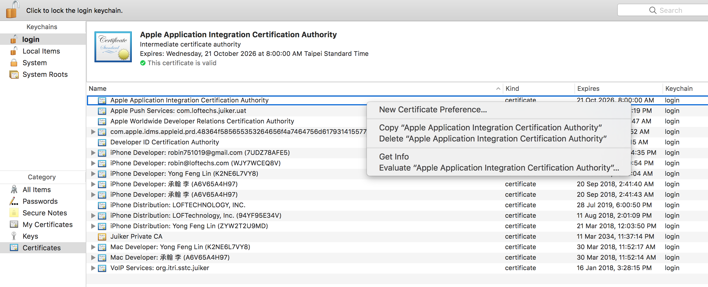

# LT IM SDK iOS Document

---
## Overview

With LT SDK, you can build your own customized application with Call and IM function. This documentary provides a guideline that demonstrates how to build and configure an in-app message and call using LT SDK.

1. At the first beginning, you must create user account/login/password to continue the following process.
2. In order to connect to the LT service please read the [Authentication](#authentication).
3. Support Version：

    iOS 10.0 above ;</br>
    Support Program language：objective c, swift


## Try the sample app

The sample application has the core functions of our LT SDK. Download the app from our GitHub repository to get an idea of what you can build with the SDK and start building in your project.

[Download sample app](https://github.com/LoFTechs/LTSample-iOS-Swift)

## Getting started

### Import SDK

Step1. You can install LT SDK for iOS through `cocoapods`.

To install the pod, add following line to your Podfile:

```
pod 'LTSDK'
pod 'LTCallSDK'
pod 'LTIMSDK'
```

Step2. Install LT SDK

```
pod install
```

## Authentication

### Init SDK

In the beginning, you must initialize **LTSDK** instance by passing the **LTSDKOptions** of your application as an argument to a parameter in the `initWithOptions:completion:` method. When initializing your App, you need to call `initWithOptions:completion:` in the `application:didFinishLaunchingWithOptions:` method of the application class.

Note: Before switching users, be sure to call [Clean SDK](#clean-sdk).

```objectivec
LTSDKOptions *options = [[LTSDKOptions alloc] init];
options.licenseKey = @"licenseKey";
options.url = @"https://xxx.xxx.net";
options.userID = userID;
options.uuid = uuid;

[LTSDK initWithOptions:options completion:^(LTResponse * _Nonnull response) {
    if (response.returnCode == LTReturnCodeSuccess) {
        //
    } else {
        //
    }
}];
```

#### The definition of LTSDKOptions parameters

| Parameter  | Definition | Necessity | Detail                      |
| :--------- | :--------- | :-------- | :-------------------------- |
| context    | Context    | Requierd  | Android context object      |
| licenseKey | String     | Requierd  | LT ID                       |
| url        | String     | Requierd  | LT authenticate url         |
| userID     | String     | Requierd  | LT unique user ID           |
| uuid       | String     | Requierd  | LT unique user authenticate |

### Start SDK

You can get user's information by calling `getUsersWithCompletion:` completion method.

```objectivec
[LTSDK getUsersWithCompletion:^(LTResponse * _Nonnull response, NSArray<LTUser *> * _Nullable users) {
    if (response.returnCode == LTReturnCodeSuccess) {
        for (LTUser *user in users) {
            //
        }
    } else {
        //
    }
}];
```

#### The definition of LTusers parameters

| Parameter   | Definition | Detail                      |
| :---------- | :--------- | :-------------------------- |
| userID      | String     | LT unique user ID           |
| uuid        | String     | LT unique user authenticate |
| phoneNumber | String     | User's phone number          |
| semiUID     | String     | Customized unique key to register |
| deviceID    | String     | LT unique device ID          |
| accountSrc  | String     | LT account source           |

### Get user status

Get the status of other users through their respective phoneNumbers or semiUIDs.

1. query with phonenumbers, use `getUserStatusWithPhoneNumbers: completion:` method.

```objectivec
[LTSDK getUserStatusWithPhoneNumbers:@[@"phonenumber1",@"phonenumber2"] completion:(void (^)(LTResponse * _Nonnull response, NSArray<LTUserStatus *> * _Nullable userStatuses)) {
    if (response.returnCode == LTReturnCodeSuccess) {
        for (LTUserStatus *userStatus in userStatuses) {

        }
    }
}];
```

2. query with semiUIDs, using `getUserStatusWithSemiUIDs: completion:` method.

```objectivec
[LTSDK getUserStatusWithSemiUIDs:@[@"semiUID1",@"semiUID2"] completion:(void (^)(LTResponse * _Nonnull response, NSArray<LTUserStatus *> * _Nullable userStatuses)) {
    if (response.returnCode == LTReturnCodeSuccess) {
        for (LTUserStatus *userStatus in userStatuses) {

        }
    }
}];
```

#### LTUserStatus parameters description

- **userID** _(M, String)_: LT unique user ID.
- **phoneNumber** _(O, String)_: user's phoneNumber.
- **email** _(O, String)_: LT user's email.
- **semiUID** _(C, String)_: LT unique semiUID.
- **brandID** _(M, String)_: LT user brand.
- **corpID** _(M, String)_: LT user corpID.
- **canVOIP** _(M, Bool)_: user enable VoIP feature.
- **canIM** _(M, Bool)_: user enable IM feature.

### Clean SDK

When your App was logged in with different users or when the return code of `initWithOptions` from `LTErrorInfo` is 6000, be sure to call `clean`.

```objectivec
[LTSDK initWithOptions:options completion:^(LTResponse * _Nonnull response) {
    if (response.returnCode == LTReturnCodeNotCurrentUser) {
        [LTSDK clean];
    }
}];
```

## APNS

Apple Push Notification service (APNs) is the centerpiece of the remote notifications feature. It is a robust, secure, and highly efficient service for app developers to propagate information to iOS (and, indirectly, watchOS), tvOS, and macOS devices. [See More](https://developer.apple.com/library/archive/documentation/NetworkingInternet/Conceptual/RemoteNotificationsPG/APNSOverview.html#//apple_ref/doc/uid/TP40008194-CH8-SW1)

### Generate your Apple Push Notification Push SSL Certificate

**_Step 1_** : Open [Apple developer website](https://developer.apple.com)


**_Step 2_** : Click "Account" &gt;&gt; "Certificates, IDs & Profiles".


**_Step 3_** : Select the type of Apple Push Notification Push SSL Certificate.


-   For Apple Push Notification Push SSL Certificate, please select "Apple Push Notification service SSL (Sandbox & Production)".
-   For VOIP Apple Push Notification Push SSL Certificate, please select "VoIP Services Certificate".

**_Step 4_** : Select your APP ID (For example,select com.loftechs.helper).


**_Step 5_** : Based on the description of Certificate Assistant, create Certificate Request.


**_Step 6_** : Upload Certificate Request that was created previously.


**_Step 7_** : Download and double click the certification and add it to Keychain Access.


### Provide APNS .p12 certificate

**_Step 1_** : Launch the Keychain Access application (Application -&gt; Utilities -&gt; Keychain Access -&gt; Certificates) in your Mac OS X and Generate APNS .p12 certificate.

Go to Keychain Access, select login keychain and My Certificate from side menu. Find app certificate and right click to export it



**_Step 2_** : Provide APNS .p12 certificate to Loftech. Otherwise you can't send APNS.

### Enable the Push Notifications Capability

To add the required entitlements to your app, enable the Push Notifications capability in your Xcode project, as shown in Figure 1. Enabling this option in iOS adds the APS Environment Entitlement to the app. In macOS, it adds the APS Environment (macOS) Entitlement. See Enable push notifications in Xcode help for more information.


### Register Your App and Retrieve Your App's Device Token

Register your app with APNs and receive a globally unique device token, which is effectively the address of your app on the current device. Your provider server must have this token before it can deliver notifications to the device.

```objectivec
- (BOOL)application:(UIApplication *)application didFinishLaunchingWithOptions:(NSDictionary *)launchOptions {

    UNUserNotificationCenter *center = [UNUserNotificationCenter currentNotificationCenter];
    [center requestAuthorizationWithOptions:(UNAuthorizationOptionAlert + UNAuthorizationOptionSound + UNAuthorizationOptionBadge) completionHandler:^(BOOL granted, NSError * _Nullable error) {

        if (grand) { // Request Authorization Success
            dispatch_async(dispatch_get_main_queue(), ^{
                [[UIApplication sharedApplication] registerForRemoteNotifications];
            });
        }

    }];

    return YES;
}

- (void)application:(UIApplication*)application didRegisterForRemoteNotificationsWithDeviceToken:(NSData *)deviceToken {
    //Send DeviceToken To Server
}

- (void)application:(UIApplication *)application didFailToRegisterForRemoteNotificationsWithError:(NSError *)error {
    // Try again later.
}
```

### Update APNS Token to LT Server

Please always keep updating APNS Token. Otherwise, the users may not be able to receive messages or call notification.

```objectivec
- (void)pushRegistry:(PKPushRegistry *)registry didUpdatePushCredentials:(PKPushCredentials *)credentials forType:(NSString *)type {
    NSString *token = [self hexadecimalStringFromData:credentials.token];
    [LTSDK updateNotificationKeyWithAPNSToken:@"" voipToken:token cleanOld:NO completion:^(LTResponse * _Nonnull response) {
        if (response.returnCode == 0) {
        } else {
        }
    }];
}

- (NSString *)hexadecimalStringFromData:(NSData *)data {
    NSUInteger dataLength = data.length;
    if (dataLength == 0) {
        return nil;
    }

    const unsigned char *dataBuffer = data.bytes;
    NSMutableString *hexString  = [NSMutableString stringWithCapacity:(dataLength * 2)];
    for (int i = 0; i < dataLength; ++i) {
        [hexString appendFormat:@"%02x", dataBuffer[i]];
    }
    return [NSString stringWithFormat:@"%@",hexString];
}
```

#### Request parameters description

-   **apnsToken** _(O, String)_ : Member Device Token
-   **voipToken** _(M, String)_ : Member Device PushKit Token.
-   **cleanOld** _(O, boolean)_ : Clean the tokens of previous devices that login using the same userID.

## Start IM

請使用`[LTSDK getIMManagerWithUserID:]`來得到 **LTIMManager** 物件後，可利用 **LTIMManager** 物件來操作連線相關服務。在呼叫 IM API 後，可能會從 Block 和 [Receive Event](#receive-event) 方法取得結果。並在每次呼叫 IM 服務時都需帶入 **transID**，此 **transID** 表示此 API 服務的專屬 ID。

```objectivec
LTIMManager *manager = [LTSDK getIMManagerWithUserID:user.userID];
if (manager) {
    // Susscess to get LTIMManager.
} else {
    // LTUser is invalid or not able to use IM service.
}
```

### Connect

在使用 IM 相關的各式 API 之前，請務必使用 **LTIMManager** 先呼叫 `connect`。可從 **Block** 中得到連線的結果。連線成功後即可以開始使用 IM API 的服務。連線成功會觸發 [Receive Event - Common](#common) 方法 [`LTIMManagerConnectedWithReceiver:`](#common)，失敗則會觸發 [`LTIMManagerDisconnectedWithReceiver:error`](#common)。

```objectivec
[manager connectWithCompletion:^(BOOL success, LTErrorInfo * _Nullable error) {
    if (error) {
        //連線失敗會有 error 資訊
        return;
    }
    //連線成功
}];
BOOL success = [manager connect];
if (success) {
    // Start to connect or be connecting server.
} else {
    // LTUser is neccessary to be updated.
}
```

Receive Event :

```objectivec
- (void)LTIMManagerConnectedWithReceiver:(NSString * _Nonnull)receiver {
    //連線成功
}

- (void)LTIMManagerDisconnectedWithReceiver:(NSString * _Nonnull)receiver error:(NSError * _Nullable)error {
    //連線失敗會有 error 資訊
}
```

### Disconnect

若無需再使用 IM 服務，可呼叫 `disconnect`來中斷 IM 服務。成功中斷連線會觸發 [`LTIMManagerDisconnectedWithReceiver:error`](#common)。**強烈建議**進入背景時呼叫斷線，可以減少不必要的背景操作。

```objectivec
 [manager disconnectWithCompletion:^(BOOL success, LTErrorInfo * _Nullable error) {
    if (success) {
        //斷線成功
        return;
    }
}];
```

Receive Event :

```objectivec
- (void)LTIMManagerDisconnectedWithReceiver:(NSString * _Nonnull)receiver error:(NSError * _Nullable)error {
    //主動中斷連線 error 為 nil
}
```

### Detect Connection

如需偵測連線服務是否正常，可呼叫 `isConnected`

```objectivec
BOOL isConnected = [manager isConnected];
```

## Channel

Channel is a delivered path of messages. If you don't have any channel, you should create a channel before sending messages.

Obtain **LTChannelHelper** from **LTIMManager** and call channel funtions.

```
LTIMManger *manager = [LTSDK getIMManagerWithUserID:userID];
LTChannelHelper *helper = manager.channelHelper;
// Call channel functions...
```

### Create Single Channel

一對一聊天室為兩用戶間傳遞訊息的聊天室, 此聊天室為固定專屬於兩用戶之間的聊天室。固定專屬的聊天室，無需再操作刪除或退出的功能，並且一對一聊天室中的成員皆可行使相同權限，無需再設定成員角色在 **LTMemberModel** 中。**LTMemberModel** 是在設定成員相關資訊，在建立聊天室前，必須先組成 **LTMemberModel** 物件，再帶入 `createSingleChannelWithTransID:member:completion:`來建立一對一聊天室，建立成功將會觸發 [Receive Event - Channel](#channel-1) 方法 [`LTIMManagerIncomingCreateChannel:receiver:`](#channel-1)。

```objectivec
LTMemberModel *member = [[LTMemberModel alloc] init];
member.userID = @"userID";
member.chNickname = @"Paul";

NSString *transID = [[NSUUID UUID] UUIDString];

[helper createSingleChannelWithTransID:transID member:member completion:^(LTCreateChannelResponse * _Nullable response, LTErrorInfo * _Nullable error) {
    if (error) {
        return;
    }
}];
```

Receive Event :

```objectivec
- (void)LTIMManagerIncomingCreateChannel:(LTCreateChannelResponse * _Nullable)response receiver:(NSString * _Nonnull)receiver {

}
```

### Create Group Channel

Group Channel 為多人聊天室，每次建立的多人聊天室都是唯一的。一但聊天室解散後，此聊天室就不存在。在多人聊天室中的成員可以設定不同的權限。權限可由 **LTMemberModel** 設定，並帶入到 `createGroupChannelWithTransID:chID:channelSubject:members:completion:`，建立成功將會觸發 [Receive Event - Channel](#channel-1) 方法 [`LTIMManagerIncomingCreateChannel:receiver:`](#channel-1)。除此之外多人聊天室與一對一聊天室的差異，需自定義聊天室的專屬 ID 以及聊天室顯示的名稱。可參考一下的範例。

```objectivec
LTMemberModel *memberA = [[LTMemberModel alloc] init];
memberA.userID = @"userA";
memberA.chNickname = @"Paul";
memberA.roleID = LTChannelRoleParticipant;

LTMemberModel *memberB = [[LTMemberModel alloc] init];
memberB.userID = @"userB";
memberB.chNickname = @"Hugo";
memberB.roleID = LTChannelRoleParticipant;

NSMutableSet *initialMembers = [[NSMutableSet alloc] initWithObjects:memberA, memberB, nil];

NSString *transID = [[NSUUID UUID] UUIDString];
NSString *chID = [[NSUUID UUID] UUIDString];
NSString *subject = @"Channel Subject";

[helper createGroupChannelWithTransID:transID chID:chID channelSubject:subject members:initialMembers completion:^(LTCreateChannelResponse * _Nullable response, LTErrorInfo * _Nullable error) {
    if (error) {
        return;
    }
}];
```

Receive Event :

```objectivec
- (void)LTIMManagerIncomingCreateChannel:(LTCreateChannelResponse * _Nullable)response receiver:(NSString * _Nonnull)receiver {

}
```

### Set Channel

建立完 Channel 之後，可以更改 Channel 相關設定，包含以下：

#### Channel Preference

意指 user 本身在聊天室中專屬的設定值，這個設定值只有 user 本身可以取的。每次設定成功後，將會回傳目前所有的在此聊天室的專屬設定值 (Channel Preference)。若設定成功將會觸發 [Receive Event - Channel](#channel-1) 方法 [`LTIMManagerIncomingChannelPreference:receiver:`](#channel-1)。

-   **Mute** : 設定聊天室靜音，如需關掉聊天室的通知請設定 true，否則請設定成 false。

```objectivec
NSString *transID = [[NSUUID UUID] UUIDString];
NSString *chID = @"xxxxxxxx"; //真實存在的 ChannelID
BOOL isMute = YES;

[helper setChannelMuteWithTransID:transID chID:chID isMute:isMute completion:^(LTChannelPreferenceResponse * _Nullable response, LTErrorInfo * _Nullable error) {
    if (error) {
        return;
    }
    //LTChannelPreferenceResponse 包含當前 Mute, RingTone 和 Nickname 資訊
}];
```

-   **RingTone** : 設定聊天室通知鈴聲，可自行設定鈴聲同步方式，如鈴聲的路徑或是對應的資源檔 ID。

```objectivec
NSString *transID = [[NSUUID UUID] UUIDString];
NSString *chID = @"xxxxxxxx"; //真實存在的 ChannelID
NSString * ringToneID = @"xxxxxxxx.mp3";

[helper setChannelRingToneWithTransID:transID chID:chID ringToneID:ringToneID completion:^(LTChannelPreferenceResponse * _Nullable response, LTErrorInfo * _Nullable error) {
    if (error) {
        return;
    }
    //LTChannelPreferenceResponse 包含當前 Mute, RingTone 和 Nickname 資訊
}];
```

-   **Nickname** : 設定聊天室專屬暱稱，此暱稱會同步給聊天室成員顯示清單中。

```objectivec
NSString *transID = [[NSUUID UUID] UUIDString];
NSString *chID = @"xxxxxxxx"; //真實存在的 ChannelID
NSString *nickname = @"new nickname";

[helper setChannelUserNicknameWithTransID:transID chID:chID nickname:nickname completion:^(LTChannelPreferenceResponse * _Nullable response, LTErrorInfo * _Nullable error) {
    if (error) {
        return;
    }
    //LTChannelPreferenceResponse 包含當前 Mute, RingTone 和 Nickname 資訊
}];
```

#### Channel Profile

意指聊天室本身的設定，所有成員將會取得相同的資訊。若有成員設定成功後，將會收到當次的設定值，並觸發 [Receiver Event - Channel](#channel-1) 方法 [`LTIMManagerIncomingChannelProfile:receiver:`](#LTIMManagerIncomingChannelProfile) 收到自己或其他成員的更改內容。

-   **Subject** : 設定聊天室名稱。

```objectivec
NSString *transID = [[NSUUID UUID] UUIDString];
NSString *chID = @"xxxxxxxx"; //真實存在的 ChannelID
NSString *subject = @"new subject";

[helper setChannelSubjectWithTransID:transID chID:chID subject:subject completion:^(LTChannelProfileResponse * _Nullable response, LTErrorInfo * _Nullable error) {
    if (error) {
        return;
    }
    //LTChannelProfileResponse 只包含當前 Subject 資訊
}];
```

-   **Avatar** : 聊天室的圖示。

設定聊天室的圖示

```objectivec
NSString *transID = [[NSUUID UUID] UUIDString];
NSString *chID = @"xxxxxxxx"; //真實存在的 ChannelID
NSString *avatarPath = @"xxxx/xxxx/xxxx.jpg";//avatar 本地路徑

[helper setChannelAvatarWithTransID:transID chID:chID avatarPath:avatarPath completion:^(LTChannelProfileResponse * _Nullable response, LTErrorInfo * _Nullable error) {
    if (error) {
        return;
    }
    //LTChannelProfileResponse 只包含當前 Avatar 資訊
} progress:^(LTProgressResponse * _Nullable progressResponse, BOOL isDone) {
    //LTProgressResponse 為上傳進度，isDone = YES 表示上傳成功
}];
```

刪除聊天室的圖示

```objectivec
NSString *transID = [[NSUUID UUID] UUIDString];
NSString *chID = @"xxxxxxxx"; //真實存在的 ChannelID
LTFileInfo *fileInfo =channel.profileImageFileInfo;//channel fileInfo

[helper deleteChannelAvatarWithTransID:transID chID:chID fileInfo:fileInfo completion:^(LTChannelProfileResponse * _Nullable response, LTErrorInfo * _Nullable error) {
    if (error) {
        return;
    }
} ];
```

-   **CustomAttr** : 設定聊天室的客製化需求，可自訂聊天室屬性，使用 bit 概念彈性擴增聊天室顯示需求。

```objectivec
NSString *transID = [[NSUUID UUID] UUIDString];
NSString *chID = @"xxxxxxxx"; //真實存在的 ChannelID
NSUInteger customAttr = x;

[helper setChannelCustomAttrWithTransID:transID chID:chID customAttr:customAttr completion:^(LTChannelProfileResponse * _Nullable response, LTErrorInfo * _Nullable error) {
    if (error) {
        return;
    }
    //LTChannelProfileResponse 只包含當前 CustomAttr 資訊
}];
```

### Get Channel

此章節將介紹如何主動取的聊天室相關的資訊。

#### Channel Information

包含 Channel Profile、Channel Member 和其他資訊，可利用不同的參數取得指定的聊天室資訊。參數中可設定是否優先取的聊天室成員的資訊，若設定成 false，也可從 [Get Member](#get-member) 取得成員資訊。另外聊天室的資料大，所以提供批次的機制來避免一次大量的資料，請務必使用批次的機制，建議的批次數量為每一批 30 筆。

-   取得**單一**聊天室呼叫方式 : 帶入聊天室的 channelID。

```objectivec
NSString *transID = [[NSUUID UUID] UUIDString];
NSString *chID = @"xxxxxxxx"; //真實存在的 ChannelID
BOOL withMembers = YES; //是否取得 member 資訊

[helper queryChannelWithTransID:transID chID:chID withMembers:withMembers completion:^(LTQueryChannelsResponse * _Nullable response, LTErrorInfo * _Nullable error) {
    if (error) {
        return;
    }
}];
```

-   取得**特定形態**的聊天室呼叫方式 : 帶入需查詢的 chType 組成的 Set 以及 batchCount。

```objectivec
NSString *transID = [[NSUUID UUID] UUIDString];
NSSet *chTypes = [[NSSet alloc] initWithObjects:@(LTChannelTypeGroup), nil];
NSUInterger batchCount = 30;
BOOL withMembers = YES; //是否取得 member 資訊

[helper queryChannelWithTransID:transID chTypes:chTypes batchCount:batchCount withMembers:withMembers completion:^(LTQueryChannelsResponse * _Nullable response, LTErrorInfo * _Nullable error) {
    if (error) {
        return;
    }
}];
```

-   取得**特定時間點**之後有更動的聊天室呼叫方式 : 帶入需查詢時間點的 timestamp 以及 batchCount。

```objectivec
NSString *transID = [[NSUUID UUID] UUIDString];
long long lastUpdateTime = 1608797454000;
NSUInterger batchCount = 30;
BOOL withMembers = YES; //是否取得 member 資訊

[helper queryChannelWithTransID:transID lastUpdateTime:lastUpdateTime batchCount:batchCount withMembers:withMembers completion:^(LTQueryChannelsResponse * _Nullable response, LTErrorInfo * _Nullable error) {
    if (error) {
        return;
    }
}];
```

#### Channel Read Time

取得聊天室的讀取時間，可利用此讀取時間來計算未讀的數量以及相關未讀功能。

-   取得**單一**聊天室呼叫方式 : 帶入聊天室的 channelID。

```objectivec
NSString *transID = [[NSUUID UUID] UUIDString];
NSString *chID = @"xxxxxxxx"; //真實存在的 ChannelID

[helper queryChannelReadTimeWithTransID:transID chID:chID completion:^(LTQueryChannelsReadTimeResponse * _Nullable response, LTErrorInfo * _Nullable error) {
    if (error) {
        return;
    }
}];
```

-   取得**部分**聊天室呼叫方式 : 搭配 lastChID、lastChType 以及 count 的參數。lastChID、lastChType 可帶入前一次取的最後一間聊天室 ID 和 Type 來取的下一批次的聊天室讀取時間，若是第一批取得時請帶入**空字串**和 **LTChannelTypeUnknown** 表示從第一間聊天室撈取。

```objectivec
NSString *transID = [[NSUUID UUID] UUIDString];
NSString *lastChID = @"";// 從頭開始的話使用空字串
LTChannelType lastChType = LTChannelTypeUnknown;// 從頭開始的話使用 LTChannelTypeUnknown
NSUInteger count = 100;// 一次取的最大 channel 個數，建議為 100

[helper queryChannelsReadTimeWithTransID:transID lastChID:lastChID lastChType:lastChType count:count completion:^(LTQueryChannelsReadTimeResponse * _Nullable response, LTErrorInfo * _Nullable error) {
    if (error) {
        return;
    }
    if (response.channels.count == count) {
        lastChID = response.channels.lastObject.chID;
        lastChType = response.channels.lastObject.chType;
        // 下面還有資料可以繼續撈
    } else {
        // 往下撈已經沒有資料了
    }
}];
```

#### Unread Channels

一次取得有未讀聊天室的未讀數量與總未讀數。呼叫 `queryUnreadChannelsWithTransID:completion:` 來獲取資訊。

```objectivec
NSString *transID = [[NSUUID UUID] UUIDString];

[helper queryUnreadChannelsWithTransID:transID completion:^(LTQueryUnreadChannelsResponse * _Nullable response, LTErrorInfo * _Nullable error) {
    if (error) {
        return;
    }
}];
```

### Delete Channel

當多人聊天室有解散的需求時，並擁有解散聊天室的權限時可呼叫 `dismissChannelWithTransID:chID:completion:` 刪除此 Channel，若刪除成功將會觸發 [`Receive Event - Channel`](#channel-1) 方法 [`LTIMManagerIncomingDismissChannel:receiver:`](#channel-1)。

```objectivec
NSString *transID = [[NSUUID UUID] UUIDString];
NSString *chID = @"xxxxxxxx"; //真實存在的 ChannelID

[helper dismissChannelWithTransID:transID chID:chID completion:^(LTDismissChannelResponse * _Nullable response, LTErrorInfo * _Nullable error) {
    if (error) {
        return;
    }
}];
```

## Channel Member

Obtain **LTChannelHelper** from **LTIMManager** and call channel member funtions.

```objectivec
LTIMManger *manager = [LTSDK getIMManagerWithUserID:userID];
LTChannelHelper *helper = manager.channelHelper;
// Call channel member functions...
```

### Invite Member

若擁有權限，則可呼叫 `inviteMembersWithTransID:chID:members:joinMethod:completion:` **無需對方同意**使 user 直接加入 Channel，被邀請者**不能為空**，其中可使用 **LTJoinMethod** 設定加入的方式來統計加入方式，若無需使用可帶入 **LTJoinMethodNormal**，若邀請成功將會觸發 [`Receive Event - Channel Member`](#channel-member-1) 方法 [`LTIMManagerIncomingInviteMember:receiver:`](#channel-member-1)。

```objectivec
LTMemberModel *member = [[LTMemberModel alloc] init];
member.userID = @"xxxxxxx";
member.roleID = LTChannelRoleParticipant;
member.chProfileID = @"profileID";

NSMutableSet *invitelMembers = [[NSMutableSet alloc] initWithObjects:member, nil];

NSString *transID = [[NSUUID UUID] UUIDString];
NSString *chID = @"xxxxxxxx"; //真實存在的 ChannelID

[helper inviteMembersWithTransID:transID chID:chID members:invitelMembers joinMethod:LTJoinMethodNormal completion:^(LTInviteMemberResponse * _Nullable response, LTErrorInfo * _Nullable error) {
    if (error) {
        return;
    }
}];
```

### Kick Member

若擁有權限，則可呼叫 `kickMembersWithTransID:chID:members:completion: `使 member 直接退出 Channel，被剔除者**不能為空**，若剔除成功將會觸發 [`Receive Event - Channel Member`](#channel-member-1) 方法 [`LTIMManagerIncomingKickMember:receiver:`](#channel-member-1)。

```objectivec
LTMemberModel *member = [[LTMemberModel alloc] init];
member.userID = @"xxxxxxx";// 須為 channel member

NSMutableSet *kickMembers = [[NSMutableSet alloc] initWithObjects:member, nil];

NSString *transID = [[NSUUID UUID] UUIDString];
NSString *chID = @"xxxxxxxx"; //真實存在的 ChannelID

[helper kickMembersWithTransID:transID chID:chID members:kickMembers completion:^(LTKickMemberResponse * _Nullable response, LTErrorInfo * _Nullable error) {
    if (error) {
        return;
    }
}];
```

### Join

和 Invite 的差異在於 Invite 由他人邀請加入，Join 則可以主動加入聊天室。若此 Channel 擁有主動加入權限，則可呼叫 `joinChannelWithTransID:chID:joinMethod:byWho:completion:` 自行加入 Channel，Join 如同 Invite 可帶入 **LTJoinMethod** 設定的方式來統計並可搭配誰給予的加入資訊 **byWho**，若無需要則可帶入 **nil**。若加入成功會觸發 [`Receive Event - Channel Member`](#channel-member-1) 方法 [`LTIMManagerIncomingJoinChannel:receiver:`](#channel-member-1)。

```objectivec
NSString *transID = [[NSUUID UUID] UUIDString];
NSString *chID = @"xxxxxxxx"; //真實存在的 ChannelID

[helper joinChannelWithTransID:transID chID:chID joinMethod:LTJoinMethodNormal byWho:nil completion:^(LTJoinChannelResponse * _Nullable response, LTErrorInfo * _Nullable error) {
    if (error) {
        return;
    }
}];
```

### Leave

若擁有權限，則可呼叫 `leaveChannelWithTransID:chID:completion:` 自行退出 Channel，若退出成功將會觸發 [`Receive Event - Channel Member`](#channel-member-1) 方法 [`LTIMManagerIncomingLeaveChannel:receiver:`](#channel-member-1)。

```objectivec
NSString *transID = [[NSUUID UUID] UUIDString];
NSString *chID = @"xxxxxxxx"; //真實存在的 ChannelID

[helper leaveChannelWithTransID:transID chID:chID completion:^(LTLeaveChannelResponse * _Nullable response, LTErrorInfo * _Nullable error) {
    if (error) {
        return;
    }
}];
```

### Set Member

若擁有權限，則可呼叫 `setMemberRoleWithTransID:chID:userID:roleID:completion:` 設定包含自己在內的 Member 的 RoleID，一般最常使用的情境，當管理者要離開聊天室時，需先將指定的成員設定成管理者的身份再呼叫離開聊天室。若設定成功將會觸發 [`Receive Event - Channel Member`](#channel-member-1) 方法 [`LTIMManagerIncomingSetMemberRole:receiver:`](#channel-member-1)。

```objectivec
NSString *transID = [[NSUUID UUID] UUIDString];
NSString *chID = @"xxxxxxxx"; //真實存在的 ChannelID
NSString *userID = @"xxxxxxxx"; // 須為 channel member
LTChannelRole roleID = LTChannelRoleParticipant; // 新 roleID

[helper setMemberRoleWithTransID:transID chID:chID userID:userID roleID:roleID completion:^(LTSetMemberRoleResponse * _Nullable response, LTErrorInfo * _Nullable error) {
    if (error) {
        return;
    }
}];
```

### Get Member

#### Member Information

在獲取成員清單會根據你的角色權限不同，而有不一樣的結果。例如角色權限越高，能讀取的角色範圍越多。可使用 `queryChannelMembersWithTransID:chID:lastUserID:count:completion:` 來取得單一聊天室清單。這裡建議使用分批撈取的方式，**lastUserID** 為上一批最後的 userID，當為第一次撈取時請帶入**空字串**。

```objectivec
NSString *transID = [[NSUUID UUID] UUIDString];
NSString *chID = @"xxxxxxxx"; //真實存在的 ChannelID
NSString *lastUserID = @"";// 從頭開始的話使用空字串
NSUInteger count = 30;// 一次取的最大 member 個數，建議為 500 內

[helper queryChannelMembersWithTransID:transID chID:chID lastUser:lastUser count:count completion:^(LTQueryChannelMembersResponse * _Nullable response, LTErrorInfo * _Nullable error) {
    if (error) {
        return;
    }
    if (response.count == count) {
        lastUserID = response.members.lastObject.userID;
        // 下面還有資料可以繼續撈
    } else {
        // 往下撈已經沒有資料了
    }
}];
```

#### Member Read Info

如需取的聊天室其他成員讀取狀態，我們可以利用 `queryChannelReadInfoWithTransID:chID:completion:` 來取的單一聊天室的成員已讀時間。可利用此成員的已讀時間來計算已傳送訊息的已讀狀態。

```objectivec
NSString *transID = [[NSUUID UUID] UUIDString];
NSString *chID = @"xxxxxxxx"; //真實存在的 ChannelID

[helper queryChannelReadInfoWithTransID:transID chID:chID completion:^(LTQueryChannelReadInfoResponse * _Nullable response, LTErrorInfo * _Nullable error) {
    if (error) {
        return;
    }
}];
```

## Message

Obtain **LTMessageHelper** from **LTIMManager** and call message funtions.

```objectivec
LTIMManger *manager = [LTSDK getIMManagerWithUserID:userID];
LTMessageHelper *helper = manager.messageHelper;
// Call message functions...
```

### Send Message

次章節主要介紹 LTIMSDK 支援的訊息傳送方式以及訊息種類。

#### Messages

以下為 LTIMSDK 可支援的訊息種類，再搭配後面章節的傳送方式 [Send Message](#send-message)、[Send Broadcast Messages](#send-broadcast-messages) 以及 [Send Scheduled Messages](#send-scheduled-messages)。

-   **_Text Message_** : 一般文字訊息。避免訊息傳送資料量過大，請限制字數在 8000 以內。文字訊息同時支援標記 (tag) 訊息，可以利用標記訊息指定的聊天室成員。標記成員可使用 **LTTagUser** 設定標記的成員內容，搭配 **LTTagUser** 中的 **start** 與 **length** 可彈性替換 **msgContent** 中顯示標記的方式。

```objectivec
LTTagUser *tagUser = [[LTTagUser alloc] init];
tagUser.userID = @"userIDA";
tagUser.start = 0;
tagUser.length = 4;

NSSet *tagUsers = [[NSSet alloc] initWithObjects: tagUser, nil];

LTTextMessage *message = [[LTTextMessage alloc] init];
message.transID = [[NSUUID UUID] UUIDString];
message.chID = @"ChannelID";
message.chType = LTChannelTypeGroup;
message.msgContent = @"@Paul, How are you?";
message.tagUsers = tagUsers;
```

-   **_Sticker Message_** : 貼圖訊息。此貼圖訊息可搭配 LT 專屬貼圖也可以替換成自定義貼圖。如用自訂貼圖可使用 **msgContent** 設定貼圖的取得方式，例如貼圖檔案路徑。

```objectivec
LTStickerMessage *message = [[LTStickerMessage alloc] init];
message.transID = [[NSUUID UUID] UUIDString];
message.chID = @"ChannelID";
message.chType = LTChannelTypeGroup;
message.msgContent = @"690d1a03-b9c5-ae30-046b-24936dc97c46,3013,2";
```

-   **_Image Message_** : 圖片訊息。若使用 **LTImageMessage** 來傳送圖片訊息，將會傳送圖片訊息到 LT 設定的雲端空間。若想使用指定雲端空間，則可使用 **LTCustomMessage** 客制傳送的方式。在 **LTImageMessage** 中可傳送原圖路徑以及縮圖路徑，必須使用手機本地端的檔案。另外提供 **extInfo** 欄位，可添加附加資訊，例如圖片的寬高，可使用在圖片顯示上。

```objectivec
NSString *imageFilePath = [[NSBundle mainBundle] pathForResource:@"ef05f74a-90f7-4f69-94cb-d588fa435bae" ofType:@"png"];
NSString *thumbnailFilePath = [[NSBundle mainBundle] pathForResource:@"ef05f74a-90f7-4f69-94cb-d588fa435bae" ofType:@"png"];

NSDictionary *extInfo = @{@"width":@(360), @"height":@(422)};

LTImageMessage *message = [[LTImageMessage alloc] init];
message.transID = [[NSUUID UUID] UUIDString];
message.chID = @"ChannelID";
message.chType = LTChannelTypeGroup;
message.imagePath = imageFilePath;
message.thumbnailPath = thumbnailFilePath;
message.extInfo = extInfo;
message.fileName = @"iOS.png";
```

-   **_Video Message_** : 影像訊息。若使用 **LTVideoMessage** 來傳送影像訊息，將會傳送影像訊息到 LT 設定的雲端空間。若想使用指定雲端空間，則可使用 **LTCustomMessage** 客制傳送的方式。在 **LTVideoMessage** 中可傳送影像路徑以及縮圖路徑，必須使用手機本地端的檔案。另外提供 **extInfo** 欄位，可添加附加資訊，例如影像的寬高，可使用在圖片顯示上。

```objectivec
NSString *videoFilePath = [[NSBundle mainBundle] pathForResource:@"video" ofType:@"mp4"];
NSString *thumbnailFilePath = [[NSBundle mainBundle] pathForResource:@"image" ofType:@"png"];

NSDictionary *extInfo = @{@"width":@(360), @"height":@(422)};

LTImageMessage *message = [[LTImageMessage alloc] init];
message.transID = [[NSUUID UUID] UUIDString];
message.chID = @"ChannelID";
message.chType = LTChannelTypeGroup;
message.videoPath = videoFilePath;
message.thumbnailPath = thumbnailFilePath;
message.extInfo = extInfo;
message.fileName = @"iOS.mp4";
```

-   **_Voice Message_** : 語音訊息。若使用 **LTVoiceMessage** 來傳送語音訊息，將會傳送語音訊息到 LT 設定的雲端空間。若想使用指定雲端空間，則可使用 **LTCustomMessage** 客制傳送的方式。在 **LTVoiceMessage** 中可傳送語音路徑，必須使用手機本地端的檔案。另外提供 **extInfo** 欄位，可添加附加資訊，例如語音長度，可使用在圖片顯示上。

```objectivec
NSString *voiceFilePath = [[NSBundle mainBundle] pathForResource:@"voice" ofType:@"aac"];

NSDictionary *extInfo = @{@"duration":@"00:05:30"};

LTVoiceMessage *message = [[LTVoiceMessage alloc] init];
message.transID = [[NSUUID UUID] UUIDString];
message.chID = @"ChannelID";
message.chType = LTChannelTypeGroup;
message.voicePath = voiceFilePath;
message.extInfo = extInfo;
message.fileName = @"iOS.aac";
```

-   **_Location Message_** : 位置訊息。可搭配 [Google Map](https://developers.google.com/maps/documentation/android-sdk/map) 取的定位資訊，並將資料組出 **LTLocation** 參數帶入 **LTLocationMessage** 傳送。

```objectivec
LTLocation *location = [[LTLocation alloc] init];
location.address = @"300台灣新竹市東區關新路27號號 17 樓 之 1";
location.latitude = 24.784781264526057;
location.longitude = 121.01793609559535;

LTLocationMessage *message = [[LTLocationMessage alloc] init];
message.transID = [[NSUUID UUID] UUIDString];
message.chID = @"ChannelID";
message.chType = LTChannelTypeGroup;
message.location = location;
```

-   **_Contact Message_** : 聯絡人訊息。若使用 **LTContactMessage** 來傳送聯絡人訊息，將會傳送聯絡人訊息到 LT 設定的雲端空間。若想使用指定雲端空間，則可使用 **LTCustomMessage** 客制傳送的方式。在 **LTContactMessage** 中可傳送聯絡人檔案路徑以及縮圖路徑，必須使用手機本地端的檔案。另外提供 **extInfo** 欄位，可添加附加資訊，例如聯絡人名稱，可使用在圖片顯示上。

```objectivec
NSString *contactFilePath = [[NSBundle mainBundle] pathForResource:@"contact" ofType:@"vcf"];
NSString *thumbnailFilePath = [[NSBundle mainBundle] pathForResource:@"image" ofType:@"jpeg"];

NSDictionary *extInfo = @{@"displayName":@"Ann"};

LTContactMessage *message = [[LTContactMessage alloc] init];
message.transID = [[NSUUID UUID] UUIDString];
message.chID = @"ChannelID";
message.chType = LTChannelTypeGroup;
message.contactPath = contactFilePath;
message.thumbnailPath = thumbnailFilePath;
message.extInfo = extInfo;
message.fileName = @"Ann.vcf";
```

-   **_Document Message_** : 各類格式檔案訊息。若使用 **LTDocumentMessage** 來傳送檔案訊息，將會傳送檔案訊息到 LT 設定的雲端空間。若想使用指定雲端空間，則可使用 **LTCustomMessage** 客制傳送的方式。在 **LTDocumentMessage** 中可傳送檔案路徑，必須使用手機本地端的檔案。另外提供 **extInfo** 欄位，可添加附加資訊，例如檔案大小，可使用在圖片顯示上。

```objectivec
NSString *documentFilePath = [[NSBundle mainBundle] pathForResource:@"document" ofType:@"doc"];

NSDictionary *extInfo = @{@"fileSize":@"5MB"};

LTDocumentMessage *message = [[LTDocumentMessage alloc] init];
message.transID = [[NSUUID UUID] UUIDString];
message.chID = @"ChannelID";
message.chType = LTChannelTypeGroup;
message.filePath = filePath;
message.extInfo = extInfo;
message.fileName = @"Document.docf";
```

#### Relpy Messages

回覆訊息可指定各類 [Messages](#messages) 訊息 (LT : 母訊息) 進行回覆，並且也可回覆各類 [Messages](#messages) 訊息 (LT : 子訊息)。母訊息的指定方式是利用 **LTReplyMessage** 帶入各類子訊息中，**LTReplyMessage** 設定的方式將會以母訊息傳送成功後收到的資訊帶入指定參數。另外需將母訊息收到的 **msgID** 帶入到子訊息的 **parentMsgID**，當子訊息設定完成後即可利用 [Send Message](#send-message) 傳送。以下為圖片訊息與文字訊息交錯示範為例子。

-   圖片訊息 (母訊息) 回覆 文字訊息 (子訊息)

```objectivec
LTReplyMessage *replyMessage = [[LTReplyMessage alloc] init];
replyMessage.msgID = @"cec95048-9e62-11ea-9c63-599b39045450";
replyMessage.msgType = LTMessageTypeText;
replyMessage.sendTime = 1590054366458;
replyMessage.senderID = @"sendUserID";
replyMessage.senderNickName = @"Ann";

NSString *imageFilePath = [[NSBundle mainBundle] pathForResource:@"ef05f74a-90f7-4f69-94cb-d588fa435bae" ofType:@"png"];
NSString *thumbnailFilePath = [[NSBundle mainBundle] pathForResource:@"ef05f74a-90f7-4f69-94cb-d588fa435bae" ofType:@"png"];

NSDictionary *extInfo = @{@"width":@(360), @"height":@(422)};

LTImageMessage *message = [[LTImageMessage alloc] init];
message.transID = [[NSUUID UUID] UUIDString];
message.chID = @"ChannelID";
message.chType = LTChannelTypeGroup;
message.imagePath = imageFilePath;
message.thumbnailPath = thumbnailFilePath;
message.extInfo = extInfo;
message.fileName = @"iOS.png";
message.replyMessage = replyMessage;
message.parentMsgID = @"cec95048-9e62-11ea-9c63-599b39045450";
```

-   文字訊息(子訊息) 回覆 圖片訊息 (母訊息)

```objectivec
LTReplyMessage *replyMessage = [[LTReplyMessage alloc] init];
replyMessage.msgID = @"9a3a8afa-06f8-11eb-9c63-1a2e0f0676dd";
replyMessage.msgType = LTMessageTypeImage;
replyMessage.sendTime = 1601895037417;
replyMessage.senderID = @"sendUserID";
replyMessage.senderNickName = @"Ann";

LTTextMessage *message = [[LTTextMessage alloc] init];
message.transID = [[NSUUID UUID] UUIDString];
message.chID = @"ChannelID";
message.chType = LTChannelTypeGroup;
message.msgContent = @"1234";
message.replyMessage = replyMessage;
message.parentMsgID = @"07a9dd94-d5f7-11ea-9c63-1a2d5b06220d";
```

#### Send Message

如需傳送各類訊息 [Messages](#messages) 以及回覆訊息 [Relpy Messages](#reply-messages)，可使用 `sendMessage:completion:` 來傳送指定的訊息。傳送成功後會收到 **LTSendMessageResponse** 的結果，其中 **LTMessage** 可轉成各類訊息 [Messages](#messages) 的物件，並取得其專屬的資訊。如果傳送成功將會在 [Receive Event - Message](#message-2) 方法 [`LTIMManagerIncomingSendMessage:receiver:`](#message-2) 收到訊息。可參考以下範例。

```objectivec
LTTextMessage *message = [[LTTextMessage alloc] init];
message.transID = [[NSUUID UUID] UUIDString];
message.chID = @"ChannelID";
message.chType = LTChannelTypeGroup;
message.msgContent = @"1234";

NSString *userID = @"userID";

LTIMManager *manager = [LTSDK getIMManagerWithUserID:userID];
[manager.messageHelper sendMessage:message completion:^(LTSendMessageResponse * _Nullable response, LTErrorInfo * _Nullable error) {
    if (error) {
        return;
    }
}];
```

**Send File Message** : 傳送 LTFileMessage (包含 LTImageMessage、LTVideoMessage、LTContactMessage... 等)，若有使用到 LT 設定的雲端空間，且需要上傳進度的話，可以呼叫 `sendFileMessage:completion:progress:` ，從 callback 裡得到。如果傳送成功將會在 [Receive Event - Message](#message-2) 方法 [`LTIMManagerIncomingSendMessage:receiver:`](#message-2) 收到訊息。可參考以下範例。

```objectivec
NSString *imageFilePath = [[NSBundle mainBundle] pathForResource:@"ef05f74a-90f7-4f69-94cb-d588fa435bae" ofType:@"png"];
NSString *thumbnailFilePath = [[NSBundle mainBundle] pathForResource:@"ef05f74a-90f7-4f69-94cb-d588fa435bae" ofType:@"png"];

NSDictionary *extInfo = @{@"width":@(360), @"height":@(422)};

LTImageMessage *message = [[LTImageMessage alloc] init];
message.transID = [[NSUUID UUID] UUIDString];
message.chID = @"ChannelID";
message.chType = LTChannelTypeGroup;
message.imagePath = imageFilePath;
message.thumbnailPath = thumbnailFilePath;
message.extInfo = extInfo;
message.fileName = @"iOS.png";

NSString *userID = @"userID";

LTIMManager *manager = [LTSDK getIMManagerWithUserID:userID];
[manager.messageHelper sendFileMessage:message completion:^(LTSendMessageResponse * _Nullable response, LTErrorInfo * _Nullable error) {
    if (error) {
        return;
    }
    // 訊息傳送成功
} progress:^(LTMessageProgressResponse * _Nullable progressResponse, BOOL isDone) {
    //LTProgressResponse 為上傳進度，isDone = YES 表示上傳成功
}];
```

Receive Event :

```objectivec
- (void)LTIMManagerIncomingSendMessage:(LTSendMessageResponse * _Nullable)response receiver:(NSString * _Nonnull)receiver {

}
```

### Send Broadcast Messages

[Send Message](#send_message) 可發送一則各類訊息到指定對方或聊天室，若要一次發送多則訊息則可使用 `broadcastMessageWithTransID:messages:chIDs:completion:` 傳送至多個使用者或多間聊天室。廣播訊息後所收到的布林值 success，為廣播行為是否成功，傳送出的訊息將會在 [Receive Event - Message](#message-2) 方法 [`LTIMManagerIncomingSendMessage:receiver:`](#message-2) 收到。

```objectivec
LTTextMessage *textMessage = [[LTTextMessage alloc] init];
textMessage.transID = [[NSUUID UUID] UUIDString];
textMessage.msgContent = @"1234";

LTStickerMessage *stickMessage = [[LTStickerMessage alloc] init];
stickMessage.transID = [[NSUUID UUID] UUIDString];
stickMessage.msgContent = @"690d1a03-b9c5-ae30-046b-24936dc97c46,3013,2";

NSString *imageFilePath = [[NSBundle mainBundle] pathForResource:@"ef05f74a-90f7-4f69-94cb-d588fa435bae" ofType:@"png"];
NSString *thumbnailFilePath = [[NSBundle mainBundle] pathForResource:@"ef05f74a-90f7-4f69-94cb-d588fa435bae" ofType:@"png"];
NSDictionary *extInfo = @{@"width":@(360), @"height":@(422)};
LTImageMessage *imageMessage = [[LTImageMessage alloc] init];
imageMessage.transID = [[NSUUID UUID] UUIDString];
imageMessage.imagePath = imageFilePath;
imageMessage.thumbnailPath = thumbnailFilePath;
imageMessage.extInfo = extInfo;
imageMessage.fileName = @"iOS.png";

NSArray *messages = [[NSArray alloc] initWithObjects: textMessage, stickMessage, imageMessage, nil];
NSArray *chIDs = [[NSArray alloc] initWithObjects: @"chID", nil];
NSString *transID = [[NSUUID UUID] UUIDString];
NSString *userID = @"userID";

LTIMManager *manager = [LTSDK getIMManagerWithUserID:userID];
[manager.messageHelper broadcastMessageWithTransID:transID messages:messages chIDs:chIDs completion:^(BOOL success, LTErrorInfo * _Nullable error) {
    if (error) {
        return;
    }
    // 廣播行為成功
}];
```

### Send Scheduled Messages

如需將傳送的訊息設定指定的時間送達到使用者或聊天室時，請使用 `scheduledMessageWithTransID:messages:chIDs:scheduledTime:completion:` 傳送預約訊息並帶入指定的 **timeToSend**，為預約的時間戳記。**timeToSend** 請務必設定超過 1 分鐘並且在 30 天以內的時間。預約成功後，會觸發 [Receive Event - Message](#message-2) 方法 [`LTIMManagerIncomingScheduledMessage:receiver:`](#message-2)，當指定的時間到達時，傳送出的訊息將會在 [Receive Event - Message](#message-2) 方法 [`LTIMManagerIncomingSendMessage:receiver:`](#message-2) 收到。

```objectivec
LTTextMessage *textMessage = [[LTTextMessage alloc] init];
textMessage.transID = [[NSUUID UUID] UUIDString];
textMessage.msgContent = @"1234";

LTStickerMessage *stickMessage = [[LTStickerMessage alloc] init];
stickMessage.transID = [[NSUUID UUID] UUIDString];
stickMessage.msgContent = @"690d1a03-b9c5-ae30-046b-24936dc97c46,3013,2";

NSString *imageFilePath = [[NSBundle mainBundle] pathForResource:@"ef05f74a-90f7-4f69-94cb-d588fa435bae" ofType:@"png"];
NSString *thumbnailFilePath = [[NSBundle mainBundle] pathForResource:@"ef05f74a-90f7-4f69-94cb-d588fa435bae" ofType:@"png"];
NSDictionary *extInfo = @{@"width":@(360), @"height":@(422)};
LTImageMessage *imageMessage = [[LTImageMessage alloc] init];
imageMessage.transID = [[NSUUID UUID] UUIDString];
imageMessage.imagePath = imageFilePath;
imageMessage.thumbnailPath = thumbnailFilePath;
imageMessage.extInfo = extInfo;
imageMessage.fileName = @"iOS.png";

NSArray *messages = [[NSArray alloc] initWithObjects: textMessage, stickMessage, imageMessage, nil];
NSArray *chIDs = [[NSArray alloc] initWithObjects: @"chID", nil];
NSString *transID = [[NSUUID UUID] UUIDString];
NSString *userID = @"userID";

NSTimeInterval scheduledTime = [[NSDate date] timeIntervalSince1970] + 86400 * 7;

LTIMManager *manager = [LTSDK getIMManagerWithUserID:userID];
[manager.messageHelper scheduledMessageWithTransID:transID messages:messages chIDs:chIDs scheduledTime:scheduledTime completion:^(LTScheduledMessageResponse * _Nullable response, LTErrorInfo * _Nullable error) {
    if (error) {
        return;
    }
    // 預約行為成功
}];
```

### Send Forward Messages

!> 缺

### Get Message

#### Message

取得訊息資訊可呼叫 `queryMessageWithTransID:chID:markTS:afterN:completion:`，利用帶入不同的參數取得不同的訊息資訊。參數 chID 帶入非空值，則表示取得只取得該聊天室的訊息資料，若 chID 為空，則不指定 Channel 取得 user 的訊息。參數 markTS 表示一個時間基準點，afterN 為從 markTS 往後取得的訊息筆數，若為**負數**，則為 markTS 往前取得的訊息筆數。AfterN 建議範圍為 -30 ~ 30。

```objectivec
NSString *transID = [[NSUUID UUID] UUIDString];
NSString *chID = @"xxxxxxxx"; //真實存在的 ChannelID
long long markTS = 1608797454000;
NSInteger afterN = 30;

[helper queryMessageWithTransID:transID chID:chID markTS:markTS afterN:afterN completion:^(LTQueryMessageResponse * _Nullable response, LTErrorInfo * _Nullable error) {
    if (error) {
        return;
    }
    if (response.count == afterN) {
        markTS = response.messages.lastObject.sendTime;
        // 此聊天室到當前時間可能還有訊息可以取得
    } else {
        // 往下撈已經沒有資料了
    }
}];
```

#### File

若有使用到 LT 設定的雲端空間，取得檔案必須使用 **LTStorageManager** 呼叫`executeWithAcitons:completion:resultsChanged:`來取得檔案。將 **LTFileInfo**帶入到**LTStorageAction** 的參數中。另外 **LTFileInfo** 則可由 [LTSendMessageResponse](#ltsendmessageresponse) 取得。

```objectivec
LTSendMessageResponse *respone = ...;
LTMessage *message = response.message;
LTFileInfo *fileInfo = nil;

if ([message isKindOfClass:[LTFileMessage class]]) {
    fileInfo = ((LTFileMessage*)message).fileInfo;
}

if ([message isKindOfClass:[LTThumbnailFileMessage class]]) {
    thumbnailFileInfo = ((LTThumbnailFileMessage*)message). thumbnailFileInfo;
}

if (!fileInfo) {
    return;
}

NSString *storePath = @"/..../..../Local Store Path.png";

LTStorageAction *action = [LTStorageAction createDownloadFileActionWithLTFileInfo:fileInfo storePath:storePath];

NSString *storeThumbPath = @"/..../..../Local Store Thumb Path.png";

LTStorageAction *actionThumbnail = [LTStorageAction createDownloadFileActionWithLTFileInfo:thumbnailFileInfo storePath: storeThumbPath];

NSString *userID = @"userID";

NSArray *actions = [[NSArray alloc] initWithObjects:action, actionThumbnail, nil];

LTStorageManager *manager = [LTSDK getStorageManagerWithUserID:userID];
[manager executeWithAcitons:actions completion:^(LTResponse * _Nonnull response, NSArray<LTStorageResult *> * _Nullable resultArray) {
    if (respose.returnCode == LTReturnCodeSuccess) {
        //下載完成
    }
} resultsChanged:^(NSArray<LTStorageResult *> * _Nullable resultArray) {
    for (LTStorageResult *result in resultArray) {
        NSString *acitonID = result.actionID;
        LTStorageStatus status = result.status;
        long long loadingByted = result.loadingBytes;
        long long totalLength = result.totalLength;
    }
}];
```

### Read Message

#### Set Read

設定已讀請使用 `markReadWithTransID:chID:markTS:completion:` 來送出已讀狀態。已讀的設定方式是將需標示的已讀訊息的 **sendTime** 帶入參數，需注意的是若設定此則訊息已讀時，會同時將此則訊息以前的訊息都是視同已讀狀態。使用情境，當每次進入聊天室時或是正在聊天室中收到即時訊息時可送出當下最後一則訊息的 **sendTime**，視同此訊息以前的訊息都已讀取，不需再針對每一則訊息設定已讀狀態。同時也可從 [Receive Event - Message](#message-2) 方法 [`LTIMManagerIncomingMarkRead:receiver:`](#message-2) 收到他人的已讀狀態。

```objectivec
NSString *transID = [[NSUUID UUID] UUIDString];
NSString *chID = @"xxxxxxxx"; //真實存在的 ChannelID
long long markTS = 1608797454000;//存在於此 Channel 的某訊息的 sendTime

[helper markReadWithTransID:transID chID:chID markTS:markTS completion:^(LTMarkReadResponse * _Nullable response, LTErrorInfo * _Nullable error) {
    if (error) {
        return;
    }
}];
```

Receive Event :

```objectivec
- (void)LTIMManagerIncomingMarkRead:(LTMarkReadResponse * _Nullable)response receiver:(NSString * _Nonnull)receiver {

}
```

#### Get Read

從 [Set Read](#set-read) 從了解如何設定自己的已讀資訊，接下來要來介紹如何取得他人的已讀資訊。在聊天室其他成員設定 [Set Read](#set-read) 後，可從 [Receive Event - Message](#message-2) 方法 [`LTIMManagerIncomingMarkRead:receiver:`](#message-2) 收到此成員的已讀狀態。並從收到的[LTMarkReadResponse](#ltmarkreadresponse) 得知此成員的最後讀取的訊息時間，得而計算此成員在此聊天室的已讀狀態。若成員整傳送送已讀狀態，同時自己不在線上無法收到已讀狀態時，需當重新連線並回到聊天室時可呼叫 [Member Read Info](#member-read-info) 來取得聊天室成員的已讀狀態。

-   **已讀 user 個數**：將所需要查詢的訊息的 msgID 組成 array，帶入 `queryMessageReadCountWithTransID:msgIDs:completion:`，即可獲得各訊息的的已讀 user 的個數。

```objectivec
NSString *transID = [[NSUUID UUID] UUIDString];
NSString *msgID = @"msgID";

[helper queryMessageReadCountWithTransID:transID msgIDs:@[msgID] completion:^(LTQueryMessageReadCountResponse * _Nullable response, LTErrorInfo * _Nullable error) {
    if (error) {
        return;
    }
}];
```

-   **已讀 user 資訊**：呼叫 `queryMessageReadUsersWithTransID:msgID:lastReadTime:count:completion:`，可獲得此 msgID 的訊息的已讀 user 清單，避免已讀清單資料量大，提供使用分批撈取的方式，**lastReadTime** 可帶入上一批最一個使用者的讀取時間，若是第一次請帶入 **0**。

```objectivec
NSString *transID = [[NSUUID UUID] UUIDString];
NSString *msgID = @"msgID";
long long lastReadTime = 0;
NSUInteger count = 100;

[helper queryMessageReadUsersWithTransID:transID msgID:msgID lastReadTime:lastReadTime count:count completion:^(LTQueryMessageReadUsersResponse * _Nullable response, LTErrorInfo * _Nullable error) {
    if (error) {
        return;
    }
    if (response..userscount == count) {
        lastReadTime = response.users.lastObject.readTime;
        // 此已讀 user 清單可能還沒拿完
    } else {
        // 往下撈已經沒有資料了
    }
}];
```

### Delete Message

本章節介紹關於訊息刪除相關的功能。

#### Delete a messages

刪除多筆指定訊息，只會刪除自己在伺服器上的訊息，其他成員的訊息仍然存在。

-   針對**特定 Message** 刪除，呼叫 `deleteMessagesWithTransID:msgIDs:completion:`。刪除成功會觸發 [Receive Event - Message](#message-2) 方法 [`LTIMManagerIncomingDeleteMessages:receiver:`](#message-2)。

```objectivec
NSString *transID = [[NSUUID UUID] UUIDString];
NSString *msgID = @"msgID";

[helper deleteMessagesWithTransID:transID msgIDs:@[msgID] completion:^(LTDeleteMessagesResponse *response, LTErrorInfo *error)) {
    if (error) {
        return;
    }
}];
```

Receive Event :

```objectivec
- (void)LTIMManagerIncomingDeleteMessages:(LTDeleteMessagesResponse * _Nullable)response receiver:(NSString * _Nonnull)receiver {

}
```

#### Delete channel messages

刪除指定聊天室的所有訊息，只會刪除自己在伺服器上的訊息，其他成員的訊息仍然存在，需要**權限**，呼叫 `deleteChannelMessagesWithTransID:chID:completion:`。刪除成功會觸發 [Receive Event - Message](#message-2) 方法 [`LTIMManagerIncomingDeleteChannelMessages:receiver:`](#message-2)。

```objectivec
NSString *transID = [[NSUUID UUID] UUIDString];
NSString *chID = @"chID";

[helper deleteChannelMessagesWithTransID:transID chID:chID completion:^(LTDeleteChannelMessagesResponse *response, LTErrorInfo *error)) {
    if (error) {
        return;
    }
}];
```

-   Receive Event :

```objectivec
- (void)LTIMManagerIncomingDeleteChannelMessages:(LTDeleteChannelMessagesResponse * _Nullable)response receiver:(NSString * _Nonnull)receiver {

}
```

#### Delete all messages

刪除使用者的所有訊息，只會刪除自己在伺服器上的訊息，其他成員的訊息仍然存在，呼叫 `deleteAllMessagesWithTransID:completion:`。刪除成功會觸發 [Receive Event - Message](#message-2) 方法 [`LTIMManagerIncomingDeleteAllMessages:receiver:`](#message-2)。

```objectivec
NSString *transID = [[NSUUID UUID] UUIDString];

[helper deleteAllMessagesWithTransID:transID completion:^(LTDeleteChannelMessagesResponse *response, LTErrorInfo *error)) {
    if (error) {
        return;
    }
}];
```

Receive Event :

```objectivec
- (void)LTIMManagerIncomingDeleteChannelMessages:(LTDeleteChannelMessagesResponse * _Nullable)response receiver:(NSString * _Nonnull)receiver {

}
```

### Recall Message

回收訊息將會影響其他聊天室成員 query 訊息的內容，若擁有**權限**，則可以呼叫 `recallMessageWithTransID:msgIDs:silentMode:completion:`，回收成功後，將會收到一筆 **LTMessageTypeRecall** 的訊息 **LTRecallResponse**，進而觸發 [Receive Event - Message](#message-2) 方法 [`LTIMManagerIncomingRecall:receiver:`](#message-2)。。

-   **Silent Mode** : 若為 true 則訊息回收後，query 不回原訊息，若為 false 則 query 得到原訊息，但是 msgContent 被清空。

```objectivec
NSString *transID = [[NSUUID UUID] UUIDString];
NSString *msgID = @"msgID";

[helper recallMessageWithTransID:transID msgIDs:@[msgID] completion:^(BOOL success, LTErrorInfo * _Nullable error) {
    if (error) {
        return;
    }
}];
```

## User

使用者設定值，包含全域 Nickname、頭像資訊以及 APNS 設定值...等。

```objectivec
LTIMManger *manager = [LTSDK getIMManagerWithUserID:userID];
LTUserHelper *helper = manager.userHelper;
// Call user functions...
```

### Set User

本章節介紹使用者本身的設定。

#### APNS Setting : 針對此裝置，如若 User 換裝置，會回復成預設值，需要重新設定。

-   **<span id="apns-token">APNS Token</span>** : 設定 APNS 的 Token 值，呼叫 `setUserPushTokenWithTransID:key:completion:`。[如何獲得 APNS Token](#register-your-app-and-retrieve-your-app39s-device-token)。

```objectivec
NSString *transID = [[NSUUID UUID] UUIDString];
NSString *apnsToken = @"token";

[helper setUserPushTokenWithTransID:transID key:apnsToken completion:^(LTUserPushTokenResponse * _Nullable response, LTErrorInfo * _Nullable error) {
    if (error) {
        return;
    }
}];
```

-   **<span id="apns-display">APNS Display</span>** : 設定 APNS 是否顯示發訊者及內容，呼叫 `setUserDeviceNotifyPreviewWithTransID:hidingSender:hidingContent:completion:`。

| Parameter     | Description                          |
| :------------ | :----------------------------------- |
| hidingSender  | 若為 false，則通知將不會有發訊者名稱 |
| hidingContent | 若為 false，則將不會有通知訊息內容   |

```objectivec
NSString *transID = [[NSUUID UUID] UUIDString];

[helper setUserDeviceNotifyPreviewWithTransID:transID hidingSender:YES hidingContent:YES completion:^(LTUserDeviceNotifyPreviewResponse * _Nullable response, LTErrorInfo * _Nullable error) {
    if (error) {
        return;
    }
}];
```

-   **<span id="apns-sound">APNS Sound</span>** : 設定 APNS 的 Sound 值，呼叫 `setDeviceNotifySoundWithTransID:soundType:soundID:completion:`。

| Parameter | Description |
| :-- | :-- |
| soundType | 1 為設定 APNS Sound 值，2 為設定 PushKit Sound 值 (需搭配 LT SDK)，0 為設定 APNS + PushKit Sound 值 |
| soundID | 聲音音效資訊，可設定音效路徑或是音效 ID |

```objectivec
NSString *transID = [[NSUUID UUID] UUIDString];
NSUInteger soundType = 1;// 設定 APNS Sound
NSString *soundID = @"alert.wav";

[helper setDeviceNotifySoundWithTransID:transID soundType:soundType soundID:soundID completion:^(LTUserDeviceNotifySoundResponse * _Nullable response, LTErrorInfo * _Nullable error) {
    if (error) {
        return;
    }
}];
```

-   **<span id="apns-mute">APNS Mute</span>** : 設定是否收到 APNS， 呼叫 `setUserDeviceMuteWithTransID:muteAll:time:completion:`。

| Parameter | Description |
| :-- | :-- |
| muteAll | 若為 true，則不會收到 APNS 訊息 |
| time | 勿擾模式，請設定時間戳記，在此設定的時間之前將不會收到任何通知。另外需注意 muteAll 若設定為 true，勿擾模式將無作用。若無需使用請設定 `null` |

```objectivec
NSString *transID = [[NSUUID UUID] UUIDString];

[helper setUserDeviceMuteWithTransID:transID muteAll:YES time:nil completion:^(LTUserDeviceMuteResponse * _Nullable response, LTErrorInfo * _Nullable error) {
    if (error) {
        return;
    }
}];
```

#### User Profile

使用者本身的設定。若設定成功後，將會收到當次收到的設定值，並可從 [Receiver Event - User](#user-1) 方法 [`LTIMManagerIncomingSetUserProfile:receiver:`](#user-1) 收到自己當次更改內容。若是其他人設定成功且跟你有建立過關係 (在同一間 Channel)，則會從 [Receiver Event - User](#user-1) 方法 [`LTIMManagerIncomingModifyUserProfile:receiver:`](#user-1) 收到別人當次更改內容。

-   **<span id="user-nickname">User Nickname</span>** : 設定使用者暱稱。

```objectivec
NSString *transID = [[NSUUID UUID] UUIDString];
NSString *nickname = @"Robin";

[helper setUserNicknameWithTransID:transID nickname:nickname completion:^(LTSetUserProfileResponse * _Nullable response, LTErrorInfo * _Nullable error) {
    if (error) {
        return;
    }
    // LTSetUserProfileResponse 只包含 nickname 資訊
}];
```

-   **<span id="user-avatar">User Avatar</span>** : 使用者的頭像。

設定使用者的頭像

```objectivec
NSString *transID = [[NSUUID UUID] UUIDString];
NSString *chID = @"xxxxxxxx"; //真實存在的 ChannelID
NSString *avatarPath = @"xxxx/xxxx/xxxx.jpg";//avatar 本地路徑

[helper setUserAvatarWithTransID:transID filePath:avatarPath completion:^(LTSetUserProfileResponse * _Nullable response, LTErrorInfo * _Nullable error) {
    if (error) {
        return;
    }
    // LTSetUserProfileResponse 只包含當前 Avatar 資訊
} progress:^(LTProgressResponse * _Nullable progressResponse, BOOL isDone) {
    // LTProgressResponse 為上傳進度，isDone = YES 表示上傳成功
}];
```

刪除使用者的頭像

```objectivec
NSString *transID = [[NSUUID UUID] UUIDString];
NSString *chID = @"xxxxxxxx"; //真實存在的 ChannelID
LTFileInfo *fileInfo = profileImageFileInfo;//user fileInfo

[helper deleteUserAvatarWithTransID:transID fileInfo:fileInfo completion:^(LTSetUserProfileResponse * _Nullable response, LTErrorInfo * _Nullable error) {
    if (error) {
        return;
    }
}];
```

### Get User

本章節介紹如何取得使用者本身的設定。

#### APNS Setting : 針對此裝置，如若 User 換裝置，會回復成預設值。

呼叫 `queryDeviceNotifyWithTransID:completion:`，一次拿到 [APNS Display](#apns-display)、[APNS Mute](#apns-mute)、[APNS Sound](#apns-sound) 以及 [APNS Token](#apns-token) 值 :

```objectivec
NSString *transID = [[NSUUID UUID] UUIDString];

[helper queryDeviceNotifyWithTransID:transID completion:^(LTQueryUserDeviceNotifyResponse * _Nullable response, LTErrorInfo * _Nullable error) {
    if (error) {
        return;
    }
}];
```

#### Query User : 查詢自己或其他使用者的資訊。

將需要查詢的 userID 組成的 Array 、需要查詢的 phoneNumber (E164) 組成的 Array 以及所在的 brandID，帶入 `queryUserProfileWithTransID:userIDs:phoneNumbers:brandID:completion:`，將會獲得包含 [User Nickname](#user-nickname) 以及 [User Avatar](#user-avatar) 的資訊。

```objectivec
NSString *transID = [[NSUUID UUID] UUIDString];
NSString *phoneNumber = @"+886901234567";
NSString *userID = @"userID";
NSString *brandID = @"yourBrand";

[helper queryUserProfileWithTransID:transID userIDs:@[userID] phoneNumbers:@[phoneNumber] brandID:brandID completion:^(LTQueryUserProfileResponse * _Nullable response, LTErrorInfo * _Nullable error) {
    if (error) {
        return;
    }
}];
```

## Receive Event

當設定連線時，請務必先設定 **LTIMManager** 的 **Delegate** 並實作其 **Protocol** 方法。

-   **實作 Protocol 方法**

```objectivec
@interface MyDelegate : NSObject <LTIMManagerDelegate>
@end
@implemenetation MyDelegate

//Common
- (void)LTIMManagerConnectedWithReceiver:(NSString * _Nonnull)receiver {
}
- (void)LTIMManagerDisconnectedWithReceiver:(NSString * _Nonnull)receiver error:(NSError * _Nullable)error {
}
- (void)LTIMManagerIncomingMessage:(LTMessageResponse * _Nullable)response receiver:(NSString * _Nonnull)receiver {
}

//Channel
- (void)LTIMManagerIncomingCreateChannel:(LTCreateChannelResponse * _Nullable)response receiver:(NSString * _Nonnull)receiver {
}
- (void)LTIMManagerIncomingDismissChannel:(LTDismissChannelResponse * _Nullable)response receiver:(NSString * _Nonnull)receiver {
}
- (void)LTIMManagerIncomingChannelPreference:(LTChannelPreferenceResponse * _Nullable)response receiver:(NSString * _Nonnull)receiver {
}
- (void)LTIMManagerIncomingChannelProfile:(LTChannelProfileResponse * _Nullable)response receiver:(NSString * _Nonnull)receiver {
}

//Channel Member
- (void)LTIMManagerIncomingJoinChannel:(LTJoinChannelResponse * _Nullable)response receiver:(NSString * _Nonnull)receiver {
}
- (void)LTIMManagerIncomingInviteMember:(LTInviteMemberResponse * _Nullable)response receiver:(NSString * _Nonnull)receiver {
}
- (void)LTIMManagerIncomingKickMember:(LTKickMemberResponse * _Nullable)response receiver:(NSString * _Nonnull)receiver {
}
- (void)LTIMManagerIncomingLeaveChannel:(LTLeaveChannelResponse * _Nullable)response receiver:(NSString * _Nonnull)receiver {
}
- (void)LTIMManagerIncomingMemberRole:(LTMemberRoleResponse * _Nullable)response receiver:(NSString * _Nonnull)receiver {
}

//Message
- (void)LTIMManagerIncomingSendMessage:(LTSendMessageResponse * _Nullable)response receiver:(NSString * _Nonnull)receiver {
}
- (void)LTIMManagerIncomingScheduledMessage:(LTScheduledMessageResponse * _Nullable)response receiver:(NSString * _Nonnull)receiver {
}
- (void)LTIMManagerIncomingScheduledInDueTime:(LTScheduledInDueTimeMessageResponse * _Nullable)response receiver:(NSString * _Nonnull)receiver {
}
- (void)LTIMManagerIncomingMarkRead:(LTMarkReadResponse * _Nullable)response receiver:(NSString * _Nonnull)receiver {
}
- (void)LTIMManagerIncomingDeleteAllMessages:(LTDeleteAllMessagesResponse * _Nullable)response receiver:(NSString * _Nonnull)receiver {
}
- (void)LTIMManagerIncomingDeleteChannelMessages:(LTDeleteChannelMessagesResponse * _Nullable)response receiver:(NSString * _Nonnull)receiver {
}
- (void)LTIMManagerIncomingDeleteMessages:(LTDeleteMessagesResponse * _Nullable)response receiver:(NSString * _Nonnull)receiver {
}
- (void)LTIMManagerIncomingRecall:(LTRecallResponse * _Nullable)response receiver:(NSString * _Nonnull)receiver {
}

//User
- (void)LTIMManagerIncomingSetUserProfile:(LTSetUserProfileResponse * _Nullable)response receiver:(NSString * _Nonnull)receiver {
}
- (void)LTIMManagerIncomingModifyUserProfile:(LTModifyUserProfileResponse * _Nullable)response receiver:(NSString * _Nonnull)receiver {
}
@end
```

-   **設定 Delegate**

```objectivec
NSString *userID = @"userID";
LTIMManager *manager = [LTSDK getIMManagerWithUserID:userID];
MyDelegate *delegateObject = [[MyDelegate alloc] init];
manager.delegate = delegateObject;
```

### Common

| Method | Description |
| :-- | :-- |
| <span id="LTIMManagerConnectedWithReceiver">`LTIMManagerConnectedWithReceiver:`</span> | 已與伺服器連線 |
| <span id="LTIMManagerDisconnectedWithReceiver">`LTIMManagerDisconnectedWithReceiver:error:`</span> | 已與伺服器中斷連線 |
| <span id="LTIMManagerIncomingMessage">`LTIMManagerIncomingMessage:reciver:`</span> | 一般訓令事件 |

#### LTMessageResponse

| Parameter | Definition | Description |
| :-- | :-- | :-- |
| transID | String | The client's message ID in UUID format |
| chID | String | The channel ID |
| chType | LTChannelType | ChannelType are declared as Enum type, which represents different kind of Chatroom |
| msgContent | String | The message content |
| msgCategory | String | The specific message category. |
| msgID | String | The IM server generated message ID in UUID(type 1) format. |
| msgType | [LTMessageType](#appendix-b-message-type-list) | The message content by message format. |
| senderID | String | The user ID who send the message. |
| senderNickname | String | The user nickname who send the message. |
| senderProfileID | String | The user profileID who send the message. |
| sendTime | long | The message's sent time. |
| encrypted | boolean | The value is true while the message content is encrypted in database. otherwise, the value is false. |
| isRead | boolean | Whether the message is read by the receiver. |
| extInfo | String | The additional information. |
| recallStatus | [LTRecallStatus](#ltrecallstatus) | It includes the following info: Mode, Time and the one who asks Recall message. |

### Channel

| Method | Description |
| :-- | :-- |
| <span id="LTIMManagerIncomingCreateChannel">`LTIMManagerIncomingCreateChannel:receiver:`</span> | 收到聊天室建立的事件，可呼叫 [Channel Information](#channel-information) 來同步新建立的聊天室資訊 |
| <span id ="LTIMManagerIncomingDismissChannel">`LTIMManagerIncomingDismissChannel:receiver:`</span> | 收到聊天室解散的事件 |
| <span id="LTIMManagerIncomingChannelPreference">`LTIMManagerIncomingChannelPreference:receiver:`</span> | 收到聊天室中專屬的設定值。一般來說會再多裝置設定時，收到同一個使用者更改的設定 |
| <span id="LTIMManagerIncomingChannelProfile">`LTIMManagerIncomingChannelProfile:receiver:`</span> | 收到聊天室共同設定 |

#### LTCreateChannelResponse

繼承 **[LTMessageResponse](#ltmessageresponse)**

| Parameter | Definition | Description |
| :-- | :-- | :-- |
| members | NSSet <[LTMemberProfile](#ltmemberprofile)> | The member's info. |
| count | NSUInteger | The count for create members |

#### LTDismissChannelResponse

繼承 **[LTMessageResponse](#ltmessageresponse)**

#### LTChannelPreferenceResponse

繼承 **[LTMessageResponse](#ltmessageresponse)**

| Parameter | Definition | Description |
| :-- | :-- | :-- |
| channelPreference | [LTChannelPreference](#ltchannelpreference) | The `channelPreference` contains changed information, |

#### LTChannelProfileResponse

繼承 **[LTMessageResponse](#ltmessageresponse)**

| Parameter | Definition | Description |
| :-- | :-- | :-- |
| channelProfile | NSDictionary \<NSString, NSString\> | The `channelProfile` contains changed information, including `subject` and `profileImageID`. |

### Channel Member

| Method | Description |
| :-- | :-- |
| <span id="LTIMManagerIncomingJoinChannel">`LTIMManagerIncomingJoinChannel:receiver:`</span> | 收到聊天室成員加入的事件 |
| <span id="LTIMManagerIncomingInviteMember">`LTIMManagerIncomingInviteMember:receiver:`</span> | 收到聊天室成員被邀請的事件 |
| <span id="LTIMManagerIncomingKickMember">`LTIMManagerIncomingKickMember:receiver:`</span> | 收到聊天室成員被踢除的事件 |
| <span id="LTIMManagerIncomingLeaveChannel">`LTIMManagerIncomingLeaveChannel:receiver:`</span> | 收到聊天室成員離開的事件 |
| <span id="LTIMManagerIncomingSetMemberRole">`LTIMManagerIncomingSetMemberRole:receiver:`</span> | 收到聊天室成員角色改變的事件 |

#### LTJoinChannelResponse

繼承 **[LTMessageResponse](#ltmessageresponse)**

| Parameter | Definition | Description |
| :-- | :-- | :-- |
| members | NSSet \<[LTMemberProfile](#ltmemberprofile)\> | The member's info. |

#### LTInviteMemberResponse

繼承 **[LTMessageResponse](#ltmessageresponse)**

| Parameter | Definition | Description |
| :-- | :-- | :-- |
| members | NSSet <[LTMemberProfile](#ltmemberprofile)> | The member's info. |
| count | NSUInteger | The count for invite members |

#### LTKickMemberResponse

繼承 **[LTMessageResponse](#ltmessageresponse)**

| Parameter | Definition | Description |
| :-- | :-- | :-- |
| members | NSSet <[LTMemberProfile](#ltmemberprofile)> | The member's info. |
| count | NSUInteger | The count for kick members |
| reason | NSUInteger | The reason for kick members, default is 0 |
| memberCount | NSUInteger | The count for channel members |
| channelUpdate | NSUInteger | The update tag, that is bit value. Bit0 is member role. Bit1 is channel preference. Bit2 is member changed. |

#### LTLeaveChannelResponse

繼承 **[LTMessageResponse](#ltmessageresponse)**

| Parameter | Definition | Description |
| :-- | :-- | :-- |
| members | NSSet <[LTMemberProfile](#ltmemberprofile)> | The member's info. |
| channelUpdate | NSUInteger | The update tag, that is bit value. Bit0 is member role. Bit1 is channel preference. Bit2 is member changed. |
| memberCount | NSNumber | The count for channel members |

#### LTSetMemberRoleResponse

繼承 **[LTMessageResponse](#ltmessageresponse)**

| Parameter | Definition | Description |
| :-- | :-- | :-- |
| roleID | [LTChannelRole](#ltchannelrole) | The one's role ID in the channel. |
| memberUserID | NSString | The user ID who role changed. |

### Message

| Method | Description |
| :-- | :-- |
| <span id="LTIMManagerIncomingSendMessage">`LTIMManagerIncomingSendMessage:reciver:`</span> | 收到成員傳送的訊息事件 |
| <span id="LTIMManagerIncomingScheduledMessage">`LTIMManagerIncomingScheduledMessage:receiver:`</span> | 收到多裝置的同一個使用者傳送的預約訊息 |
| <span id="LTIMManagerIncomingScheduledInDueTime">`LTIMManagerIncomingScheduledInDueTime:receiver:`</span> | 收到自己發送的預約訊息已傳送出的事件 |
| <span id="LTIMManagerIncomingMarkRead">`LTIMManagerIncomingMarkRead:receiver:`</span> | 收到成員的已讀事件 |
| <span id="LTIMManagerIncomingDeleteAllMessages">`LTIMManagerIncomingDeleteAllMessages:receiver:`</span> | 收到多裝置的同一個使用者刪除所有訊息的事件 |
| <span id="LTIMManagerIncomingDeleteChannelMessages">`LTIMManagerIncomingDeleteChannelMessages:receiver:`</span> | 收到多裝置的同一個使用者刪除聊天室訊息的事件 |
| <span id="LTIMManagerIncomingDeleteMessages">`LTIMManagerIncomingDeleteMessages:receiver:`</span> | 收到多裝置的同一個使用者刪除指定訊息的事件 |
| <span id="LTIMManagerIncomingRecall">`LTIMManagerIncomingRecall:receiver:`</span> | 收到成員回收訊息的事件 |

#### LTSendMessageResponse

繼承 **[LTMessageResponse](#ltmessageresponse)**

| Parameter | Definition | Description |
| :-- | :-- | :-- |
| message | [LTMessage](#ltmessage) | 呼叫 [Send Message](#send-message)、[Send Broadcast Messages](#send-broadcast-messages) 以及 [Send Scheduled Messages](#send-scheduled-messages) 傳送出去的訊息 |

#### LTScheduledMessageResponse

繼承 **[LTMessageResponse](#ltmessageresponse)**

| Parameter | Definition | Description |
| :-- | :-- | :-- |
| chIDs | NSArray | The channel ID array. |
| messages | NSArray | The array of message ([LTMessage](#ltmessage)) which needed to be schedule. |
| timeToSend | long long | The time when the message will send out in millisecond. |

#### LTScheduledInDueTimeMessageResponse

繼承 **[LTMessageResponse](#ltmessageresponse)**

#### LTMarkReadResponse

繼承 **[LTMessageResponse](#ltmessageresponse)**

#### LTDeleteAllMessagesResponse

繼承 **[LTMessageResponse](#ltmessageresponse)**

#### LTDeleteChannelMessagesResponse

繼承 **[LTMessageResponse](#ltmessageresponse)**

#### LTDeleteMessagesResponse

繼承 **[LTMessageResponse](#ltmessageresponse)**

#### LTRecallResponse

繼承 **[LTMessageResponse](#ltmessageresponse)**

| Parameter   | Definition | Description        |
| :---------- | :--------- | :----------------- |
| recallMsgID | NSString   | 被回收訊息的 msgID |

### User

| Method | Description |
| :-- | :-- |
| <span id="LTIMManagerIncomingSetUserProfile">`LTIMManagerIncomingSetUserProfile:receiver:`</span> | 收到多裝置的同一個使用者更改本身個人資料的事件 |
| <span id="LTIMManagerIncomingModifyUserProfile">`LTIMManagerIncomingModifyUserProfile:receiver:`</span> | 收到聊天室成員之中更改資料的事件 |

#### LTSetUserProfileResponse

繼承 **[LTMessageResponse](#ltmessageresponse)**

| Parameter | Definition | Description |
| :-- | :-- | :-- |
| userProfile | NSDictionary \<NSString, NSString\> | 當次更改的 [userProfile](#user-profile) 值 |

#### LTModifyUserProfileResponse

繼承 **[LTMessageResponse](#ltmessageresponse)**

| Parameter | Definition | Description |
| :-- | :-- | :-- |
| userProfiles | NSArray \<NSDictionary \<NSString, NSString\>\> | 聊天室其他成員更改的 [userProfile](#user-profile) 值 |

**<span id="user-profile">User Profile</span>** : 為 Map 格式如下，當下有被更動的才會取得。

Map 格式如下，當下有被更動的才會取得：

| key            | Definition | Description        |
| :------------- | :--------- | :----------------- |
| userID         | NSString   | 使用者 ID          |
| nickname       | NSString   | 使用者暱稱         |
| profileImageFileInfo | LTFileInfo(#ltfileinfo)    | 使者者 Avatar 資訊 |

## Appendix A. Other Error Code List

While requesting **failed**, you will get **ErrorResponse** which includes **returnCode** and **returnMessage** The details are as below.

| ReturnCode | Description                                                  |
| :--------: | :----------------------------------------------------------- |
|     1      | Wrong User Account or Password                               |
|     2      | Wrong Function                                               |
|     3      | Error happened in database                                   |
|     4      | PHP Error                                                    |
|     5      | Wrong EndPoint                                               |
|     6      | Error happened in Data Format                                |
|     7      | The function is unavailable                                  |
|     8      | Wrong number format                                          |
|    1000    | Unknown error                                                |
|    1001    | Not supported format                                         |
|    1002    | Not supported command                                        |
|    1003    | IM database server access error                              |
|    1004    | Request too many times for the API                           |
|    1008    | Schedule time error                                          |
|    1101    | Channel ID's format error                                    |
|    1102    | Channel ID is already exist                                  |
|    1103    | Channel type is not supported                                |
|    1104    | Channel type is not matched                                  |
|    1105    | Channel ID is not exist                                      |
|    1106    | UserID is not in the channel                                 |
|    1107    | The user is without privilege                                |
|    1108    | The number of members in the channel is below the limit      |
|    1109    | No user to kick                                              |
|    1110    | No user to ban                                               |
|    1111    | No channel preference to set                                 |
|    1112    | No user profile to set                                       |
|    1113    | The message is not belong to the user                        |
|    1114    | One of the members is not in the channel                     |
|    1115    | The number of members in the channel is over the upper limit |
|    1116    | The user is not invited in the channel                       |
|    1117    | The user is not in the channel                               |
|    1118    | Message not exist                                            |
|    1119    | Message is already sent or exist                             |
|    1120    | No user privilege to set                                     |
|    1121    | Time expire                                                  |
|    1122    | More than the number of voting                               |
|    6000    | Not current user                                             |

## Appendix B. Message Type List

Y : Yes <br> N : No <br> O : Option <br>

| msgType | insertMessage | insertLastMessage | sendXMPP | sendNotification | addUnreadCount | Comment |
| :-: | :-: | :-: | :-: | :-: | :-: | :-- |
| 1 | Y | Y | Y | Y | Y | Text message |
| 2 | Y | Y | Y | Y | Y | Sticker message |
| 3 | Y | Y | Y | Y | Y | Picture message |
| 4 | Y | Y | Y | Y | Y | Video message |
| 5 | Y | Y | Y | Y | Y | Voice message |
| 6 | Y | Y | Y | Y | Y | Contact message |
| 7 | Y | Y | Y | Y | Y | Location message |
| 8 | Y | Y | Y | Y | Y | File message |
| 101 | Y | Y | Y | Y | Y | Voting's Text Content |
| 102 | Y | N | Y | Y | Y | Voting's Sticker Content |
| 103 | Y | N | Y | Y | Y | Voting's Picture Content |
| 104 | Y | N | Y | Y | Y | Voting's Video Content |
| 105 | Y | N | Y | Y | Y | Voting's Voice Content |
| 106 | Y | N | Y | Y | Y | Voting's Contact Content |
| 107 | Y | N | Y | Y | Y | Voting's Location Content |
| 108 | Y | N | Y | Y | Y | Voting's File Content |
| 201 | N | N | N | N | N | Send scheduled message |
| 202 | Y | N | Y | Y | N | Scheduled message is sent |
| 203 | N | N | N | N | N | Send scheduled voting message |
| 204 | Y | N | Y | Y | N | Scheduled voting message is sent |
| 205 | Y | N | Y | Y | N | Send scheduled message |
| 206 | N | N | N | N | N | Scheduled message is sent |
| 221 | Y | Y | Y | N | N | user take a screenshot |
| 222 | Y | Y | Y | N | N | user make a copy of message |
| 223 | Y | Y | Y | N | N | user transfer messages to others |
| 224 | Y | Y | Y | N | N | user saved the channel's message, image, video, voice or file |
| 1001 | Y | N | Y | Y | - | create a channel |
| 1002 | Y | N | Y | N | N | dismiss a channel |
| 1003 | Y | N | Y | N | N | leave a channel |
| 1004 | Y | N | Y | Y | N | invite members to join a channel |
| 1005 | Y | N | Y | N | N | respond a channel invitation |
| 1006 | Y | N | Y | N | N | kick a member out of a channel |
| 1007 | Y | N | Y | N | N | ban a member |
| 1008 | Y | N | Y | N | N | change channel's subject |
| 1009 | Y | N | Y | N | N | change channel's profile image id |
| 1010 | Y | N | Y | N | N | change members' affiliation and role |
| 1011 | Y | N | Y | N | N | change user's preference of a channel |
| 1012 | Y | N | Y | N | N | change user's profile image id and nick name |
| 1013 | Y | N | Y | N | N | change user's profile image id and nick name in a specific channel |
| 1015 | Y | N | Y | N | N | change a channel's background image id |
| 1017 | Y | N | Y | N | N | create a channel |
| 1018 | Y | N | Y | N | N | change members' affiliation and role |
| 1101 | - | N | Y | N | N | mark read of a specific channel |
| 1102 | Y | N | Y | N | N | delete a message |
| 1103 | Y | N | Y | N | N | delete a channel's all messages |
| 1104 | Y | N | Y | N | N | recall a message |
| 1105 | Y | N | Y | N | N | delete user's all channels' all messages |
| 1106 | N | N | Y | N | N | push channel active user |
| 1201 | Y | N | Y | N | N | create a public news channel |
| 1202 | Y | N | Y | Y | Y | create a public news message of the specific channel |
| 1203 | Y | N | Y | N | N | create a corporation news channel |
| 1204 | Y | N | Y | Y | Y | create a corporation news message of the specifi corporation channel |
| 2001 | Y | N | Y | Y | N | incoming call notification |
| 2002 | Y | N | Y | Y | N | call cancel notification |
| 2003 | Y | N | Y | N | N | send CDR (call log) message |
| 3000 | O | O | O | O | O | Send customized message with attribute |
| 3001 | Y | N | Y | N | N | Customized message without notification and insert last message |
| 3002 | Y | Y | Y | Y | N | Custom message |

## Appendix C. Object List

### LTChannelRole

| Enum                     | Description                              |
| :----------------------- | :--------------------------------------- |
| LTChannelRoleNone        | Number 0, None member                    |
| LTChannelRoleOutcast     | Number 1, Outcast member                 |
| LTChannelRoleInvieted    | Number 2, Visited and not to join member |
| LTChannelRoleParticipant | Number 4, General member                 |
| LTChannelRoleModerator   | Number 8, Moderator member               |
| LTChannelRoleAdmin       | Number 16, admin member                  |

### LTRecallStatus

| Parameter | Definition | Description |
| :-- | :-- | :-- |
| silentMode | BOOL | The server will response True or False accordingly. If True, the server will delete both message content and system log. If False, the server will delete message content but response system log. |
| recallTime | long long | The timestamp when the message is recalled |
| recallBy | NSString | The userID who recall the message |
| senderNickname | NSString | The user nickName who recall the message |

### LTMemberProfile

| Parameter | Definition | Description |
| :-- | :-- | :-- |
| profileImageFileInfo | LTFileInfo | The user's profile info. |
| nickname | NSString | The user nickname. |
| userID | NSString | One of queried userID. UserID, provided by LT, is an unique code for each user. |
| phoneNumber | NSString | The phone number corresponds to the parameter **userID** behind. |

### LTChannelPreference

| Parameter  | Definition | Description                                |
| :--------- | :--------- | :----------------------------------------- |
| ringToneID | NSString   | The ringTone ID in channel for the user.   |
| nickname   | NSString   | The user's nickname in cahnnel.            |
| isMute     | BOOL       | The sound is mute in channel for the user. |

### LTMessage

| Parameter | Definition | Description |
| :-- | :-- | :-- |
| transID | NSString | The client's message ID in UUID(type 1) format. |
| chID | NSString | The channel ID. |
| chType | LTChannelType | The channel type. |
| replyMessage | [LTReplyMessage](#ltmessage) | The object of the Mother message. |
| parentMsgID | NSString | The message ID of the Mother message. |

### LTThumbnailFileMessage

繼承 **[LTFileMessage](#ltfilemessage)**

| Parameter       | Definition            | Description                  |
| :-------------- | :-------------------- | :--------------------------- |
| thumbnailFileInfo | LTFileInfo          | The server return thumbnail file info.|

### LTFileMessage

繼承 **[LTMessage](#ltmessage)**

| Parameter | Definition | Description |
| :-- | :-- | :-- |
| fileName | NSString | The display name for file. |
| extInfo | NSDictionary \<NSString, NSObject\> | Set custom info |
| fileInfo | [LTFileInfo](#ltfileInfo) | The server return file info. |

### LTReplyMessage

| Parameter | Definition | Description |
| :-- | :-- | :-- |
| senderID | NSString | The sender ID of the Mother message. |
| senderNickname | NSString | The sender ID’s nickname of the Mother message. |
| msgID | NSString | The message ID of the Mother message. |
| msgType | LTChannelType | The message types of the Mother message. |
| sendTime | NSString | The send time of the Mother message. |
| displayText | NSString | The display content of the Mother message. |
| extInfo | NSDictionary \<NSString, NSObject\> | The ext info of the Mother message. |
| tagUsers | NSSet \<[LTTagUser](#lttaguser)\> | The tag user of the Mother message(LTTextMessage only). |
| fileInfo | [LTFileInfo](#ltfileInfo) | The file info of the Mother message(LTFileMessage only). |
| thumbnailFileInfo | LTFileInfo | The thumbnail file info of the Mother message(LTFileMessage only). |
| location | [LTLocation](#ltlocation) | The location info of the Mother message(LTLocationMessage only). |

### LTTextMessage

繼承 **[LTMessage](#ltmessage)**

| Parameter  | Definition                          | Description      |
| :--------- | :---------------------------------- | :--------------- |
| msgContent | NSString                            | 訊息內容         |
| extInfo    | NSDictionary \<NSString, NSObject\> | 可輸入自定義資訊 |
| tagUsers   | NSSet \<[LTTagUser](#lttaguser)\>   | 標記的成員       |

### LTStickerMessage

繼承 **[LTMessage](#ltmessage)**

| Parameter  | Definition                          | Description      |
| :--------- | :---------------------------------- | :--------------- |
| msgContent | NSString                            | 貼圖內容         |
| extInfo    | NSDictionary \<NSString, NSObject\> | 可輸入自定義資訊 |

### LTImageMessage

繼承 **[LTFileMessage](#ltfilemessage)**

| Parameter     | Definition | Description |
| :------------ | :--------- | :---------- |
| imagePath     | NSString   | 原圖路徑    |
| thumbnailPath | NSString   | 縮圖路徑    |

### LTVideoMessage

繼承 **[LTFileMessage](#ltfilemessage)**

| Parameter     | Definition | Description |
| :------------ | :--------- | :---------- |
| videoPath     | NSString   | 影片路徑    |
| thumbnailPath | NSString   | 縮圖路徑    |

### LTVoiceMessage

繼承 **[LTFileMessage](#ltfilemessage)**

| Parameter | Definition | Description |
| :-------- | :--------- | :---------- |
| voicePath | NSString   | 語音檔路徑  |

### LTContactMessage

繼承 **[LTFileMessage](#ltfilemessage)**

| Parameter     | Definition | Description    |
| :------------ | :--------- | :------------- |
| contactPath   | NSString   | 聯絡人檔案路徑 |
| thumbnailPath | NSString   | 縮圖路徑       |

### LTLocationMessage

繼承 **[LTMessage](#ltmessage)**

| Parameter | Definition                       | Description      |
| :-------- | :------------------------------- | :--------------- |
| location  | [LTLocation](#ltlocation) | 地圖資訊         |
| extInfo   | Map\<NSString, NSObject\>        | 可輸入自定義資訊 |

### LTDocumentMessage

繼承 **[LTFileMessage](#ltfilemessage)**

| Parameter | Definition | Description  |
| :-------- | :--------- | :----------- |
| filePath  | NSString   | 文件檔案資訊 |

### LTCustomMessage

繼承 **[LTMessage](#ltmessage)**

| Parameter   | Definition                                | Description      |
| :---------- | :---------------------------------------- | :--------------- |
| msgContent  | NSString                                  | 訊息內容         |
| msgCategory | NSString                                  | 訊息分類         |
| extInfo     | NSDictionary \<NSString, NSObject\>       | 可輸入自定義資訊 |
| attributes  | Long | 訊息的行為模式   |

### LTFileInfo

| Parameter            | Definition | Description      |
| :------------------- | :--------- | :--------------- |
| isExist             |  BOOL   | 檔案是否存在        |
| filename             | NSString   | 檔案名稱         |
| remoteFilePath       | NSString   | 檔案遠端路徑     |
| fileContentType      | NSString   | 檔案類型         |
| fileSize             | long long  | 檔案大小         |
| storageDomain        | NSString   | LT 雲端 domain   |
| storageID            | NSString   | LT 雲端 ID       |
| endpointName         | NSString   | LT 雲端 endpoint |

### LTLocation

| Parameter | Definition | Description |
| :-------- | :--------- | :---------- |
| address   | NSString   | 位置地址    |
| latitude  | double     | 位置緯度    |
| longitude | double     | 位置經度    |

### LTTagUser

| Parameter | Definition | Description       |
| :-------- | :--------- | :---------------- |
| start     | NSUInteger | 標記位置起始      |
| length    | NSUInteger | 標記位置長度      |
| userID    | NSString   | 標記成員的 UserID |
